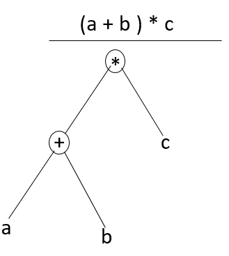
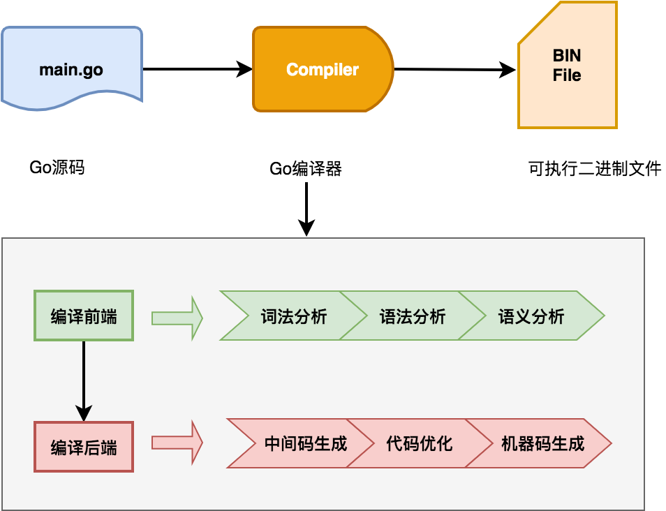

# 編譯流程

Go語言是一門靜態編譯型語言，源代碼需要通過編譯器轉換成目標平臺的機器碼才能運行。本文將介紹編譯器的編譯流程，包括編譯器的六個階段、Go編譯器的自舉機制以及源碼編譯的相關知識，幫助讀者理解Go語言的編譯流程。

## 編譯的六階段

編譯器的核心任務是**將高級語言（high-level language）轉換爲目標平臺的機器碼（machine code）**。編譯器的整個編譯流程可分爲兩部分：分析部分（Analysis part）以及合成部分（Synthesis part）。這兩部分也稱爲**編譯前端**和**編譯後端**。每部分又可以細分爲三個階段，簡單來說整個編譯流程大致可細分爲六個階段：

- 詞法分析（Lexical analysis）[^1]
- 語法分析（Syntax analysis）[^2]
- 語義分析（Semantic analysis）
- 中間碼生成（Intermediate code generator）
- 代碼優化（Code optimizer）
- 機器代碼生成（Code generator）

### 詞法分析

詞法分析是編譯的第一步，編譯器掃描源代碼，從左到右逐行將字符序列分組，生成**詞法單元（Tokens）**。這些詞法單元包括標識符（identifier）、關鍵字（reserved word）、運算符（operator）和常量（constant）等。例如，對於代碼 `c = a + b * 5`，詞法分析會生成以下Tokens：

Lexemes | Tokens
--- | ---
c | 標誌符
= | 賦值符號
a | 標誌符
\+ | 加法符號
b | 標誌符
\* | 乘法符號
5 | 數字

### 語法分析

詞法分析階段接收詞法分析階段生成的Tokens序列，然後基於特定編程語言的規則生成抽象語法樹。

#### 抽象語法樹

抽象語法樹（Abstract Syntax Tree），簡稱AST，是源代碼語法結構的一種抽象表示。它以樹狀的形式表現編程語言的語法結構，樹上的每個節點都表示源代碼中的一種結構。以`(a+b)*c`爲例，最終生成的抽象語法樹如下：



### 語義分析

語義分析階段用來檢查代碼的語義一致性。它使用前一階段的語法樹以及符號表來驗證給定的源代碼在語義上是一致的。它還檢查代碼是否傳達了適當的含義。例如語義分析會檢查`a+b`中的`a`和`b`是否爲可以進行`+`操作的類型。

在Go語言中，語義分析會檢查接口實現、類型推導（如 := 短變量聲明）以及包級作用域的符號解析。例如，Go編譯器會確保 `var x int; x = "string" `這樣的代碼被標記爲類型錯誤。

### 中間碼生成

中間碼是一種介於高級語言和機器碼之間的表示形式，具有跨平臺特性。。使用中間碼易於跨平臺轉換爲特定類型目標機器代碼。

Go編譯器會生成一種平臺無關的中間表示（IR），便於後續優化和目標代碼生成。Go編輯器使用的是一種名爲SSA(Static Single Assignment)的中間表示形式。SSA的每個變量只被賦值一次，便於優化器進行常量傳播，死代碼消除等操作。

### 代碼優化

代碼優化階段主要是改進中間代碼，生成更高效的代碼，優化包括但不限於：
- 刪除冗餘代碼（死代碼消除）
- 常量摺疊
- -通過循環展開來進行循環優化
- 內聯函數
- 邊界檢查消除（BCE, Bound Check Elimination）

Go編譯器在優化階段執行**逃逸分析（Escape Analysis）**，確定變量是否需要分配到堆上，從而減少內存分配開銷。此外，Go還會進行內聯優化，將短小的函數直接嵌入調用處，減少函數調用開銷。

### 機器碼生成

機器碼生成是編譯器工作的最後階段。此階段會基於中間碼生成彙編代碼，彙編器根據彙編代碼生成目標文件，目標文件經過鏈接器處理最終生成可執行文件。

Go編譯器使用 `Plan9` 彙編作爲統一彙編語言，屏蔽了不同架構的細節，生成的彙編代碼隨後通過彙編器（如 `go tool asm`）和鏈接器（如 `go tool link`）轉換爲可執行文件。

## Go 編譯流程

上面介紹了通用編譯器工作的整個流程，Go語言編譯器整體遵循這個流程：



Go 編譯器在編譯的具體實現時候， 在六個階段基礎上進一步細化。根據Go官方博客介紹[^3]，Go編譯具體實現包括下面八個階段：

階段名稱 | 主要功能 | 相關包
--- | --- | ---
解析	| 詞法分析和語法分析，構建語法樹，包含位置信息用於錯誤和調試。| cmd/compile/internal/syntax
類型檢查	| 使用語法樹的AST進行類型檢查，基於go/types的端口。| cmd/compile/internal/types2
IR構建（Noding）| 將語法和類型轉換爲IR和類型，使用統一IR支持導入/導出和內聯。| cmd/compile/internal/types, cmd/compile/internal/ir, cmd/compile/internal/noder
中端優化	| 包括死代碼消除、去虛擬化、內聯和逃逸分析等優化。	| cmd/compile/internal/inline, cmd/compile/internal/devirtualize, cmd/compile/internal/escape
遍歷（Walk）|	分解複雜語句，引入臨時變量，簡化構造（如將switch轉換爲跳轉表）。| cmd/compile/internal/walk
通用SSA	 | 將IR轉換爲SSA形式，應用內建函數，執行機器無關的優化（如死代碼消除）。	| cmd/compile/internal/ssa, cmd/compile/internal/ssagen
生成機器碼	| 將SSA降低爲機器特定代碼，優化（如寄存器分配），生成包含反射和調試數據的目標文件。	| cmd/compile/internal/ssa, cmd/internal/obj
導出	| 寫入導出數據文件，包括類型信息、IR和逃逸分析摘要。

我們執行`go build`命令時候，帶上`-n`選項可以觀察編譯流程所執行所有的命令：

```shell
#
# command-line-arguments
#

mkdir -p $WORK/b001/
cat >$WORK/b001/importcfg << 'EOF' # internal
# import config
packagefile runtime=/usr/lib/go/pkg/linux_amd64/runtime.a
EOF
cd /home/vagrant/dive-into-go
/usr/lib/go/pkg/tool/linux_amd64/compile -o $WORK/b001/_pkg_.a -trimpath "$WORK/b001=>" -p main -complete -buildid aJhlsTb17ElgWQeF76b5/aJhlsTb17ElgWQeF76b5 -goversion go1.14.13 -D _/home/vagrant/dive-into-go -importcfg $WORK/b001/importcfg -pack ./empty_string.go
/usr/lib/go/pkg/tool/linux_amd64/buildid -w $WORK/b001/_pkg_.a # internal
cat >$WORK/b001/importcfg.link << 'EOF' # internal
packagefile command-line-arguments=$WORK/b001/_pkg_.a
packagefile runtime=/usr/lib/go/pkg/linux_amd64/runtime.a
packagefile internal/bytealg=/usr/lib/go/pkg/linux_amd64/internal/bytealg.a
packagefile internal/cpu=/usr/lib/go/pkg/linux_amd64/internal/cpu.a
packagefile runtime/internal/atomic=/usr/lib/go/pkg/linux_amd64/runtime/internal/atomic.a
packagefile runtime/internal/math=/usr/lib/go/pkg/linux_amd64/runtime/internal/math.a
packagefile runtime/internal/sys=/usr/lib/go/pkg/linux_amd64/runtime/internal/sys.a
EOF
mkdir -p $WORK/b001/exe/
cd .
/usr/lib/go/pkg/tool/linux_amd64/link -o $WORK/b001/exe/a.out -importcfg $WORK/b001/importcfg.link -buildmode=exe -buildid=FoylCipvV-SPkhyi2PJs/aJhlsTb17ElgWQeF76b5/aJhlsTb17ElgWQeF76b5/FoylCipvV-SPkhyi2PJs -extld=gcc $WORK/b001/_pkg_.a
/usr/lib/go/pkg/tool/linux_amd64/buildid -w $WORK/b001/exe/a.out # internal
mv $WORK/b001/exe/a.out empty_string

```

從上面命令輸出的內容可以看到：

1. Go編譯器首先會創建一個任務輸出臨時目錄（`mkdir -p $WORK/b001/`）。b001是root task的工作目錄，每次構建都是由一系列task完成，它們構成 **[action graph](https://github.com/golang/go/blob/master/src/cmd/go/internal/work/action.go)**

2. 接着將`empty_string.go`中依賴的包: `/usr/lib/go/pkg/linux_amd64/runtime.a` 寫入到`importcfg`中

3. 接着會使用`compile`命令，並指定`importcfg`文件，將主程序`empty_string.go`編譯成`_pkg.a`文件（`/usr/lib/go/pkg/tool/linux_amd64/compile -o $WORK/b001/_pkg_.a -trimpath "$WORK/b001=>" -p main -complete -buildid aJhlsTb17ElgWQeF76b5/aJhlsTb17ElgWQeF76b5 -goversion go1.14.13 -D _/home/vagrant/dive-into-go -importcfg $WORK/b001/importcfg -pack ./empty_string.go`）。

4. 程序依賴的包都寫到`importcfg.link`這個文件中，Go編譯器連接階段中鏈接器會使用該文件，找到所有依賴的包文件，將其連接到程序中（`/usr/lib/go/pkg/tool/linux_amd64/link -o $WORK/b001/exe/a.out -importcfg $WORK/b001/importcfg.link -buildmode=exe -buildid=FoylCipvV-SPkhyi2PJs/aJhlsTb17ElgWQeF76b5/aJhlsTb17ElgWQeF76b5/FoylCipvV-SPkhyi2PJs -extld=gcc $WORK/b001/_pkg_.a`）。接着會將`buildid`寫入二進制文件中（
 `/usr/lib/go/pkg/tool/linux_amd64/buildid -w $WORK/b001/exe/a.out`）。

5. 將編譯成功的二進制文件移動到輸出目錄中（`mv $WORK/b001/exe/a.out empty_string`）。

上面4中我們可以看到`buildid`寫入過程。在 Go 的構建過程中，`buildid` 用於緩存管理。Go 的構建系統會根據`buildid`來判斷是否需要重新構建某個包或模塊。如果緩存中已經存在具有相同`buildid`的構建結果，構建系統可以重用緩存，從而加快構建速度。`buildid`也可用於唯一標識每次構建的二進制文件。我們可以通過下面命令查看二進制文件的`buildid`：

```bash
go tool buildid ./example_binary
```

### 完整編譯流程輸出

爲了詳細查看`go build`整個詳細過程，我們可以使用`go build -work -a -p 1 -x empty_string.go`命令來觀察整個過程，它比`go build -n`提供了更詳細的信息:

- -work選項指示編譯器編譯完成後保留編譯臨時工作目錄
- -a選項強制編譯所有包。我們使用`go build -n`時候，只看到main包編譯過程，這是因爲其他包已經編譯過了，不會再編譯。我們可以使用這個選項強制編譯所有包。
- -p選項用來指定編譯過程中線程數，這裏指定爲1，是爲觀察編譯的順序性
- -x選項可以指定編譯參數

完整編譯輸出內容摘要如下：

```bash
vagrant@vagrant:~/dive-into-go$ go build -work -a -p 1 -x empty_string.go
WORK=/tmp/go-build871888098
mkdir -p $WORK/b004/
cat >$WORK/b004/go_asm.h << 'EOF' # internal
EOF
cd /usr/lib/go/src/internal/cpu
/usr/lib/go/pkg/tool/linux_amd64/asm -trimpath "$WORK/b004=>" -I $WORK/b004/ -I /usr/lib/go/pkg/include -D GOOS_linux -D GOARCH_amd64 -gensymabis -o $WORK/b004/symabis ./cpu_x86.s
cat >$WORK/b004/importcfg << 'EOF' # internal
# import config
EOF
/usr/lib/go/pkg/tool/linux_amd64/compile -o $WORK/b004/_pkg_.a -trimpath "$WORK/b004=>" -p internal/cpu -std -+ -buildid 8F_1bll3rU7d1mo74DFt/8F_1bll3rU7d1mo74DFt -goversion go1.14.13 -symabis $WORK/b004/symabis -D "" -importcfg $WORK/b004/importcfg -pack -asmhdr $WORK/b004/go_asm.h ./cpu.go ./cpu_amd64.go ./cpu_x86.go
/usr/lib/go/pkg/tool/linux_amd64/asm -trimpath "$WORK/b004=>" -I $WORK/b004/ -I /usr/lib/go/pkg/include -D GOOS_linux -D GOARCH_amd64 -o $WORK/b004/cpu_x86.o ./cpu_x86.s
/usr/lib/go/pkg/tool/linux_amd64/pack r $WORK/b004/_pkg_.a $WORK/b004/cpu_x86.o # internal
/usr/lib/go/pkg/tool/linux_amd64/buildid -w $WORK/b004/_pkg_.a # internal
cp $WORK/b004/_pkg_.a /home/vagrant/.cache/go-build/e2/e20b6a590621cff911735ea491492b992b429df9b0b579155aecbfdffdf7ec74-d # internal
mkdir -p $WORK/b003/
cat >$WORK/b003/go_asm.h << 'EOF' # internal
EOF
cd /usr/lib/go/src/internal/bytealg
/usr/lib/go/pkg/tool/linux_amd64/asm -trimpath "$WORK/b003=>" -I $WORK/b003/ -I /usr/lib/go/pkg/include -D GOOS_linux -D GOARCH_amd64 -gensymabis -o $WORK/b003/symabis ./compare_amd64.s ./count_amd64.s ./equal_amd64.s ./index_amd64.s ./indexbyte_amd64.s
cat >$WORK/b003/importcfg << 'EOF' # internal
# import config
packagefile internal/cpu=$WORK/b004/_pkg_.a
EOF
/usr/lib/go/pkg/tool/linux_amd64/compile -o $WORK/b003/_pkg_.a -trimpath "$WORK/b003=>" -p internal/bytealg -std -+ -buildid I0-Z7SEGCaTIz2BZXZCm/I0-Z7SEGCaTIz2BZXZCm -goversion go1.14.13 -symabis $WORK/b003/symabis -D "" -importcfg $WORK/b003/importcfg -pack -asmhdr $WORK/b003/go_asm.h ./bytealg.go ./compare_native.go ./count_native.go ./equal_generic.go ./equal_native.go ./index_amd64.go ./index_native.go ./indexbyte_native.go
/usr/lib/go/pkg/tool/linux_amd64/asm -trimpath "$WORK/b003=>" -I $WORK/b003/ -I /usr/lib/go/pkg/include -D GOOS_linux -D GOARCH_amd64 -o $WORK/b003/compare_amd64.o ./compare_amd64.s
/usr/lib/go/pkg/tool/linux_amd64/asm -trimpath "$WORK/b003=>" -I $WORK/b003/ -I /usr/lib/go/pkg/include -D GOOS_linux -D GOARCH_amd64 -o $WORK/b003/count_amd64.o ./count_amd64.s
/usr/lib/go/pkg/tool/linux_amd64/asm -trimpath "$WORK/b003=>" -I $WORK/b003/ -I /usr/lib/go/pkg/include -D GOOS_linux -D GOARCH_amd64 -o $WORK/b003/equal_amd64.o ./equal_amd64.s
/usr/lib/go/pkg/tool/linux_amd64/asm -trimpath "$WORK/b003=>" -I $WORK/b003/ -I /usr/lib/go/pkg/include -D GOOS_linux -D GOARCH_amd64 -o $WORK/b003/index_amd64.o ./index_amd64.s
/usr/lib/go/pkg/tool/linux_amd64/asm -trimpath "$WORK/b003=>" -I $WORK/b003/ -I /usr/lib/go/pkg/include -D GOOS_linux -D GOARCH_amd64 -o $WORK/b003/indexbyte_amd64.o ./indexbyte_amd64.s
/usr/lib/go/pkg/tool/linux_amd64/pack r $WORK/b003/_pkg_.a $WORK/b003/compare_amd64.o $WORK/b003/count_amd64.o $WORK/b003/equal_amd64.o $WORK/b003/index_amd64.o $WORK/b003/indexbyte_amd64.o # internal
/usr/lib/go/pkg/tool/linux_amd64/buildid -w $WORK/b003/_pkg_.a # internal
cp $WORK/b003/_pkg_.a /home/vagrant/.cache/go-build/42/42c362e050cb454a893b15620b72fbb75879ac0a1fdd13762323eec247798a43-d # internal
mkdir -p $WORK/b006/
cat >$WORK/b006/go_asm.h << 'EOF' # internal
EOF
cd /usr/lib/go/src/runtime/internal/atomic
/usr/lib/go/pkg/tool/linux_amd64/asm -trimpath "$WORK/b006=>" -I $WORK/b006/ -I /usr/lib/go/pkg/include -D GOOS_linux -D GOARCH_amd64 -gensymabis -o $WORK/b006/symabis ./asm_amd64.s
cat >$WORK/b006/importcfg << 'EOF' # internal
# import config
EOF
/usr/lib/go/pkg/tool/linux_amd64/compile -o $WORK/b006/_pkg_.a -trimpath "$WORK/b006=>" -p runtime/internal/atomic -std -+ -buildid uI0THQvFtr7yRsGPOXDw/uI0THQvFtr7yRsGPOXDw -goversion go1.14.13 -symabis $WORK/b006/symabis -D "" -importcfg $WORK/b006/importcfg -pack -asmhdr $WORK/b006/go_asm.h ./atomic_amd64.go ./stubs.go
/usr/lib/go/pkg/tool/linux_amd64/asm -trimpath "$WORK/b006=>" -I $WORK/b006/ -I /usr/lib/go/pkg/include -D GOOS_linux -D GOARCH_amd64 -o $WORK/b006/asm_amd64.o ./asm_amd64.s
/usr/lib/go/pkg/tool/linux_amd64/pack r $WORK/b006/_pkg_.a $WORK/b006/asm_amd64.o # internal
/usr/lib/go/pkg/tool/linux_amd64/buildid -w $WORK/b006/_pkg_.a # internal
cp $WORK/b006/_pkg_.a /home/vagrant/.cache/go-build/6b/6b2c5449e17d9b0e34bfe37a77dc16b9675ffb657fbe9277a1067fa8ca5179ab-d # internal
mkdir -p $WORK/b008/
cat >$WORK/b008/importcfg << 'EOF' # internal
# import config
EOF
cd /usr/lib/go/src/runtime/internal/sys
/usr/lib/go/pkg/tool/linux_amd64/compile -o $WORK/b008/_pkg_.a -trimpath "$WORK/b008=>" -p runtime/internal/sys -std -+ -complete -buildid AZJ761JYi_ToDiYI_5UA/AZJ761JYi_ToDiYI_5UA -goversion go1.14.13 -D "" -importcfg $WORK/b008/importcfg -pack ./arch.go ./arch_amd64.go ./intrinsics.go ./intrinsics_common.go ./stubs.go ./sys.go ./zgoarch_amd64.go ./zgoos_linux.go ./zversion.go
/usr/lib/go/pkg/tool/linux_amd64/buildid -w $WORK/b008/_pkg_.a # internal
cp $WORK/b008/_pkg_.a /home/vagrant/.cache/go-build/f7/f706a1321f01a45857a441e80fd50709a700a9d304543d534a953827021222c1-d # internal
mkdir -p $WORK/b007/
cat >$WORK/b007/importcfg << 'EOF' # internal
# import config
packagefile runtime/internal/sys=$WORK/b008/_pkg_.a
EOF
cd /usr/lib/go/src/runtime/internal/math
/usr/lib/go/pkg/tool/linux_amd64/compile -o $WORK/b007/_pkg_.a -trimpath "$WORK/b007=>" -p runtime/internal/math -std -+ -complete -buildid NxqylyDav-hCzDju1Kr1/NxqylyDav-hCzDju1Kr1 -goversion go1.14.13 -D "" -importcfg $WORK/b007/importcfg -pack ./math.go
/usr/lib/go/pkg/tool/linux_amd64/buildid -w $WORK/b007/_pkg_.a # internal
cp $WORK/b007/_pkg_.a /home/vagrant/.cache/go-build/f6/f6dcba7ea64d64182a26bcda498c1888786213b0b5560d9bde92cfff323be7df-d # internal
...
```

從上面可以看到編譯器工作目錄是`/tmp/go-build871888098`，cd進去之後，我們可以看到多個子目錄，每個子目錄都是用編譯子task使用，存放的都是編譯後的包：

```bash
vagrant@vagrant:/tmp/go-build871888098$ ls
b001  b002  b003  b004  b006  b007  b008
```

其中`b001`目錄用於main包編譯，是任務圖的root節點。`b001`目錄下面的`importcfg.link`文件存放都是程序所有依賴的包地址，它們指向的都是b002,b003...這些目錄下的`_pkg_.a`文件。

## Go 編譯器

Go 編譯器，英文名稱是`Go compiler`，簡稱gc。gc是Go命令的一部分，包含在每次Go發行版本中。Go命令是由Go語言編寫的，而Go語言編寫的程序需要Go命令來編譯，也就是自己編譯自己，這就出現了“先有雞還是先有蛋”的問題。Go gc如何做到自己編譯自己呢，要解答這個問題，我們先來瞭解下自舉概念。

### 自舉

自舉，英文名稱是Bootstrapping，這個詞來自自西方的一句諺語：“pull oneself up by one's bootstraps”，字面意思就是“拽着鞋帶把自己拉起來”。自舉一詞在編譯器領域指的是用待編譯的程序的編程語言來編寫其編譯器。自舉步驟一般如下，假定要編譯的程序語言是A：

1. 先使用程序語言B實現A的編譯器，假定爲compiler0
2. 接着使用A語言實現A的編譯器，之後使用步驟1中的compiler0編譯器編譯，得到編譯器compiler1
3. 最後我們就可以使用compiler1來編譯A語言寫的程序，這樣實現了自己編譯自己

通過自舉方式，解決了上面說的“先有雞還是先有蛋”的問題，實現了自己編譯自己。

Go語言最開始是使用C語言實現的編譯器，go1.4是最後一個C語言實現的編譯器版本。自go1.5開始，Go實現了自舉功能，go1.5的gc是由go語言實現的，它是由go1.4版本的C語言實現編譯器編譯出來的，詳細內容可以參見Go 自舉的設計文檔：[Go 1.3+ Compiler Overhaul](https://docs.google.com/document/d/1P3BLR31VA8cvLJLfMibSuTdwTuF7WWLux71CYD0eeD8/edit)。

除了 Go 語言實現的 gc 外，Go 官方還維護了一個基於 gcc 實現的 Go 編譯器 [gccgo](https://go.dev/doc/install/gccgo)。與 gc 相比，gccgo 編譯速度較慢，但支持更強大的優化，因此由 gccgo 構建的 CPU 密集型(CPU-bound)程序通常會運行得更快。此外 gccgo 比 gc 支持更多的操作系統，如果交叉編譯gc不支持的操作系統，可以考慮使用gccgo。

### 源碼安裝

Go 源碼安裝需要系統先有一個`bootstrap toolchain`，該toolchain可以從下面三種方式獲取：

- 從官網下載Go二進制發行包
- 使用gccgo工具編譯
- 基於Go1.4版本的工具鏈

#### 從官網下載發行包

第一種方式是從Go發行包中獲取Go二進制應用，比如要源碼編譯go1.14.13，我們可以去[官網](https://golang.org/dl/)下載已經編譯好的go1.13，設置好`GOROOT_BOOTSTRAP`環境變量，就可以源碼編譯了。

```bash
wget https://golang.org/dl/go1.13.15.linux-amd64.tar.gz
tar xzvf go1.13.15.linux-amd64.tar.gz
mv go go1.13.15
export GOROOT_BOOTSTRAP=/tmp/go1.13.15 # 設置GOROOT_BOOTSTRAP環境變量指向bootstrap toolchain的目錄

cd /tmp
git clone -b go1.14.13 https://go.googlesource.com/go go1.14.13
cd go1.14.13/src
./make.bash
```

#### 使用gccgo工具編譯

第二種方式是使用gccgo來編譯：

```bash
sudo apt-get install gccgo-5
sudo update-alternatives --set go /usr/bin/go-5
export GOROOT_BOOTSTRAP=/usr

cd /tmp
git clone -b go1.14.13 https://go.googlesource.com/go go1.14.13
cd go1.14.13/src
./make.bash
```

### 基於go1.14版本工具鏈編譯

第三種方式是先編譯出go1.4版本，然後使用go1.4版本去編譯其他版本。

```bash
cd /tmp
git clone -b go1.4.3 https://go.googlesource.com/go go1.4
cd go1.4/src
./all.bash # go1.4版本是c語言實現的編譯器
export GOROOT_BOOTSTRAP=/tmp/go1.4

git clone -b go1.14.13 https://go.googlesource.com/go go1.14.13
cd go1.14.13/src
./all.bash
```

## 進一步閱讀

- [Go官方博客：Introduction to the Go compiler](https://go.dev/src/cmd/compile/README)
- [Go: Overview of the Compiler](https://medium.com/a-journey-with-go/go-overview-of-the-compiler-4e5a153ca889)
- [How a Go Program Compiles down to Machine Code](https://getstream.io/blog/how-a-go-program-compiles-down-to-machine-code/)
- [編譯原理](https://draveness.me/golang/docs/part1-prerequisite/ch02-compile/golang-compile-intro/)
- [Compiler appearance - Phases of Compiler](http://www.en.w3ki.com/compiler_design/compiler_design_phases_of_compiler.html)
- [Introduction to the Go compiler](https://github.com/golang/go/tree/master/src/cmd/compile)
- [How “go build” Works](https://maori.geek.nz/how-go-build-works-750bb2ba6d8e)
- [Go 1.3+ Compiler Overhaul](https://docs.google.com/document/d/1P3BLR31VA8cvLJLfMibSuTdwTuF7WWLux71CYD0eeD8/edit)
- [Installing Go from source](https://golang.org/doc/install/source)
- [GcToolchainTricks](https://github.com/golang/go/wiki/GcToolchainTricks)
- [Bootstrapping Go](https://weeraman.com/bootstrapping-go-ee5633ce3329)
- [Gccgo in GCC 4.7.1](https://go.dev/blog/gccgo-in-gcc-471)

[^1]: [Lexical analysis](https://en.wikipedia.org/wiki/Lexical_analysis)
[^2]: [Syntax analysis](https://en.wikipedia.org/wiki/Parsing)
[^3]: https://go.dev/src/cmd/compile/README
