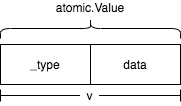

# 原子操作 - atomic
atomic是Go內置原子操作包。下面是官方說明：

> Package atomic provides low-level atomic memory primitives useful for implementing synchronization algorithms. atomic包提供了用於實現同步機制的底層原子內存原語。

> These functions require great care to be used correctly. Except for special, low-level applications, synchronization is better done with channels or the facilities of the sync package. Share memory by communicating; don't communicate by sharing memory. 使用這些功能需要非常小心。除了特殊的底層應用程序外，最好使用通道或sync包來進行同步。**通過通信來共享內存；不要通過共享內存來通信**。

atomic包提供的操作可以分爲三類：
### 對整數類型T的操作

T類型是`int32`、`int64`、`uint32`、`uint64`、`uintptr`其中一種。

```go
func AddT(addr *T, delta T) (new T)
func CompareAndSwapT(addr *T, old, new T) (swapped bool)
func LoadT(addr *T) (val T)
func StoreT(addr *T, val T)
func SwapT(addr *T, new T) (old T)
```

### 對於`unsafe.Pointer`類型的操作

```go
func CompareAndSwapPointer(addr *unsafe.Pointer, old, new unsafe.Pointer) (swapped bool)
func LoadPointer(addr *unsafe.Pointer) (val unsafe.Pointer)
func StorePointer(addr *unsafe.Pointer, val unsafe.Pointer)
func SwapPointer(addr *unsafe.Pointer, new unsafe.Pointer) (old unsafe.Pointer)
```

### `atomic.Value`類型提供Load/Store操作

atomic提供了`atomic.Value`類型，用來原子性加載和存儲類型一致的值（consistently typed value）。`atomic.Value`提供了對任何類型的原則性操作。

```go
func (v *Value) Load() (x interface{}) // 原子性返回剛剛存儲的值，若沒有值返回nil
func (v *Value) Store(x interface{}) // 原子性存儲值x，x可以是nil，但需要每次存的值都必須是同一個具體類型。
```

## 用法

### 用法示例1：原子性增加值

```go
package main

import (
	"fmt"
	"sync"
	"sync/atomic"
)

func main() {
	var count int32
	var wg sync.WaitGroup

	for i := 0; i < 10; i++ {
		wg.Add(1)
		go func() {
			atomic.AddInt32(&count, 1) // 原子性增加值
			wg.Done()
		}()
		go func() {
			fmt.Println(atomic.LoadInt32(&count)) // 原子性加載
		}()
	}
	wg.Wait()
	fmt.Println("count: ", count)
}
```

### 用法示例2：簡易自旋鎖實現

```go
package main

import (
	"sync/atomic"
)

type spin int64

func (l *spin) lock() bool {
	for {
		if atomic.CompareAndSwapInt64((*int64)(l), 0, 1) {
			return true
		}
		continue
	}
}

func (l *spin) unlock() bool {
	for {
		if atomic.CompareAndSwapInt64((*int64)(l), 1, 0) {
			return true
		}
		continue
	}
}

func main() {
	s := new(spin)

	for i := 0; i < 5; i++ {
		s.lock()
		go func(i int) {
			println(i)
			s.unlock()
		}(i)
	}
	for {

	}
}
```

### 用法示例3： 無符號整數減法操作

對於Uint32和Uint64類型Add方法第二個參數只能接受相應的無符號整數，`atomic`包沒有提供減法`SubstractT`操作：

```go
func AddUint32(addr *uint32, delta uint32) (new uint32)
func AddUint64(addr *uint64, delta uint64) (new uint64)
```

對於無符號整數`V`，我們可以傳遞`-V`給AddT方法第二個參數就可以實現減法操作。

```go
package main

import (
	"sync/atomic"
)

func main() {
	var i uint64 = 100
	var j uint64 = 10
	var k = 5
	atomic.AddUint64(&i, -j)
	println(i)
	atomic.AddUint64(&i, -uint64(k))
	println(i)
	// 下面這種操作是不可以的，會發生恐慌：constant -5 overflows uint64
	// atomic.AddUint64(&i, -uint64(5))
}
```

## 源碼分析

`atomic`包提供的三類操作的前兩種都是直接通過彙編源碼實現的（[sync/atomic/asm.s](https://github.com/cyub/go-1.14.13/tree/master/src/sync/atomic/asm.s)):

```as
#include "textflag.h"

TEXT ·SwapInt32(SB),NOSPLIT,$0
	JMP	runtime∕internal∕atomic·Xchg(SB)

TEXT ·SwapUint32(SB),NOSPLIT,$0
	JMP	runtime∕internal∕atomic·Xchg(SB)

...

TEXT ·StoreUintptr(SB),NOSPLIT,$0
	JMP	runtime∕internal∕atomic·Storeuintptr(SB)
```

從上面彙編代碼可以看出來atomic操作通過JMP操作跳到`runtime/internal/atomic`目錄下面的彙編實現。我們把目標轉移到`runtime/internal/atomic`目錄下面。

該目錄包含針對不同平臺的atomic彙編實現`asm_xxx.s`。這裏面我們只關注`amd64`平臺`asm_amd64.s`([runtime/internal/atomic/asm_amd64.s](https://github.com/cyub/go-1.14.13/tree/master/src/runtime/internal/atomic/asm_amd64.s))和`atomic_amd64.go`([runtime/internal/atomic/atomic_amd64.go](https://github.com/cyub/go-1.14.13/tree/master/src/runtime/internal/atomic/atomic_amd64.go))。

函數  | 底層實現
--- | ---
SwapInt32 / SwapUint32 | runtime∕internal∕atomic·Xchg
SwapInt64 / SwapUint64 / SwapUintptr | runtime∕internal∕atomic·Xchg64
CompareAndSwapInt32 / CompareAndSwapUint32 | runtime∕internal∕atomic·Cas
CompareAndSwapUintptr / CompareAndSwapInt64 / CompareAndSwapUint64 | runtime∕internal∕atomic·Cas64
AddInt32 / AddUint32 | runtime∕internal∕atomic·Xadd
AddUintptr / AddInt64 / AddUint64 | runtime∕internal∕atomic·Xadd64
LoadInt32 / LoadUint32 | runtime∕internal∕atomic·Load
LoadInt64 / LoadUint64 / LoadUint64/ LoadUintptr| runtime∕internal∕atomic·Load64
LoadPointer | runtime∕internal∕atomic·Loadp
StoreInt32 / StoreUint32 | runtime∕internal∕atomic·Store
StoreInt64 / StoreUint64 / StoreUintptr | runtime∕internal∕atomic·Store64

### Add操作

`AddUintptr` 、 `AddInt64` 以及 `AddUint64`都是由方法`runtime∕internal∕atomic·Xadd64`實現:

```as
TEXT runtime∕internal∕atomic·Xadd64(SB), NOSPLIT, $0-24
	MOVQ	ptr+0(FP), BX // 第一個參數保存到BX
	MOVQ	delta+8(FP), AX // 第二個參數保存到AX
	MOVQ	AX, CX  // 將第二個參數臨時存到CX寄存器中
	LOCK			// LOCK指令進行鎖住操作，實現對共享內存獨佔訪問
	XADDQ	AX, 0(BX) // xaddq指令，實現寄存器AX的值與BX指向的內存存的值互換，
	// 並將這兩個值的和存在BX指向的內存中，此時AX寄存器存的是第一個參數指向的值
	ADDQ	CX, AX // 此時AX寄存器的值是Add操作之後的值，和0(BX)值一樣
	MOVQ	AX, ret+16(FP) # 返回值
	RET
```

**LOCK**指令是一個指令前綴，其後是**讀-寫**性質的指令，在多處理器環境中，LOCK指令能夠確保在執行LOCK隨後的指令時，處理器擁有對數據的獨佔使用。若對應數據已經在cache line裏，也就不用鎖定總線，僅鎖住緩存行即可，否則需要鎖住總線來保證獨佔性。

**XADDQ**指令用於交換加操作，會將源操作數與目的操作數互換，並將兩者的和保存到源操作數中。

`AddInt32` 、 `AddUint32` 都是由方法`runtime∕internal∕atomic·Xadd`實現，實現邏輯和`runtime∕internal∕atomic·Xadd64`一樣，只是Xadd中相關數據操作指令後綴是`L`：

```as
TEXT runtime∕internal∕atomic·Xadd(SB), NOSPLIT, $0-20
	MOVQ	ptr+0(FP), BX // 注意第一個參數是一個指針類型，是64位，所以還是MOVQ指令
	MOVL	delta+8(FP), AX // 第二個參數32位的，所以是MOVL指令
	MOVL	AX, CX
	LOCK
	XADDL	AX, 0(BX)
	ADDL	CX, AX
	MOVL	AX, ret+16(FP)
	RET
```

### Store操作
`StoreInt64`、`StoreUint64`、`StoreUintptr`三個是`runtime∕internal∕atomic·Store64`方法實現:

```as
TEXT runtime∕internal∕atomic·Store64(SB), NOSPLIT, $0-16
	MOVQ	ptr+0(FP), BX // 第一個參數保存到BX
	MOVQ	val+8(FP), AX // 第二個參數保存到AX
	XCHGQ	AX, 0(BX) // 將AX寄存器與BX寄存指向內存的值互換，
	// 那麼第一個參數指向的內存存的值爲第二個參數
	RET
```

**XCHGQ**指令是交換指令，用於交換源操作數和目的操作數。

`StoreInt32`、`StoreUint32`是由`runtime∕internal∕atomic·Store`方法實現，與`runtime∕internal∕atomic·Store64`邏輯一樣，這裏不在贅述。

### CompareAndSwap操作

`CompareAndSwapUintptr`、`CompareAndSwapInt64`和`CompareAndSwapUint64`都是由`runtime∕internal∕atomic·Cas64`實現：

```as
TEXT runtime∕internal∕atomic·Cas64(SB), NOSPLIT, $0-25
	MOVQ	ptr+0(FP), BX // 將第一個參數保存到BX
	MOVQ	old+8(FP), AX // 將第二個參數保存到AX
	MOVQ	new+16(FP), CX // 將第三個參數保存CX
	LOCK				 // LOCK指令進行上鎖操作
	CMPXCHGQ	CX, 0(BX) // BX寄存器指向的內存的值與AX寄存器值進行比較，若相等則把CX寄存器值存儲到BX寄存器指向的內存中
	SETEQ	ret+24(FP)
	RET
```

**CMPXCHGQ**指令是比較並交換指令，它的用法是將目的操作數和累加寄存器AX進行比較，若相等，則將源操作數複製到目的操作數中，否則將目的操作複製到累加寄存器中。

### Swap操作

`SwapInt64`、`SwapUint64`、`SwapUintptr`實現的方法是`runtime∕internal∕atomic·Xchg64`，`SwapInt32`和`SwapUint32`底層實現是`runtime∕internal∕atomic·Xchg`，這裏面只分析64的操作：

```as
TEXT runtime∕internal∕atomic·Xchg64(SB), NOSPLIT, $0-24
	MOVQ	ptr+0(FP), BX // 第一個參數保存到BX
	MOVQ	new+8(FP), AX // 第一個參數保存到AX中
	XCHGQ	AX, 0(BX) // XCHGQ指令交互AX值到0(BX)中
	MOVQ	AX, ret+16(FP) // 將舊值返回
	RET
```

### Load操作

`LoadInt32`、`LoadUint32`、`LoadInt64` 、 `LoadUint64` 、 `LoadUint64`、 `LoadUintptr`、`LoadPointer`實現都是Go實現的：

```go
//go:linkname Load
//go:linkname Loadp
//go:linkname Load64

//go:nosplit
//go:noinline
func Load(ptr *uint32) uint32 {
	return *ptr
}

//go:nosplit
//go:noinline
func Loadp(ptr unsafe.Pointer) unsafe.Pointer {
	return *(*unsafe.Pointer)(ptr)
}

//go:nosplit
//go:noinline
func Load64(ptr *uint64) uint64 {
	return *ptr
}
```

最後我們來分析atomic.Value類型提供Load/Store操作。

### atomic.Value類型的Load/Store操作

atomic.Value類型定義如下：
```go
type Value struct {
	v interface{}
}

 // ifaceWords是空接口底層表示
type ifaceWords struct {
	typ  unsafe.Pointer
	data unsafe.Pointer
}
```

atomic.Value底層存儲的是空接口類型，空接口底層結構如下：

```go
type eface struct {
	_type *_type // 空接口持有的類型
	data  unsafe.Pointer // 指向空接口持有類型變量的指針
}
```

atomic.Value內存佈局如下所示：



從上圖可以看出來atomic.Value內部分爲兩部分，第一個部分是_type類型指針，第二個部分是unsafe.Pointer類型，兩個部分大小都是8字節（64系統下）。我們可以通過以下代碼進行測試：

```go
type Value struct {
	v interface{}
}

type ifaceWords struct {
	typ  unsafe.Pointer
	data unsafe.Pointer
}

func main() {
	func main() {
	val := Value{v: 123456}
	t := (*ifaceWords)(unsafe.Pointer(&val))
	dp := (*t).data            // dp是非安全指針類型變量
	fmt.Println(*((*int)(dp))) // 輸出123456

	var val2 Value
	t = (*ifaceWords)(unsafe.Pointer(&val2))
	fmt.Println(t.typ) // 輸出nil
}
```

接下來我們看下Store方法：
```go
func (v *Value) Store(x interface{}) {
	if x == nil { // atomic.Value類型變量不能是nil
		panic("sync/atomic: store of nil value into Value")
	}
	vp := (*ifaceWords)(unsafe.Pointer(v)) // 將指向atomic.Value類型指針轉換成*ifaceWords類型
	xp := (*ifaceWords)(unsafe.Pointer(&x)) // xp是*faceWords類型指針，指向傳入參數x
	for {
		typ := LoadPointer(&vp.typ) // 原子性返回vp.typ
		if typ == nil { // 第一次調用Store時候，atomic.Value底層結構體第一部分是nil，
		// 我們可以從上面測試代碼可以看出來
			runtime_procPin() // pin process處理，防止M被搶佔
			if !CompareAndSwapPointer(&vp.typ, nil, unsafe.Pointer(^uintptr(0))) { // 通過cas操作，將atomic.Value的第一部分存儲爲unsafe.Pointer(^uintptr(0))，若沒操作成功，繼續操作
				runtime_procUnpin() // unpin process處理，釋放對當前M的鎖定
				continue
			}

			// vp.data == xp.data
			// vp.typ == xp.typ
			StorePointer(&vp.data, xp.data)
			StorePointer(&vp.typ, xp.typ)
			runtime_procUnpin()
			return
		}
		if uintptr(typ) == ^uintptr(0) { // 此時說明第一次的Store操作未完成，正在處理中，此時其他的Store等待第一次操作完成
			continue
		}

		if typ != xp.typ { // 再次Store操作時進行typ類型校驗，確保每次Store數據對象都必須是同一類型
			panic("sync/atomic: store of inconsistently typed value into Value")
		}
		StorePointer(&vp.data, xp.data) // vp.data == xp.data
		return
	}
}
```

總結上面Store流程：

1. 每次調用Store方法時候，會將傳入參數轉換成interface{}類型。當第一次調用Store方法時候，分兩部分操作，分別將傳入參數空接口類型的_typ和data，存儲到Value類型中。
2. 當再次調用Store類型時候，進行傳入參數空接口類型的_type和Value的_type比較，若不一致直接panic，若一致則將data存儲到Value類型中

從流程2可以看出來，**每次調用Store方法時傳入參數都必須是同一類型的變量**。當Store完成之後，實現了“鳩佔鵲巢”，atomic.Value底層存儲的實際上是(interface{})x。

最後我們看看atomic.Value的Load操作：

```go
func (v *Value) Load() (x interface{}) {
	vp := (*ifaceWords)(unsafe.Pointer(v)) // 將指向v指針轉換成*ifaceWords類型
	typ := LoadPointer(&vp.typ)
	if typ == nil || uintptr(typ) == ^uintptr(0) { // typ == nil 說明Store方法未調用過
	// uintptr(typ) == ^uintptr(0) 說明第一Store方法調用正在進行中
		return nil
	}
	data := LoadPointer(&vp.data)
	xp := (*ifaceWords)(unsafe.Pointer(&x))
	xp.typ = typ
	xp.data = data
	return
}
```
