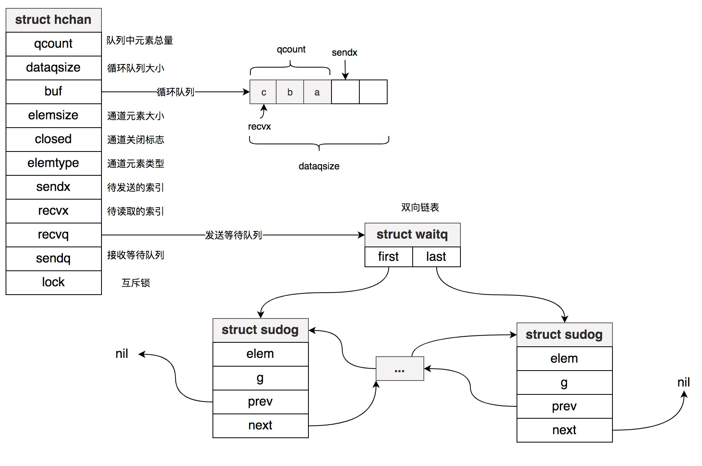
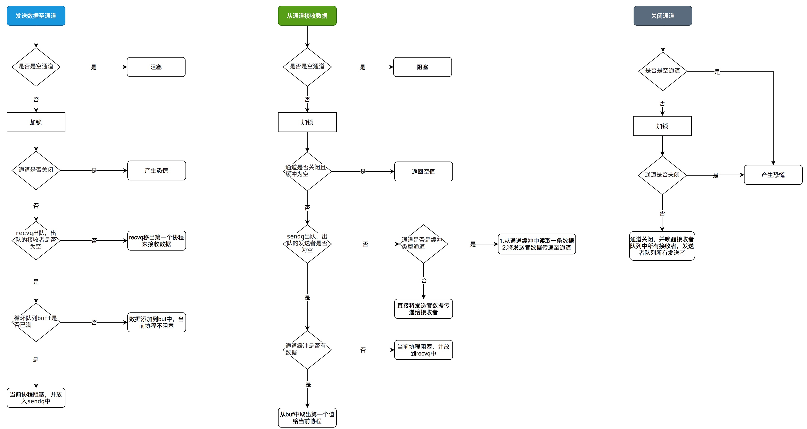

# 通道 - channel

Golang中Channel是goroutine間重要通信的方式，是併發安全的，通道內的數據First In First Out，我們可以把通道想象成隊列。

## channel數據結構

Channel底層數據結構是一個結構體。

```go
type hchan struct {
	qcount   uint // 隊列中元素個數
	dataqsiz uint // 循環隊列的大小
	buf      unsafe.Pointer // 指向循環隊列
	elemsize uint16 // 通道里面的元素大小
	closed   uint32 // 通道關閉的標誌
	elemtype *_type // 通道元素的類型
	sendx    uint   // 待發送的索引，即循環隊列中的隊尾指針rear
	recvx    uint   // 待讀取的索引，即循環隊列中的隊頭指針front
	recvq    waitq  // 接收等待隊列
	sendq    waitq  // 發送等待隊列
	lock mutex // 互斥鎖
}
```

<!--more-->

hchan結構體中的buf指向一個數組，用來實現循環隊列，sendx是循環隊列的隊尾指針，recvx是循環隊列的隊頭指針。dataqsize是緩存型通道的大小，qcount記錄着通道內數據個數。

循環隊列一般使用空餘單元法來解決隊空和隊滿時候都存在font=rear帶來的二義性問題，但這樣會浪費一個單元。golang的channel中是通過增加qcount字段記錄隊列長度來解決二義性，一方面不會浪費一個存儲單元，另一方面當使用len函數查看通道長度時候，可以直接返回qcount字段，一舉兩得。

hchan結構體中另一重要部分是recvq,sendq，分別存儲了等待從通道中接收數據的goroutine，和等待發送數據到通道的goroutine。兩者都是waitq類型。

waitq是一個結構體類型，waitq和sudog構成雙向鏈表，其中sudog是鏈表元素的類型，waitq中first和last字段分別指向鏈表頭部的sudog，鏈表尾部的sudog。

```go
type waitq struct {
	first *sudog
	last  *sudog
}

type sudog struct {
	...
	g *g // 當前阻塞的G
	...
	next     *sudog
	prev     *sudog
	elem     unsafe.Pointer
	...
}
```

hchan結構圖如下：



## channel的創建

在分析channel的創建代碼之前，我們看下源碼文件中最開始定義的兩個常量；

```go
const (
	maxAlign  = 8
	hchanSize = unsafe.Sizeof(hchan{}) + uintptr(-int(unsafe.Sizeof(hchan{}))&(maxAlign-1))
	...
)
```

- maxAlgin用來設置內存最大對齊值，對應就是64位系統下cache line的大小。當結構體是8字節對齊時候，能夠避免false share，提高讀寫速度
- hchanSize用來設置chan大小，unsafe.Sizeof(hchan{}) + uintptr(-int(unsafe.Sizeof(hchan{}))&(maxAlign-1))，這個複雜公式用來計算離unsafe.Sizeof(hchan{})最近的8的倍數。假設hchan{}大小是13，hchanSize是16。

假設n代表unsafe.Sizeof(hchan{})，a代表maxAlign，c代表hchanSize，則上面hchanSize的計算公式可以抽象爲：

> c = n + ((-n) & (a - 1))

計算離8最近的倍數，只需將n補足與到8倍數的差值就可，c也可以用下面公式計算

> c = n + (a - n%a)

感興趣的可以證明在a爲2的n的次冪時候，上面兩個公式是相等的。

```go
func makechan(t *chantype, size int) *hchan {
	elem := t.elem
	// 通道元素的大小不能超過64K
	if elem.size >= 1<<16 {
		throw("makechan: invalid channel element type")
	}

	// hchanSize大小不是maxAlign倍數，或者通道數據元素的對齊保證大於maxAlign
	if hchanSize%maxAlign != 0 || elem.align > maxAlign {
		throw("makechan: bad alignment")
	}
	// 判斷通道數據是否超過內存限制
	mem, overflow := math.MulUintptr(elem.size, uintptr(size))
	if overflow || mem > maxAlloc-hchanSize || size < 0 {
		panic(plainError("makechan: size out of range"))
	}

	var c *hchan
	switch {
	case mem == 0: // 無緩衝通道
		c = (*hchan)(mallocgc(hchanSize, nil, true))
		c.buf = c.raceaddr()
	case elem.ptrdata == 0: 
		// 當通道數據元素不含指針，hchan和buf內存空間調用mallocgc一次性分配完成
		c = (*hchan)(mallocgc(hchanSize+mem, nil, true))
		// hchan和buf內存上佈局是緊挨着的
		c.buf = add(unsafe.Pointer(c), hchanSize)
	default:
		// 當通道數據元素含指針時候，先創建hchan，然後給buf分配內存空間
		c = new(hchan)
		c.buf = mallocgc(mem, elem, true)
	}

	c.elemsize = uint16(elem.size)
	c.elemtype = elem
	c.dataqsiz = uint(size)
	...
	return c
}
```

## 發送數據到channel

```go
func chansend(c *hchan, ep unsafe.Pointer, block bool, callerpc uintptr) bool {
	// 當通道爲nil時候
	if c == nil {
		// 非阻塞模式下，直接返回false
		if !block {
			return false
		}
		// 調用gopark將當前Goroutine休眠，調用gopark時候，將傳入unlockf設置爲nil，當前Goroutine會一直休眠
		gopark(nil, nil, waitReasonChanSendNilChan, traceEvGoStop, 2)
		throw("unreachable")
	}

	// 調試，不必關注
	if debugChan {
		print("chansend: chan=", c, "\n")
	}
	// 競態檢測，不必關注
	if raceenabled {
		racereadpc(c.raceaddr(), callerpc, funcPC(chansend))
	}

	// 非阻塞模式下，不使用鎖快速檢查send操作
	if !block && c.closed == 0 && ((c.dataqsiz == 0 && c.recvq.first == nil) ||
		(c.dataqsiz > 0 && c.qcount == c.dataqsiz)) {
		return false
	}

	var t0 int64
	if blockprofilerate > 0 {
		t0 = cputicks()
	}
	// 加鎖
	lock(&c.lock)

	// 如果通道已關閉，再發送數據，發生恐慌
	if c.closed != 0 {
		unlock(&c.lock)
		panic(plainError("send on closed channel"))
	}
	
	// 從接收者隊列recvq中取出一個接收者，接收者不爲空情況下，直接將數據傳遞給該接收者
	if sg := c.recvq.dequeue(); sg != nil {
		send(c, sg, ep, func() { unlock(&c.lock) }, 3)
		return true
	}

	// 緩衝隊列中的元素個數小於隊列的大小
	// 說明緩衝隊列還有空間
	if c.qcount < c.dataqsiz {
		qp := chanbuf(c, c.sendx) // qp指向循環數組中未使用的位置
		if raceenabled {
			raceacquire(qp)
			racerelease(qp)
		}
		// 將發送的數據寫入到qp指向的循環數組中的位置
		typedmemmove(c.elemtype, qp, ep)
		c.sendx++ // 將send加一，相當於循環隊列的front指針向前進1
		if c.sendx == c.dataqsiz { //當循環隊列最後一個元素已使用，此時循環隊列將再次從0開始
			c.sendx = 0
		}
		c.qcount++ // 隊列中元素計數加1
		unlock(&c.lock) // 釋放鎖
		return true
	}

	if !block {
		unlock(&c.lock)
		return false
	}

	gp := getg() // 獲取當前的G
	mysg := acquireSudog() // 返回一個sudog
	mysg.releasetime = 0
	if t0 != 0 {
		mysg.releasetime = -1
	}
	mysg.elem = ep // 發送的數據
	mysg.waitlink = nil
	mysg.g = gp // 當前G，即發送者
	mysg.isSelect = false
	mysg.c = c
	gp.waiting = mysg
	gp.param = nil
	c.sendq.enqueue(mysg) // 將當前發送者入隊sendq中
	goparkunlock(&c.lock, waitReasonChanSend, traceEvGoBlockSend, 3) // 將當前goroutine放入waiting狀態，並釋放c.lock鎖

	// Ensure the value being sent is kept alive until the
	// receiver copies it out. The sudog has a pointer to the
	// stack object, but sudogs aren't considered as roots of the
	// stack tracer
	KeepAlive(ep)

	// someone woke us up.
	if mysg != gp.waiting {
		throw("G waiting list is corrupted")
	}
	gp.waiting = nil
	if gp.param == nil {
		if c.closed == 0 {
			throw("chansend: spurious wakeup")
		}
		panic(plainError("send on closed channel"))
	}
	gp.param = nil
	if mysg.releasetime > 0 {
		blockevent(mysg.releasetime-t0, 2)
	}
	mysg.c = nil
	releaseSudog(mysg)
	return true
}

func send(c *hchan, sg *sudog, ep unsafe.Pointer, unlockf func(), skip int) {
	if raceenabled {
		if c.dataqsiz == 0 {
			// 無緩衝通道
			racesync(c, sg)
		} else {
			qp := chanbuf(c, c.recvx)
			raceacquire(qp)
			racerelease(qp)
			raceacquireg(sg.g, qp)
			racereleaseg(sg.g, qp)
			c.recvx++ // 相當於循環隊列的rear指針向前進1
			if c.recvx == c.dataqsiz { // 隊列數組中最後一個元素已讀取，則再次從頭開始讀取
				c.recvx = 0
			}
			c.sendx = c.recvx
		}
	}
	if sg.elem != nil { // 複製數據到sg中
		sendDirect(c.elemtype, sg, ep)
		sg.elem = nil
	}
	gp := sg.g
	unlockf()
	gp.param = unsafe.Pointer(sg)
	if sg.releasetime != 0 {
		sg.releasetime = cputicks()
	}
	goready(gp, skip+1) // 使goroutine變成runnable狀態，喚醒goroutine
}

func sendDirect(t *_type, sg *sudog, src unsafe.Pointer) {
	dst := sg.elem
	typeBitsBulkBarrier(t, uintptr(dst), uintptr(src), t.size)
	memmove(dst, src, t.size)
}

// 返回緩存槽i位置的對應的指針
func chanbuf(c *hchan, i uint) unsafe.Pointer {
	return add(c.buf, uintptr(i)*uintptr(c.elemsize))
}

// 將src值複製到dst
// 源碼https://github.com/golang/go/blob/2bc8d90fa21e9547aeb0f0ae775107dc8e05dc0a/src/runtime/mbarrier.go#L156
func typedmemmove(typ *_type, dst, src unsafe.Pointer) {
	if dst == src {
		return
	}
	...
	memmove(dst, src, typ.size)
	...
}
```

## 從channel中讀取數據

```go
func chanrecv(c *hchan, ep unsafe.Pointer, block bool) (selected, received bool) {
	// 當通道爲nil時候
	if c == nil {
		if !block { // 當非阻塞模式直接返回
			return
		}
		// 一直阻塞
		gopark(nil, nil, waitReasonChanReceiveNilChan, traceEvGoStop, 2)
		throw("unreachable")
	}
	...
	// 加鎖鎖
	lock(&c.lock)
	// 當通道已關閉，且通道緩衝沒有元素時候，直接返回
	if c.closed != 0 && c.qcount == 0 {
		if raceenabled {
			raceacquire(c.raceaddr())
		}
		unlock(&c.lock) // 釋放鎖
		if ep != nil {
			typedmemclr(c.elemtype, ep) // 清空ep指向的內存
		}
		return true, false
	}
	// 從發送者隊列中取出一個發送者，發送者不爲空時候，將發送者數據傳遞給接收者
	if sg := c.sendq.dequeue(); sg != nil {
		recv(c, sg, ep, func() { unlock(&c.lock) }, 3)
		return true, true
	}

	// 緩衝隊列中有數據情況下，從緩存隊列取出數據，傳遞給接收者
	if c.qcount > 0 {
		// qp指向循環隊列數組中元素
		qp := chanbuf(c, c.recvx)
		if raceenabled {
			raceacquire(qp)
			racerelease(qp)
		}
		if ep != nil {
			// 直接qp指向的數據複製到ep指向的地址
			typedmemmove(c.elemtype, ep, qp)
		}
		// 清空qp指向內存的數據
		typedmemclr(c.elemtype, qp)
		c.recvx++ // 相當於循環隊列中的rear加1
		if c.recvx == c.dataqsiz { // 隊列最後一個元素已讀取出來，recvx指向0
			c.recvx = 0
		}
		c.qcount-- // 隊列中元素個數減1
		unlock(&c.lock) // 釋放鎖
		return true, true
	}

	if !block {
		unlock(&c.lock)
		return false, false
	}

	gp := getg()
	mysg := acquireSudog()
	mysg.releasetime = 0
	if t0 != 0 {
		mysg.releasetime = -1
	}

	mysg.elem = ep
	mysg.waitlink = nil
	gp.waiting = mysg
	mysg.g = gp
	mysg.isSelect = false
	mysg.c = c
	gp.param = nil
	c.recvq.enqueue(mysg)
	goparkunlock(&c.lock, waitReasonChanReceive, traceEvGoBlockRecv, 3)

	if mysg != gp.waiting {
		throw("G waiting list is corrupted")
	}
	gp.waiting = nil
	if mysg.releasetime > 0 {
		blockevent(mysg.releasetime-t0, 2)
	}
	closed := gp.param == nil
	gp.param = nil
	mysg.c = nil
	releaseSudog(mysg)
	return true, !closed
}

func recv(c *hchan, sg *sudog, ep unsafe.Pointer, unlockf func(), skip int) {
	if c.dataqsiz == 0 {
		if raceenabled {
			racesync(c, sg)
		}
		if ep != nil {
			recvDirect(c.elemtype, sg, ep)
		}
	} else {
		qp := chanbuf(c, c.recvx)
		if raceenabled {
			raceacquire(qp)
			racerelease(qp)
			raceacquireg(sg.g, qp)
			racereleaseg(sg.g, qp)
		}
		// 複製隊列中數據到接收者
		if ep != nil {
			typedmemmove(c.elemtype, ep, qp)
		}
		typedmemmove(c.elemtype, qp, sg.elem)
		c.recvx++
		if c.recvx == c.dataqsiz {
			c.recvx = 0
		}
		c.sendx = c.recvx
	}
	sg.elem = nil
	gp := sg.g
	unlockf()
	gp.param = unsafe.Pointer(sg)
	if sg.releasetime != 0 {
		sg.releasetime = cputicks()
	}
	goready(gp, skip+1) // 喚醒G
}
```

## 關閉channel

```go
func closechan(c *hchan) {
	// 當關閉的通道是nil時候，直接恐慌
	if c == nil {
		panic(plainError("close of nil channel"))
	}
	// 加鎖
	lock(&c.lock)
	// 通道已關閉，再次關閉直接恐慌
	if c.closed != 0 {
		unlock(&c.lock)
		panic(plainError("close of closed channel"))
	}
	...
	c.closed = 1 // 關閉標誌closed置爲1
	var glist gList
	// 將接收者添加到glist中
	for {
		sg := c.recvq.dequeue()
		if sg == nil {
			break
		}
		if sg.elem != nil {
			typedmemclr(c.elemtype, sg.elem)
			sg.elem = nil
		}
		if sg.releasetime != 0 {
			sg.releasetime = cputicks()
		}
		gp := sg.g
		gp.param = nil
		if raceenabled {
			raceacquireg(gp, c.raceaddr())
		}
		glist.push(gp)
	}
	// 將發送者添加到glist中
	for {
		sg := c.sendq.dequeue()
		if sg == nil {
			break
		}
		sg.elem = nil
		if sg.releasetime != 0 {
			sg.releasetime = cputicks()
		}
		gp := sg.g
		gp.param = nil
		if raceenabled {
			raceacquireg(gp, c.raceaddr())
		}
		glist.push(gp) // 
	}
	unlock(&c.lock)

	// 循環glist，調用goready喚醒所有接收者和發送者
	for !glist.empty() {
		gp := glist.pop()
		gp.schedlink = 0
		goready(gp, 3)
	}
}
```

## 總結

1. channel規則：

|  操作  | 空Channel | 已關閉Channel | 活躍Channel |
|  ----  | ----  | --- | --- |
| close(ch)  | panic | panic | 成功關閉 |
| ch <-v  | 永遠阻塞 | panic | 成功發送或阻塞 |
| v,ok = <-ch | 永遠阻塞 | 不阻塞 | 成功接收或阻塞 |

**注意：** 從空通道中寫入或讀取數據會永遠阻塞，這會造成goroutine泄漏。

2. 發送、接收數據以及關閉通道流程圖：


