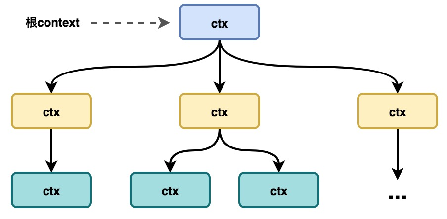
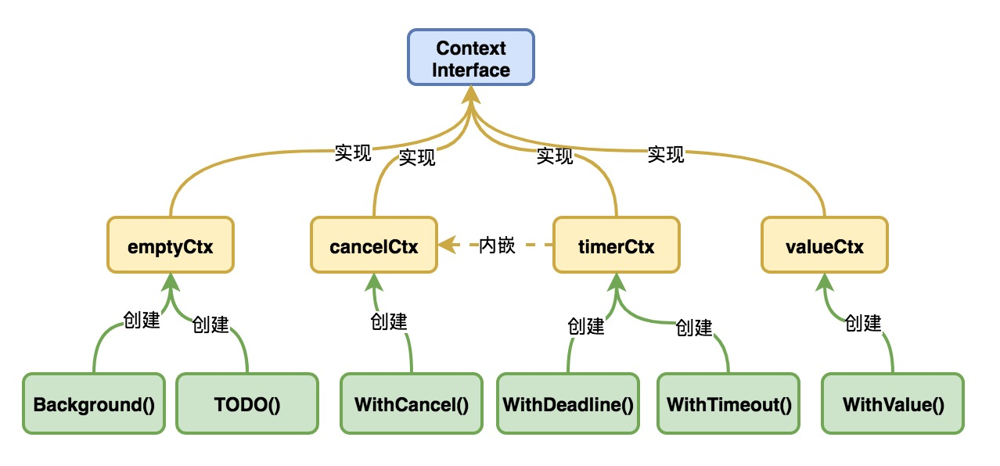
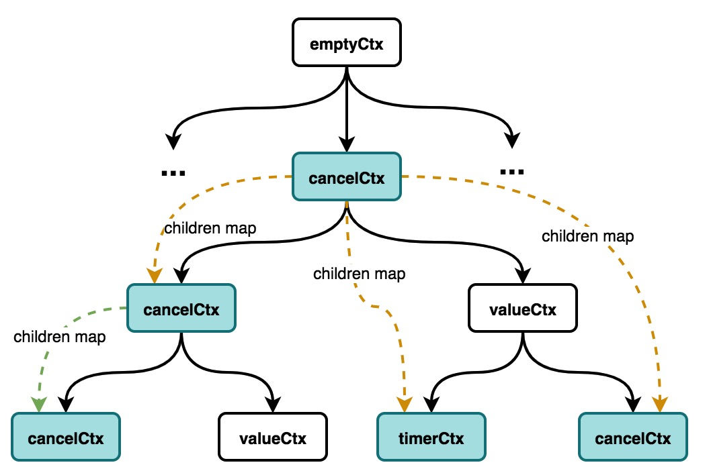
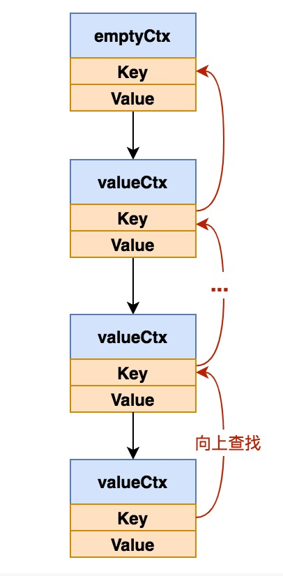

# 上下文 - context

Context是由Golang官方開發的併發控制包，一方面可以用於當請求超時或者取消時候，相關的goroutine馬上退出釋放資源，另一方面Context本身含義就是上下文，其可以在多個goroutine或者多個處理函數之間傳遞共享的信息。

創建一個新的context，必須基於一個父context，新的context又可以作爲其他context的父context。所有context在一起構造成一個context樹。



<!--more-->

## Context使用示例

Context一大用處就是超時控制。我們先看一個簡單用法。

```go
func main() {
	ctx, cancel := context.WithTimeout(context.Background(), 3 * time.Second)
	defer cancel()
	go SlowOperation(ctx)
	go func() {
		for {
			time.Sleep(300 * time.Millisecond)
			fmt.Println("goroutine:", runtime.NumGoroutine())
		}
	}()
	time.Sleep(4 * time.Second)

}

func SlowOperation(ctx context.Context) {
	done := make(chan int, 1)
	go func() { // 模擬慢操作
		dur := time.Duration(rand.Intn(5)+1) * time.Second
		time.Sleep(dur)
		done <- 1
	}()

	select {
	case <-ctx.Done():
		fmt.Println("SlowOperation timeout:", ctx.Err())
	case <-done:
		fmt.Println("Complete work")
	}
}
```

上面代碼會不停打印當前groutine數量，可以觀察到SlowOperation函數執行超時之後，goroutine數量由4個變成2個，相關goroutetine退出了。源碼可以去[go playground](https://play.golang.org/p/fjGJgMwtIl3)查看。

再看一個關於超時處理的例子， 源碼可以去[go playground](https://play.golang.org/p/DctV9268FTD)查看：

```go
// 
// 根據github倉庫統計信息接口查詢某個倉庫信息
func QueryFrameworkStats(ctx context.Context, framework string) <-chan string {
	stats := make(chan string)
	go func() {
		repos := "https://api.github.com/repos/" + framework
		req, err := http.NewRequest("GET", repos, nil)
		if err != nil {
			return
		}
		req = req.WithContext(ctx)

		client := &http.Client{}
		resp, err := client.Do(req)
		if err != nil {
			return
		}

		data, err := ioutil.ReadAll(resp.Body)
		if err != nil {
			return
		}
		defer resp.Body.Close()
		stats <- string(data)
	}()

	return stats
}

func main() {
	ctx, cancel := context.WithTimeout(context.Background(), 3*time.Second)
	defer cancel()
	framework := "gin-gonic/gin"
	select {
	case <-ctx.Done():
		fmt.Println(ctx.Err())
	case statsInfo := <-QueryFrameworkStats(ctx, framework):
		fmt.Println(framework, " fork and start info : ", statsInfo)
	}
}
```

Context另外一個用途就是傳遞上下文信息。從WithValue方法我們可以創建一個可以儲存鍵值的context

## Context源碼分析

### Context接口

首先我們來看下Context接口

```go
type Context interface {
	Deadline() (deadline time.Time, ok bool)
    Done() <-chan struct{}
    Err() error
    Value(key interface{}) interface{}
}
```

Context接口一共包含四個方法：
- Deadline：返回綁定該context任務的執行超時時間，若未設置，則ok等於false
- Done：返回一個只讀通道，當綁定該context的任務執行完成並調用cancel方法或者任務執行超時時候，該通道會被關閉
- Err：返回一個錯誤，如果Done返回的通道未關閉則返回nil,如果context如果被取消，返回`Canceled`錯誤，如果超時則會返回`DeadlineExceeded`錯誤
- Value：根據key返回，存儲在context中k-v數據

### 實現Context接口的類型

Context一共有4個類型實現了Context接口, 分別是emptyCtx, cancelCtx,timerCtx,valueCtx。每個類型都關聯一個創建方法。



#### emptyCtx

emptyCtx是int類型，**emptyCtx實現了Context接口，是一個空context，只能作爲根context**。

```go
type emptyCtx int // 

func (*emptyCtx) Deadline() (deadline time.Time, ok bool) {
	return
}

func (*emptyCtx) Done() <-chan struct{} {
	return nil
}

func (*emptyCtx) Err() error {
	return nil
}

func (*emptyCtx) Value(key interface{}) interface{} {
	return nil
}

func (e *emptyCtx) String() string {
	switch e {
	case background:
		return "context.Background"
	case todo:
		return "context.TODO"
	}
	return "unknown empty Context"
}
```

**Background/TODO**

context包還提供兩個函數返回emptyCtx類型。

```go
var (
	background = new(emptyCtx)
	todo       = new(emptyCtx)
)

func Background() Context {
	return background
}

func TODO() Context {
	return todo
}
```

Background用於創建根context，一般用於主函數、初始化和測試中，**我們創建的context一般都是基於Bacground創建的**。**TODO用於當我們不確定使用什麼樣的context的時候使用**。

#### cancelCtx

`cancelCtx`支持取消操作，取消同時也會對實現了`canceler`接口的子代進行取消操作。我們來看下`cancelCtx`結構體和`cancelceler`接口：

```go
type cancelCtx struct {
	Context
	mu       sync.Mutex
	done     chan struct{}
	children map[canceler]struct{}
	err      error
}

type canceler interface {
	cancel(removeFromParent bool, err error)
	Done() <-chan struct{}
}
```

cancelCtx:

- `Context`變量存儲其父context
- `done`變量定義了一個通道，並且只在第一次取消調用才關閉此通道。該通道是惰性創建的
- `children`是一個映射類型，用來存儲其子代context中實現的`canceler`，當該context取消時候，會遍歷該映射來讓子代context進行取消操作
- `err`記錄錯誤信息，默認是nil，僅當第一次cancel調用時候，纔會設置。

我們分別來看下cancelCtx實現的Done,Err,cancel方法。

```go
func (c *cancelCtx) Done() <-chan struct{} {
	c.mu.Lock() // 加鎖
	if c.done == nil {
    	// done通道惰性創建，只有調用Done方法時候纔會創建
		c.done = make(chan struct{})
	}
	d := c.done
	c.mu.Unlock()
	return d
}

func (c *cancelCtx) Err() error {
	c.mu.Lock()
	err := c.err
	c.mu.Unlock()
	return err
}

func (c *cancelCtx) cancel(removeFromParent bool, err error) {
	if err == nil { 
    	// 取消操作時候一定要傳遞err信息
		panic("context: internal error: missing cancel error")
	}
	c.mu.Lock()
	if c.err != nil { 
    	// 只允許第一次cancel調用操作，下一次進來直接返回
		c.mu.Unlock()
		return
	}
	c.err = err
	if c.done == nil { 
    	// 未先進行Done調用，而先行調用Cancel, 此時done是nil，
    	// 這時候複用全局已關閉的通道
		c.done = closedchan 
	} else {
    	// 關閉Done返回的通道，發送關閉信號
		close(c.done)
	}
    // 子級context依次進行取消操作
	for child := range c.children {
		child.cancel(false, err)
	}
	c.children = nil
	c.mu.Unlock()

	if removeFromParent {
    	// 將當前context從其父級context中children map中移除掉，父級Context與該Context脫鉤。
    	// 這樣當父級Context進行Cancel操作時候，不會再改Context進行取消操作了。因爲再取消也沒有意義了，因爲該Context已經取消過了
		removeChild(c.Context, c)
	}
}

func removeChild(parent Context, child canceler) {
	p, ok := parentCancelCtx(parent)
	if !ok {
		return
	}
	p.mu.Lock()
	if p.children != nil {
		delete(p.children, child)
	}
	p.mu.Unlock()
}

func parentCancelCtx(parent Context) (*cancelCtx, bool) {
	for {
		switch c := parent.(type) {
		case *cancelCtx:
			return c, true
		case *timerCtx:
			return &c.cancelCtx, true
		case *valueCtx: // 當父級context是不支持cancel操作的ValueCtx類型時候，向上一直查找
			parent = c.Context
		default:
			return nil, false
		}
	}
}
```

注意`parentCancelCtx`找到的節點不一定是就是父context，有可能是其父輩的context。可以參考下面這種圖:



**WithCancel**

接下來看cancelCtx類型Context的創建。WithCancel會創一個cancelCtx，以及它關聯的取消函數。

```go
type CancelFunc func()

func WithCancel(parent Context) (ctx Context, cancel CancelFunc) {
	// 根據父context創建新的cancelCtx類型的context
	c := newCancelCtx(parent)
    // 向上遞歸找到父輩，並將新context的canceler添加到父輩的映射中
	propagateCancel(parent, &c)
	return &c, func() { c.cancel(true, Canceled) }
}

func newCancelCtx(parent Context) cancelCtx {
	return cancelCtx{Context: parent}
}

func propagateCancel(parent Context, child canceler) {
	if parent.Done() == nil {
    	// parent.Done()返回nil表明父Context不支持取消操作
        // 大部分情況下，該父context已是根context，
        // 該父context是通過context.Background()，或者context.ToDo()創建的
		return
	}
	if p, ok := parentCancelCtx(parent); ok {
		p.mu.Lock()
		if p.err != nil {
        	// 父conext已經取消操作過，
        	// 子context立即進行取消操作，並傳遞父級的錯誤信息
			child.cancel(false, p.err)
		} else {
			if p.children == nil {
				p.children = make(map[canceler]struct{})
			}
			p.children[child] = struct{}{} 
            // 將當前context的取消添加到父context中
		}
		p.mu.Unlock()
	} else {
    	// 如果parent是不可取消的，則監控parent和child的Done()通道
		go func() {
			select {
			case <-parent.Done():
				child.cancel(false, parent.Err())
			case <-child.Done():
			}
		}()
	}
}
```

#### timerCtx

timerCtx是基於cancelCtx的context類型，它支持過期取消。

```go
type timerCtx struct {
	cancelCtx
	timer *time.Timer
	deadline time.Time
}

func (c *timerCtx) Deadline() (deadline time.Time, ok bool) {
	return c.deadline, true
}

func (c *timerCtx) String() string {
	return contextName(c.cancelCtx.Context) + ".WithDeadline(" +
		c.deadline.String() + " [" +
		time.Until(c.deadline).String() + "])"
}

func (c *timerCtx) cancel(removeFromParent bool, err error) {
	c.cancelCtx.cancel(false, err)
	if removeFromParent {
    	// 刪除與父輩context的關聯
		removeChild(c.cancelCtx.Context, c)
	}
	c.mu.Lock()
	if c.timer != nil {
    	// 停止timer並回收
		c.timer.Stop()
		c.timer = nil
	}
	c.mu.Unlock()
}
```

**WithDeadline**

WithDeadline會創建一個timerCtx，以及它關聯的取消函數

```go
func WithDeadline(parent Context, d time.Time) (Context, CancelFunc) {
	if cur, ok := parent.Deadline(); ok && cur.Before(d) {
    	// 如果父context過期時間早於當前context過期時間，則創建cancelCtx
		return WithCancel(parent)
	}
	c := &timerCtx{
		cancelCtx: newCancelCtx(parent),
		deadline:  d,
	}
	propagateCancel(parent, c)
	dur := time.Until(d)
	if dur <= 0 {
    	// 如果新創建的timerCtx正好過期了，則取消操作並傳遞DeadlineExceeded
		c.cancel(true, DeadlineExceeded)
		return c, func() { c.cancel(false, Canceled) }
	}
	c.mu.Lock()
	defer c.mu.Unlock()
	if c.err == nil {
    	// 創建定時器，時間一到執行context取消操作
		c.timer = time.AfterFunc(dur, func() {
			c.cancel(true, DeadlineExceeded)
		})
	}
	return c, func() { c.cancel(true, Canceled) }
}
```

**WithTimeout**

WithTimeout用來創建超時就會取消的context，內部實現就是WithDealine，傳遞給WithDealine的過期時間就是當前時間加上timeout時間

```go
func WithTimeout(parent Context, timeout time.Duration) (Context, CancelFunc) {
	return WithDeadline(parent, time.Now().Add(timeout))
}
```

#### valueCtx

valueCtx是可以傳遞共享信息的context。

```go
type valueCtx struct {
	Context
	key, val interface{}
}

func (c *valueCtx) Value(key interface{}) interface{} {
	if c.key == key {
    	// 當前context存在當前的key
		return c.val
	}
    
    // 當前context不存在，則會沿着context樹，向上遞歸查找，直到根context，如果一直未找到，則會返回nil
	return c.Context.Value(key)
}
```

如果當前context不存在該key，則會沿着context樹，向上遞歸查找，直到查找到根context，最後返回nil


**WithValue**

WithValue用來創建valueCtx。如果key是不可以比較的時候，則會發生恐慌。可以比較類型，可以參考[Comparison_operators](https://golang.org/ref/spec#Comparison_operators)。**key應該是不導出變量，防止衝突**。

```go
func WithValue(parent Context, key, val interface{}) Context {
	if key == nil {
		panic("nil key")
	}
	if !reflectlite.TypeOf(key).Comparable() {
		panic("key is not comparable")
	}
	return &valueCtx{parent, key, val}
}
```

## 總結

### 實現Context接口的類型

Context一共有4個類型實現了Context接口, 分別是`emptyCtx`,	`cancelCtx`,`timerCtx`,`valueCtx`。

它們的功能與創建方法如下：

| 類型 | 創建方法 | 功能 |
| --- |----|--- |
| emptyCtx | Background()/TODO() | 用做context樹的根節點 |
cancelCtx | WithCancel() | 可取消的context
timerCtx | WithDeadline()/WithTimeout() | 可取消的context，過期或超時會自動取消
valueCtx | WithValue() | 可存儲共享信息的context

### Context實現兩種遞歸

Context實現兩種方向的遞歸操作。

遞歸方向 | 目的
---|---
向下遞歸 | 當對父Context進去手動取消操作，或超時取消時候，向下遞歸處理對實現了canceler接口的後代進行取消操作
向上隊規 | 當對Context查詢Key信息時候，若當前Context沒有當前K-V信息時候，則向父輩遞歸查詢，一直到查詢到跟節點的emptyCtx，返回nil爲止

### Context使用規範
使用Context的是應該準守以下原則來保證在不同包中使用時候的接口一致性，以及能讓靜態分析工具可以檢查context的傳播：

1. 不要將Context作爲結構體的一個字段存儲，相反而應該顯示傳遞Context給每一個需要它的函數，Context應該作爲函數的第一個參數，並命名爲ctx
2. 不要傳遞一個nil Context給一個函數，即使該函數能夠接受它。如果你不確定使用哪一個Context，那你就傳遞context.TODO
3. context是併發安全的，相同的Context能夠傳遞給運行在不同goroutine的函數

## 參考資料

- [深入理解Golang之context](https://juejin.im/post/6844904070667321357)
- [Go Concurrency Patterns: Context](https://blog.golang.org/context)
- [Using Goroutines, Channels, Contexts, Timers, WaitGroups and Errgroups](https://medium.com/@ankur_a22/using-goroutines-channels-contexts-timers-waitgroups-and-errgroups-24b6062c1c93)
