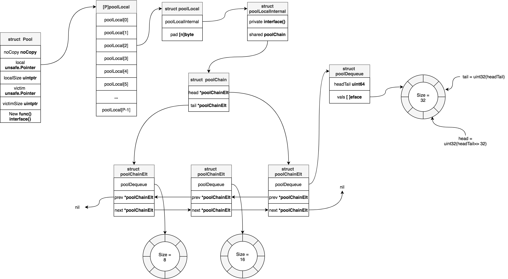
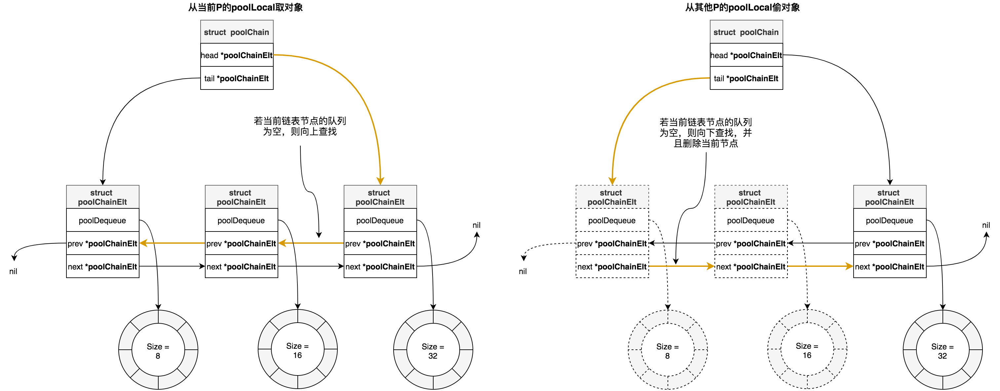
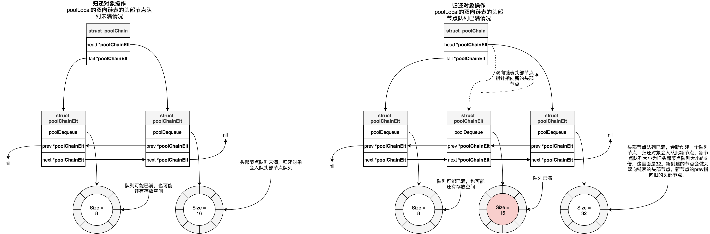
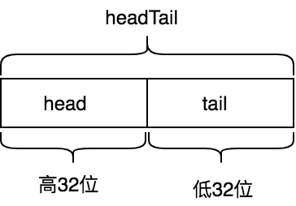
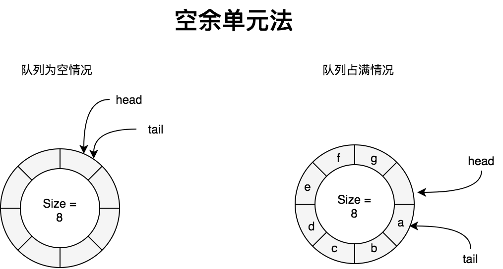
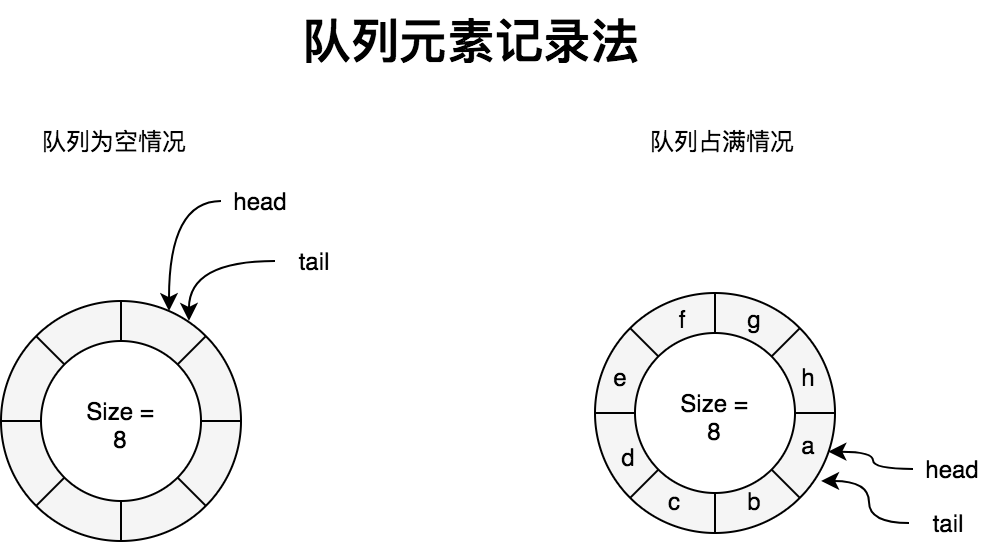

# 緩衝池 - sync.Pool

> A Pool is a set of temporary objects that may be individually saved and retrieved.

> Any item stored in the Pool may be removed automatically at any time without notification. If the Pool holds the only reference when this happens, the item might be deallocated.

> A Pool is safe for use by multiple goroutines simultaneously.

> Pool's purpose is to cache allocated but unused items for later reuse, relieving pressure on the garbage collector. That is, it makes it easy to build efficient, thread-safe free lists. However, it is not suitable for all free lists

sync.Pool提供了臨時對象緩存池，存在池子的對象可能在任何時刻被自動移除，我們對此不能做任何預期。sync.Pool**可以併發使用**，它通過**複用對象來減少對象內存分配和GC的壓力**。當負載大的時候，臨時對象緩存池會擴大，**緩存池中的對象會在每2個GC循環中清除**。

sync.Pool擁有兩個對象存儲容器：`local pool`和`victim cache`。`local pool`與`victim cache`相似，相當於`primary cache`。當獲取對象時，優先從`local pool`中查找，若未找到則再從`victim cache`中查找，若也未獲取到，則調用New方法創建一個對象返回。當對象放回sync.Pool時候，會放在`local pool`中。當GC開始時候，首先將`victim cache`中所有對象清除，然後將`local pool`容器中所有對象都會移動到`victim cache`中，所以說緩存池中的對象會在每2個GC循環中清除。

`victim cache`是從CPU緩存中借鑑的概念。下面是維基百科中關於`victim cache`的定義：

> 所謂受害者緩存（Victim Cache），是一個與直接匹配或低相聯緩存並用的、容量很小的全相聯緩存。**當一個數據塊被逐出緩存時，並不直接丟棄，而是暫先進入受害者緩存**。如果受害者緩存已滿，就替換掉其中一項。**當進行緩存標籤匹配時，在與索引指向標籤匹配的同時，並行查看受害者緩存**，如果在受害者緩存發現匹配，就將其此數據塊與緩存中的不匹配數據塊做交換，同時返回給處理器。

> 受害者緩存的意圖是彌補因爲低相聯度造成的頻繁替換所損失的時間局部性。

## 用法

sync.Pool提供兩個接口，`Get`和`Put`分別用於從緩存池中獲取臨時對象，和將臨時對象放回到緩存池中：

```go
func (p *Pool) Get() interface{}
func (p *Pool) Put(x interface{})
```

### 示例1

```go

type A struct {
	Name string
}

func (a *A) Reset() {
	a.Name = ""
}

var pool = sync.Pool{
	New: func() interface{} {
		return new(A)
	},
}

func main() {
	objA := pool.Get().(*A)
	objA.Reset() // 重置一下對象數據，防止髒數據
	defer pool.Put(objA)
	objA.Name = "test123"
	fmt.Println(objA)
}
```

接下來我們進行基準測試下未使用和使用sync.Pool情況：

```go
type A struct {
	Name string
}

func (a *A) Reset() {
	a.Name = ""
}

var pool = sync.Pool{
	New: func() interface{} {
		return new(A)
	},
}

func BenchmarkWithoutPool(b *testing.B) {
	var a *A
	b.ReportAllocs()
	b.ResetTimer()
	for i := 0; i < b.N; i++ {
		for j := 0; j < 10000; j++ {
			a = new(A)
			a.Name = "tink"
		}
	}
}

func BenchmarkWithPool(b *testing.B) {
	var a *A
	b.ReportAllocs()
	b.ResetTimer()
	for i := 0; i < b.N; i++ {
		for j := 0; j < 10000; j++ {
			a = pool.Get().(*A)
			a.Reset()
			a.Name = "tink"
			pool.Put(a) // 一定要記得放回操作，否則退化到每次都需要New操作
		}
	}
}
```

基準測試結果如下：

```
# go test -benchmem -run=^$ -bench  .
goos: darwin
goarch: amd64
BenchmarkWithoutPool-8              3404            314232 ns/op          160001 B/op      10000 allocs/op
BenchmarkWithPool-8                 5870            220399 ns/op               0 B/op          0 allocs/op
```
從上面基準測試中，我們可以看到使用sync.Pool之後，每次執行的耗時由314232ns降到220399ns，降低了29.8%，每次執行的內存分配降到0（注意這是平均值，並不是沒進行過內存分配，只不過是絕大數操作沒有進行過內存分配，最終平均下來，四捨五入之後爲0）。

### 示例2

[go-redis/redis](https://github.com/go-redis/redis)項目中實現連接池時候，使用到sync.Pool來創建定時器：

```go
// 創建timer Pool
var timers = sync.Pool{
	New: func() interface{} { // 定義創建臨時對象創建方法
		t := time.NewTimer(time.Hour)
		t.Stop()
		return t
	},
}

func (p *ConnPool) waitTurn(ctx context.Context) error {
	select {
	case <-ctx.Done():
		return ctx.Err()
	default:
	}
	...
	timer := timers.Get().(*time.Timer) // 從緩存池中取出對象
	timer.Reset(p.opt.PoolTimeout)

	select {
	...
	case <-timer.C:
		timers.Put(timer) // 將對象放回到緩存池中，以便下次使用
		atomic.AddUint32(&p.stats.Timeouts, 1)
		return ErrPoolTimeout
	}
```

## 數據結構



sync.Pool底層數據結構體是Pool結構體([sync/pool.go](https://github.com/golang/go/blob/go1.14.13/src/sync/pool.go#L44-L57))：

```go
type Pool struct {
	noCopy noCopy // nocopy機制，用於go vet命令檢查是否複製後使用

	local     unsafe.Pointer // 指向[P]poolLocal數組，P等於runtime.GOMAXPROCS(0)
	localSize uintptr        // local數組大小，即[P]poolLocal大小

	victim     unsafe.Pointer // 指向上一個gc循環前的local
	victimSize uintptr        // victim數組大小

	New func() interface{} // 創建臨時對象的方法，當從local數組和victim數組中都沒有找到臨時對象緩存，那麼會調用此方法現場創建一個
}
```

Pool.local指向大小爲`runtime.GOMAXPROCS(0)`的poolLocal數組，相當於大小爲`runtime.GOMAXPROCS(0)`的緩存槽(solt)。每一個P都會通過其ID關聯一個槽位上的poolLocal，比如對於ID=1的P關聯的poolLocal就是[1]poolLocal，這個poolLocal屬於per-P級別的poolLocal，與P關聯的M和G可以無鎖的操作此poolLocal。

poolLocal結構如下：

```go
type poolLocal struct {
	poolLocalInternal // 內嵌poolLocalInternal結構體
	// 進行一些padding，阻止false share
	pad [128 - unsafe.Sizeof(poolLocalInternal{})%128]byte
}

type poolLocalInternal struct {
	private interface{} // 私有屬性，快速存取臨時對象
	shared  poolChain   // shared是一個雙端鏈表
}
```

爲啥不直接把所有poolLocalInternal字段都寫到poolLocal裏面，而是採用內嵌形式？這是爲了好計算出poolLocal的padding大小。

poolChain結構如下：

```go
type poolChain struct {
	// 指向雙向鏈表頭
	head *poolChainElt

	// 指向雙向鏈表尾
	tail *poolChainElt
}

type poolChainElt struct {
	poolDequeue
	next, prev *poolChainElt
}

type poolDequeue struct {
	// headTail高32位是環形隊列的head
	// headTail低32位是環形隊列的tail
	// [tail, head)範圍是隊列所有元素
	headTail uint64

	vals []eface // 用於存放臨時對象，大小是2的倍數，最小尺寸是8，最大尺寸是dequeueLimit
}

type eface struct {
	typ, val unsafe.Pointer
}
```

`poolLocalInternal`的shared字段指向是一個雙向鏈表(doubly-linked list)，鏈表每一個元素都是poolChainElt類型，poolChainElt是一個雙端隊列（Double-ended Queue，簡寫deque），並且鏈表中每一個元素的隊列大小是2的倍數，且是前一個元素隊列大小的2倍。poolChainElt是基於環形隊列(Circular Queue)實現的雙端隊列。

若poolLocal屬於當前P，那麼可以對shared進行pushHead和popHead操作，而其他P只能進行popTail操作。當前其他P進行popTail操作時候，會檢查鏈表中節點的poolChainElt是否爲空，若是空，則會drop掉該節點，這樣當popHead操作時候避免去查一個空的poolChainElt。

`poolDequeue`中的headTail字段的高32位記錄的是環形隊列的head，其低32位是環形隊列的tail。vals是環形隊列的底層數組。

## Get操作

我們來看下如何從sync.Pool中取出臨時對象。下面代碼已去掉競態檢測相關代碼。

```go
func (p *Pool) Get() interface{} {
	l, pid := p.pin() // 返回當前per-P級poolLocal和P的id
	x := l.private
	l.private = nil
	if x == nil {
		x, _ = l.shared.popHead()
		if x == nil {
			x = p.getSlow(pid)
		}
	}
	runtime_procUnpin()
	if x == nil && p.New != nil {
		x = p.New()
	}
	return x
}
```

上面代碼執行流程如下：

1. 首先通過調用pin方法，獲取當前G關聯的P對應的poolLocal和該P的id
2. 接着查看poolLocal的private字段是否存放了對象，如果有的話，那麼該字段存放的對象可直接返回，這屬於最快路徑。
3. 若poolLocal的private字段未存放對象，那麼就嘗試從poolLocal的雙端隊列中取出對象，這個操作是lock-free的。
4. 若G關聯的per-P級poolLocal的雙端隊列中沒有取出來對象，那麼就嘗試從其他P關聯的poolLocal中偷一個。若從其他P關聯的poolLocal沒有偷到一個，那麼就嘗試從victim cache中取。
5. 若步驟4中也沒沒有取到緩存對象，那麼只能調用pool.New方法新創建一個對象。

我們來看下pin方法：

```go
func (p *Pool) pin() (*poolLocal, int) {
	pid := runtime_procPin() // 禁止M被搶佔
	s := atomic.LoadUintptr(&p.localSize) // 原子性加載local pool的大小
	l := p.local
	if uintptr(pid) < s {
		// 如果local pool大小大於P的id，那麼從local pool取出來P關聯的poolLocal
		return indexLocal(l, pid), pid
	}

	/*
	 * 當p.local指向[P]poolLocal數組還沒有創建
	 * 或者通過runtime.GOMAXPROCS()調大P數量時候都可能會走到此處邏輯
	 */
	return p.pinSlow()
}

func (p *Pool) pinSlow() (*poolLocal, int) {
	runtime_procUnpin()
	allPoolsMu.Lock() // 加鎖
	defer allPoolsMu.Unlock()
	pid := runtime_procPin()

	s := p.localSize
	l := p.local
	if uintptr(pid) < s { // 加鎖後再次判斷一下P關聯的poolLocal是否存在
		return indexLocal(l, pid), pid
	}
	if p.local == nil { // 將p記錄到全局變量allPools中，執行GC鉤子時候，會使用到
		allPools = append(allPools, p)
	}

	size := runtime.GOMAXPROCS(0) // 根據P數量創建p.local
	local := make([]poolLocal, size)
	atomic.StorePointer(&p.local, unsafe.Pointer(&local[0]))
	atomic.StoreUintptr(&p.localSize, uintptr(size))
	return &local[pid], pid
}

func indexLocal(l unsafe.Pointer, i int) *poolLocal {
	// 通過uintptr和unsafe.Pointer取出[P]poolLocal數組中，索引i對應的poolLocal
	lp := unsafe.Pointer(uintptr(l) + uintptr(i)*unsafe.Sizeof(poolLocal{}))
	return (*poolLocal)(lp)
}
```

pin方法中會首先調用`runtime_procPin`來設置M禁止被搶佔。GMP調度模型中，M必須綁定到P之後才能執行G，禁止M被搶佔就是禁止M綁定的P被剝奪走，相當於`pin processor`。

pin方法中爲啥要首先禁止M被搶佔？這是因爲我們需要找到per-P級的poolLocal，如果在此過程中發生M綁定的P被剝奪，那麼我們找到的就可能是其他M的per-P級poolLocal，沒有局部性可言了。

`runtime_procPin`方法是通過給M加鎖實現禁止被搶佔的，即`m.locks++`。當`m.locks==0`時候m是可以被搶佔的:

```go
//go:linkname sync_runtime_procPin sync.runtime_procPin
//go:nosplit
func sync_runtime_procPin() int {
	return procPin()
}

//go:linkname sync_runtime_procUnpin sync.runtime_procUnpin
//go:nosplit
func sync_runtime_procUnpin() {
	procUnpin()
}

//go:nosplit
func procPin() int {
	_g_ := getg()
	mp := _g_.m

	mp.locks++ // 給m加鎖
	return int(mp.p.ptr().id)
}

//go:nosplit
func procUnpin() {
	_g_ := getg()
	_g_.m.locks--
}
```

`go:linkname`是編譯指令用於將私有函數或者變量在編譯階段鏈接到指定位置。從上面代碼中我們可以看到`sync.runtime_procPin`和`sync.runtime_procUnpin`最終實現方法是`sync_runtime_procPin`和`sync_runtime_procUnpin`。

pinSlow方法用到的`allPoolsMu`和`allPools`是全局變量：

```go
var (
	allPoolsMu Mutex

	// allPools is the set of pools that have non-empty primary
	// caches. Protected by either 1) allPoolsMu and pinning or 2)
	// STW.
	allPools []*Pool

	// oldPools is the set of pools that may have non-empty victim
	// caches. Protected by STW.
	oldPools []*Pool
)
```

接下我們來看Get流程中步驟3的實現：

```go
func (c *poolChain) popHead() (interface{}, bool) {
	d := c.head // 從雙向鏈表的頭部開始
	for d != nil {
		if val, ok := d.popHead(); ok { // 從雙端隊列頭部取對象緩存，若取到則返回
			return val, ok
		}
		// 若未取到，則嘗試從上一個節點開始取
		d = loadPoolChainElt(&d.prev) 
	}
	return nil, false
}

func loadPoolChainElt(pp **poolChainElt) *poolChainElt {
	return (*poolChainElt)(atomic.LoadPointer((*unsafe.Pointer)(unsafe.Pointer(pp))))
}
```

最後我們看下Get流程中步驟4的實現：

```go
func (p *Pool) getSlow(pid int) interface{} {
	size := atomic.LoadUintptr(&p.localSize)
	locals := p.local
	for i := 0; i < int(size); i++ {
		// 嘗試從其他P關聯的poolLocal取一個，
		// 類似GMP調度模型從其他P的runable G隊列中偷一個

		// 偷的時候是雙向鏈表尾部開始偷，這個和從本地P的poolLocal取恰好是反向的
		l := indexLocal(locals, (pid+i+1)%int(size))
		if x, _ := l.shared.popTail(); x != nil {
			return x
		}
	}

	// 若從其他P的poolLocal沒有偷到，則嘗試從victim cache取
	size = atomic.LoadUintptr(&p.victimSize)
	if uintptr(pid) >= size {
		return nil
	}
	locals = p.victim
	l := indexLocal(locals, pid)
	if x := l.private; x != nil {
		l.private = nil
		return x
	}
	for i := 0; i < int(size); i++ {
		l := indexLocal(locals, (pid+i)%int(size))
		if x, _ := l.shared.popTail(); x != nil {
			return x
		}
	}

	atomic.StoreUintptr(&p.victimSize, 0)

	return nil
}

func (c *poolChain) popTail() (interface{}, bool) {
	d := loadPoolChainElt(&c.tail)
	if d == nil {
		return nil, false
	}

	for {
		d2 := loadPoolChainElt(&d.next)

		if val, ok := d.popTail(); ok { // 從雙端隊列的尾部出隊
			return val, ok
		}

		if d2 == nil { // 若下一個節點爲空，則返回。說明鏈表已經遍歷完了
			return nil, false
		}

		// 下面代碼會將當前節點從鏈表中刪除掉。
		// 爲什麼要刪掉它，因爲該節點的隊列裏面有沒有對象緩存了，
		// 刪掉之後，下次本地P取的時候，不必遍歷此空節點了
		if atomic.CompareAndSwapPointer((*unsafe.Pointer)(unsafe.Pointer(&c.tail)), unsafe.Pointer(d), unsafe.Pointer(d2)) {
			storePoolChainElt(&d2.prev, nil)
		}
		d = d2
	}
}

func storePoolChainElt(pp **poolChainElt, v *poolChainElt) {
	atomic.StorePointer((*unsafe.Pointer)(unsafe.Pointer(pp)), unsafe.Pointer(v))
}
```

我們畫出Get流程中步驟3和4的中從`local pool`取對象示意圖：



總結下從`local pool`流程是：
1. 首先從當前P的localPool的私有屬性private上取
2. 若未取到，則從localPool中由隊列組成的雙向鏈表上取，**方向是從頭部節點隊列開始，依次往上查找**
3. 如果當前P的localPool中沒有取到，則嘗試從其他P的localPool偷一個，**方向是從尾部節點隊列開始，依次向下查找**，若當前節點爲空，會把當前節點從鏈表中刪掉。

## Put操作

接下來我們還看下對象歸還操作：

```go
func (p *Pool) Put(x interface{}) {
	if x == nil {
		return
	}
	l, _ := p.pin() // 返回當前P的localPool
	if l.private == nil { // 若localPool的private沒有存放對象，那就存放在private上，這是最快路徑。取的時候優先從private上面取
		l.private = x
		x = nil
	}
	if x != nil { // 入隊
		l.shared.pushHead(x)
	}
	runtime_procUnpin()
}
```

流程步驟如下：

1. 調用pin方法，返回當前P的localPool
2. 若當前P的localPool的private屬性沒有存放對象，那就存放其上面，這是最快路徑，取的時候優先從private上面取
3. 若當前P的localPool的private屬性已經存放了歸還的對象，那麼就將對象入隊存儲。

我們接着看步驟3中代碼：

```go

func (c *poolChain) pushHead(val interface{}) {
	d := c.head
	if d == nil {
		// 雙向鏈表頭部節點爲空，則創建
		// 頭部節點的隊列長度爲8
		const initSize = 8
		d = new(poolChainElt)
		d.vals = make([]eface, initSize)
		c.head = d
		storePoolChainElt(&c.tail, d)
	}

	// 將歸還對象入隊
	if d.pushHead(val) {
		return
	}

	// 若歸還對象入隊失敗，說明當前頭部節點的隊列已滿，會走後面的邏輯：
	// 創建新的隊列節點，新的隊列長度是當前節點隊列的2倍，最大不超過dequeueLimit，
	// 然後將新的隊列節點設置爲雙向鏈表的頭部
	newSize := len(d.vals) * 2
	if newSize >= dequeueLimit {
		newSize = dequeueLimit
	}

	d2 := &poolChainElt{prev: d} // 新節點的prev指針指向舊的頭部節點
	d2.vals = make([]eface, newSize)
	c.head = d2 // 新節點成爲雙向鏈表的頭部節點
	storePoolChainElt(&d.next, d2) // 舊的頭部節點next指針指向新節點
	d2.pushHead(val) // 歸還的臨時對象入隊新節點的隊列中
}
```

從上面代碼可以看到，創建的雙向鏈表第一個節點隊列的大小爲8，第二個節點隊列大小爲16，第三個節點隊列大小爲32，依次類推，最大爲dequeueLimit。每個節點隊列的大小都是2的n次冪，這是因爲隊列使用環形隊列結構實現的，底層是數組，同前面介紹的映射一樣，定位位置時候取餘運算可以改成與運算，更高效。

我們畫出雙向鏈表中頭部節點隊列未滿和已滿兩種情況下示意圖：



## 雙端隊列 - poolDequeue

從上面Get操作和Put操作中，我們可以看到都是對poolChain操作，poolChain操作最終都是對雙端隊列poolDequeue的操作，Get操作對應poolDequeue的popHead和popTail, Put操作對應poolDequeue的pushHead。

再看一下poolDequeue結構體定義：

```go
type poolDequeue struct {
	headTail uint64
	vals []eface
}

type eface struct {
	typ, val unsafe.Pointer
}

type dequeueNil *struct{}
```

`poolDequeue`是一個無鎖的（lock-free)、固定大小的（fixed-size) 單一生產者(single-producer),多消費者（multi-consumer）隊列。單一生產者可以從隊列頭部push和pop元素，消費者可以從隊列尾部pop元素。`poolDequeue`是基於環形隊列實現的雙端隊列。所謂**雙端隊列（double-ended queue，雙端隊列，簡寫deque）是一種具有隊列和棧的性質的數據結構。雙端隊列中的元素可以從兩端彈出，其限定插入和刪除操作在表的兩端進行**。`poolDequeue`支持在兩端刪除操作，只支持在head端插入。

`poolDequeue`的headTail字段是由環形隊列的head索引（即rear索引）和tail索引（即front索引）打包而來，headTail是64位無符號整形，其高32位是head索引，低32位是tail索引：



```go
const dequeueBits = 32

func (d *poolDequeue) unpack(ptrs uint64) (head, tail uint32) {
	const mask = 1<<dequeueBits - 1
	head = uint32((ptrs >> dequeueBits) & mask)
	tail = uint32(ptrs & mask)
	return
}

func (d *poolDequeue) pack(head, tail uint32) uint64 {
	const mask = 1<<dequeueBits - 1
	return (uint64(head) << dequeueBits) |
		uint64(tail&mask)
}
```

head索引指向的是環形隊列中下一個需要填充的槽位，即新入隊元素將會寫入的位置，tail索引指向的是環形隊列中最早入隊元素位置。環形隊列中元素位置範圍是[tail, head)。

我們知道環形隊列中，爲了解決`head == tail`即可能是隊列爲空，也可能是隊列空間全部佔滿的二義性，有兩種解決辦法：1. 空餘單元法， 2. 記錄隊列元素個數法。

採用空餘單元法時，隊列中永遠有一個元素空間不使用，即隊列中元素個數最多有QueueSize -1個。此時隊列爲空和佔滿的判斷條件如下：

```
head == tail // 隊列爲空
(head + 1)%QueueSize == tail // 隊列已滿
```


而`poolDequeue`採用的是記錄隊列中元素個數法，相比空餘單元法好處就是不會浪費一個隊列元素空間。後面章節講到的有緩存通道使用到的環形隊列也是採用的這種方案。這種方案隊列爲空和佔滿的判斷條件如下：

```
head == tail // 隊列爲空
tail +  nums_of_elment_in_queue == head
```


### 刪除操作

刪除操作即出隊操作。

```go
func (d *poolDequeue) popHead() (interface{}, bool) {
	var slot *eface
	for {
		ptrs := atomic.LoadUint64(&d.headTail)
		head, tail := d.unpack(ptrs)
		if tail == head { // 隊列爲空情況
			return nil, false
		}

		head--
		ptrs2 := d.pack(head, tail)

		// 先原子性更新head索引信息，更新成功，則取出隊列最新的元素所在槽位地址
		if atomic.CompareAndSwapUint64(&d.headTail, ptrs, ptrs2) {
			slot = &d.vals[head&uint32(len(d.vals)-1)]
			break
		}
	}

	val := *(*interface{})(unsafe.Pointer(slot)) // 取出槽位對應存儲的值
	if val == dequeueNil(nil) {
		val = nil
	}

	// 不同與popTail，popHead是沒有競態問題，所以可以直接將其複製爲eface{}
	*slot = eface{}
	return val, true
}

func (d *poolDequeue) popTail() (interface{}, bool) {
	var slot *eface
	for {
		ptrs := atomic.LoadUint64(&d.headTail)
		head, tail := d.unpack(ptrs)
		if tail == head { // 隊列爲空情況
			return nil, false
		}

		ptrs2 := d.pack(head, tail+1)
		// 先原子性更新tail索引信息，更新成功，則取出隊列最後一個元素所在槽位地址
		if atomic.CompareAndSwapUint64(&d.headTail, ptrs, ptrs2) {
			slot = &d.vals[tail&uint32(len(d.vals)-1)]
			break
		}
	}

	val := *(*interface{})(unsafe.Pointer(slot))
	if val == dequeueNil(nil) {
		val = nil
	}

	/**
		理解後面代碼，我們需意識到*slot = eface{}或slot = *eface(nil)不是一個原子操作。
		這是因爲每個槽位存放2個8字節的unsafe.Pointer。而Go atomic包是不支持16字節原子操作，只能原子性操作solt中的其中一個字段。

		後面代碼中先將solt.val置爲nil，然後原子操作solt.typ，那麼pushHead操作時候，只需要判斷solt.typ是否nil，既可以判斷這個槽位完全被清空了（當solt.typ==nil時候，solt.val一定是nil）。
	 */
	slot.val = nil
	atomic.StorePointer(&slot.typ, nil)

	return val, true
}
```

### 插入操作

插入操作即入隊操作。

```go
func (d *poolDequeue) pushHead(val interface{}) bool {
	ptrs := atomic.LoadUint64(&d.headTail)
	head, tail := d.unpack(ptrs)
	if (tail+uint32(len(d.vals)))&(1<<dequeueBits-1) == head { // 隊列已寫滿情況
		return false
	}
	slot := &d.vals[head&uint32(len(d.vals)-1)]

	typ := atomic.LoadPointer(&slot.typ)
	if typ != nil { // 說明有其他Goroutine正在pop此槽位，當pop完成之後會drop掉此槽位，隊列還是保持寫滿狀態
		return false
	}

	if val == nil {
		val = dequeueNil(nil)
	}
	*(*interface{})(unsafe.Pointer(slot)) = val

	atomic.AddUint64(&d.headTail, 1<<dequeueBits)
	return true
}
```

## pool回收

文章開頭介紹sync.Pool時候，我們提到緩存池中的對象會在每2個GC循環中清除。我們現在看看這塊邏輯：

```go
func poolCleanup() {

	for _, p := range oldPools { // 清空victim cache
		p.victim = nil
		p.victimSize = 0
	}

	// 將primary cache(local pool)移動到victim cache
	for _, p := range allPools {
		p.victim = p.local
		p.victimSize = p.localSize
		p.local = nil
		p.localSize = 0
	}

	oldPools, allPools = allPools, nil
}

func init() {
	runtime_registerPoolCleanup(poolCleanup)
}
```

sync.Pool通過在包初始化時候使用`runtime_registerPoolCleanup`註冊GC的鉤子poolCleanup來進行pool回收處理。`runtime_registerPoolCleanup`函數通過編譯指令`go:linkname`鏈接到 [runtime/mgc.go](https://github.com/golang/go/blob/go1.14.13/src/runtime/mgc.go) 文件中 [sync_runtime_registerPoolCleanup](https://github.com/golang/go/blob/go1.14.13/src/runtime/mgc.go#L2214-L2217) 函數: 

```go
var poolcleanup func()

//go:linkname sync_runtime_registerPoolCleanup sync.runtime_registerPoolCleanup
func sync_runtime_registerPoolCleanup(f func()) {
	poolcleanup = f
}

func clearpools() {
	// clear sync.Pools
	if poolcleanup != nil {
		poolcleanup()
	}
	...
}

// gc入口
func gcStart(trigger gcTrigger) {
	...
	clearpools()
	...
}
```

poolCleanup函數會在一次GC時候，會將`local pool`中緩存對象移動到`victim cache`中，然後在下一次GC時候，清空`victim cache`對象。

## 進一步閱讀

- [Go: Understand the Design of Sync.Pool](https://medium.com/a-journey-with-go/go-understand-the-design-of-sync-pool-2dde3024e277)
- [CPU緩存-受害者緩存](https://zh.wikipedia.org/wiki/CPU%E7%BC%93%E5%AD%98#%E5%8F%97%E5%AE%B3%E8%80%85%E7%BC%93%E5%AD%98)
