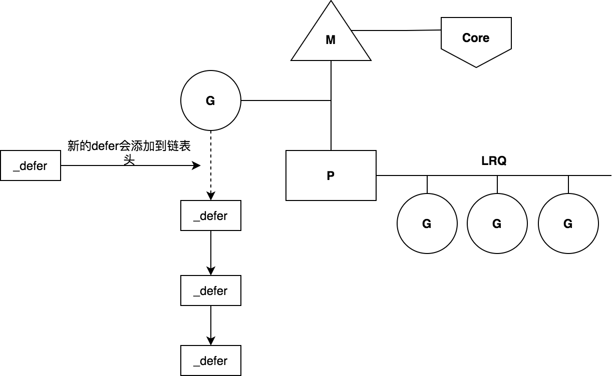
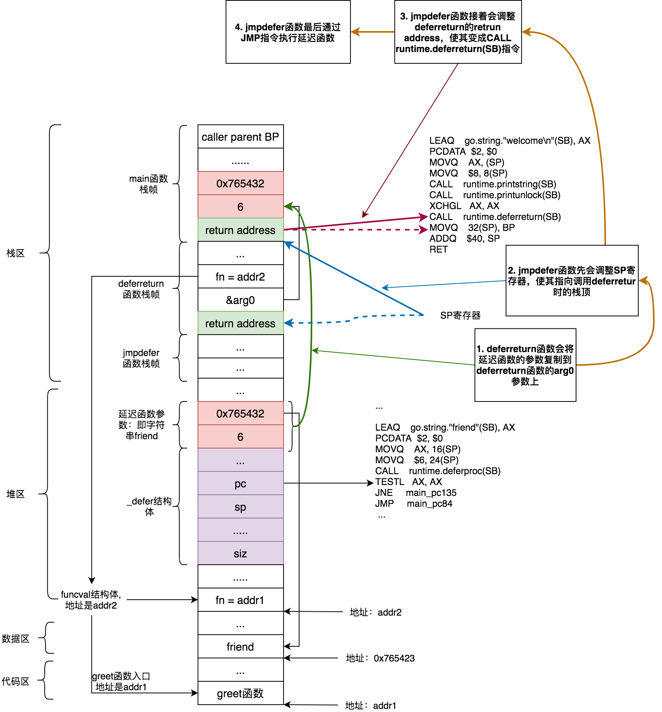

# 延遲執行 - defer語法

`defer` 語法支持是Go 語言中一大特性，通過 `defer` 關鍵字，我們可以聲明一個延遲執行函數，當調用者返回之前開始執行該函數，一般用來完成資源、鎖、連接等釋放工作，或者 `recover` 可能發生的`panic`。

## 三大特性

defer延遲執行語法有三大特性：

### defer函數的傳入參數在定義時就已經明確

```go
func main() {
	i := 1
	defer fmt.Println(i)
	i++
	return
}
```

上面代碼輸出1，而不是2。

### defer函數是按照後進先出的順序執行

```go
func main() {
	for i := 1; i <= 5; i++ {
		defer fmt.Print(i)
	}
}
```

上面代碼輸出`54321`，而不是`12345`。

### defer函數可以讀取和修改函數的命名返回值

```go
func main() {
	fmt.Println(test())
}

func test() (i int) {
	defer func() {
		i++
	}()
	return 100
}
```

上面代碼輸出輸出101，而不是100或者1。

## 白話defer原理

defer函數底層數據結構是_defer結構體，多個defer函數會構建成一個_defer鏈表，後面加入的defer函數會插入鏈表的頭部，該鏈表鏈表頭部會鏈接到G上。當函數執行完成返回的時候，會從_defer鏈表頭部開始依次執行defer函數。這也就是defer函數執行時會LIFO的原因。_defer鏈接結構示意圖如下：



創建_defer結構體是需要進行內存分配的，爲了減少分配_defer結構體時資源消耗，Go底層使用了defer緩衝池（defer pool），用來緩存上次使用完的_defer結構體，這樣下次可以直接使用，不必再重新分配內存了。defer緩衝池一共有兩級：per-P級defer緩衝池和全局defer緩衝池。當創建_defer結構體時候，優先從當前M關聯的P的緩衝池中取得_defer結構體，即從per-P緩衝池中獲取，這個過程是無鎖操作。如果per-P緩衝池中沒有，則在嘗試從全局defer緩衝池獲取，若也沒有獲取到，則重新分配一個新的_defer結構體。

當defer函數執行完成之後，Go底層會將分配的_defer結構體進行回收，先存放在per-P級defer緩衝池中，若已存滿，則存放在全局defer緩衝池中。

## 源碼分析

我們以下代碼作爲示例，分析defer實現機制：

```go
package main

func main() {
	defer greet("friend")
	println("welcome")
}

func greet(text string) {
	print("hello " + text)
}
```

在分析之前，我們先來看下defer結構體：

```go
type _defer struct {
	siz     int32 // 參數和返回值共佔用空間大小，這段空間會在_defer結構體後面，用於defer註冊時候保存參數，並在執行時候拷貝到調用者參數與返回值空間。
	started bool // 標記defer是否已經執行
	heap    bool // 標記該_defer結構體是否分配在堆上

	openDefer bool // 標誌是否使用open coded defer方式處理defer
	sp        uintptr  // 調用者棧指針，執行時會根據sp判斷該defer是否是當前執行調用者註冊的
	pc        uintptr  // deferprocStack或deferproc的返回地址
	fn        *funcval // defer函數，是funcval類型
	_panic    *_panic  // panic鏈表，用於panic處理
	link      *_defer // 鏈接到下一個_defer結構體，即該在_defer之前註冊的_defer結構體

	fd   unsafe.Pointer // funcdata for the function associated with the frame
	varp uintptr        // value of varp for the stack frame
	framepc uintptr
}
```

`_defer`結構體中`siz`字段記錄着defer函數參數和返回值大小，如果defer函數擁有參數，則Go會把其參數拷貝到該defer函數對應的_defer結構體後面的內存塊中。

`_defer`結構體中`fn`字段是指向一個funcval類型的指針，funcval結構體的fn字段字段指向defer函數的入口地址。對應上面示例代碼中就是`greet`函數的入口地址

上面示例代碼中編譯後的Go彙編代碼如下，[點擊在線查看彙編代碼](https://go.godbolt.org/z/4d74z37zr)：

```as
main_pc0:
        TEXT    "".main(SB), ABIInternal, $40-0
        MOVQ    (TLS), CX
        CMPQ    SP, 16(CX)
        JLS     main_pc151
        SUBQ    $40, SP
        MOVQ    BP, 32(SP)
        LEAQ    32(SP), BP
        FUNCDATA        $0, gclocals·33cdeccccebe80329f1fdbee7f5874cb(SB)
        FUNCDATA        $1, gclocals·33cdeccccebe80329f1fdbee7f5874cb(SB)
        FUNCDATA        $3, gclocals·9fb7f0986f647f17cb53dda1484e0f7a(SB)
        PCDATA  $2, $0
        PCDATA  $0, $0
        MOVL    $16, (SP)
        PCDATA  $2, $1
        LEAQ    "".greet·f(SB), AX
        PCDATA  $2, $0
        MOVQ    AX, 8(SP)
        PCDATA  $2, $1
        LEAQ    go.string."friend"(SB), AX
        PCDATA  $2, $0
        MOVQ    AX, 16(SP)
        MOVQ    $6, 24(SP)
        CALL    runtime.deferproc(SB)
        TESTL   AX, AX
        JNE     main_pc135
        JMP     main_pc84
main_pc84:
        CALL    runtime.printlock(SB)
        PCDATA  $2, $1
        LEAQ    go.string."welcome\n"(SB), AX
        PCDATA  $2, $0
        MOVQ    AX, (SP)
        MOVQ    $8, 8(SP)
        CALL    runtime.printstring(SB)
        CALL    runtime.printunlock(SB)
        XCHGL   AX, AX
        CALL    runtime.deferreturn(SB)
        MOVQ    32(SP), BP
        ADDQ    $40, SP
        RET
main_pc135:
        XCHGL   AX, AX
        CALL    runtime.deferreturn(SB)
        MOVQ    32(SP), BP
        ADDQ    $40, SP
        RET
```

需要注意的是上面彙編代碼是go1.12版本的彙編代碼。

從上面彙編代碼我們可以發現defer實現有兩個階段，第一個階段使用`runtime.deferproc`函數進行**defer註冊階段**。這一階段主要工作是創建defer結構，然後將其註冊到defer鏈表中。在註冊完成之後，會根據`runtime.deferproc`函數返回結果進行下一步處理，若是1則說明，defer函數有panic處理，則直接跳過defer後面的代碼，直接去執行`runtime.deferreturn`（對應就是上面彙編代碼`JNE  main_pc135`邏輯），若是0則是正常流程，則繼續後面的代碼（對應上面彙編代碼就是` JMP  main_pc84`）。

第二個階段是調用`runtime.deferreturn`函數執行**defer執行階段**。這個階段遍歷defer鏈表，獲取defer結構，然後執行defer結構中存放的defer函數信息。

### defer註冊階段

defer註冊階段是調用`deferproc`函數將創建defer結構體，並將其註冊到defer鏈表中。

```go
func deferproc(siz int32, fn *funcval) {
	if getg().m.curg != getg() { // 判斷當前G是否處在用戶棧空間上，若不是則拋出異常
		throw("defer on system stack")
	}

	sp := getcallersp()
	argp := uintptr(unsafe.Pointer(&fn)) + unsafe.Sizeof(fn) // 獲取defer函數參數起始地址
	callerpc := getcallerpc()

	d := newdefer(siz)
	if d._panic != nil {
		throw("deferproc: d.panic != nil after newdefer")
	}
	d.fn = fn
	d.pc = callerpc
	d.sp = sp
	switch siz {
	case 0:
		// Do nothing.
	case sys.PtrSize: // defer函數等於8字節大小（64位系統下），則直接將_defer結構體後面8字節空間
		*(*uintptr)(deferArgs(d)) = *(*uintptr)(unsafe.Pointer(argp))
	default:
		memmove(deferArgs(d), unsafe.Pointer(argp), uintptr(siz))
	}

	return0()
}
```

上面代碼中`getcallersp()`返回調用者SP地址。deferproc的調用者是main函數，getcallersp()返回的SP地址指向的deferproc的return address。

`getcallerpc()`返回調用者PC，此時PC指向的`CALL  runtime.deferproc(SB)`指令的下一條指令，即`TESTL   AX, AX`。

結合彙編和`deferproc`代碼，我們畫出defer註冊時狀態圖：

接下來，我們來看下newdefer函數是如何分配defer結構體的。

```go
func newdefer(siz int32) *_defer {
	var d *_defer
	sc := deferclass(uintptr(siz)) // 根據defer函數參數大小，計算出應該使用上面規格的defer緩衝池
	gp := getg()
	if sc < uintptr(len(p{}.deferpool)) { // defer緩衝池只支持5種緩衝池，從0到4，若sc規格不小於5(說明defer參數大小大於64字節)，
	// 則無法使用緩衝池，則需從內存中分配
		pp := gp.m.p.ptr() // pp指向當前M關聯的P
		if len(pp.deferpool[sc]) == 0 && sched.deferpool[sc] != nil { // 若當前P的defer緩衝池爲空，且全局緩衝池有可用的defer，那麼先從全局緩衝拿一點過來存放在P的緩衝池中
			systemstack(func() {
				lock(&sched.deferlock)
				for len(pp.deferpool[sc]) < cap(pp.deferpool[sc])/2 && sched.deferpool[sc] != nil {
					d := sched.deferpool[sc]
					sched.deferpool[sc] = d.link
					d.link = nil
					pp.deferpool[sc] = append(pp.deferpool[sc], d)
				}
				unlock(&sched.deferlock)
			})
		}
		if n := len(pp.deferpool[sc]); n > 0 {
			d = pp.deferpool[sc][n-1]
			pp.deferpool[sc][n-1] = nil
			pp.deferpool[sc] = pp.deferpool[sc][:n-1]
		}
	}
	if d == nil { // 若果需要的defer緩衝池不滿足所需的規格，或者緩衝池中沒有可用的時候，切換到系統棧上，進行defer結構內存分配。
		systemstack(func() {
			total := roundupsize(totaldefersize(uintptr(siz)))
			d = (*_defer)(mallocgc(total, deferType, true))
		})
	}
	d.siz = siz
	d.heap = true // 標記分配到堆上
	d.link = gp._defer // 插入到鏈表頭部
	gp._defer = d
	return d
}
```

總結下`newdefer`函數邏輯：

1. 首先根據defer函數的參數大小，使用`deferclass`計算出相應所需要的defer規格，如果defer緩衝池支持該規格，則嘗試從defer緩衝池取出對應的defer結構體。
2. 從defer緩衝池中取可用defer結構體時候，會首先從per-P defer緩衝池中取，若per-P defer緩衝池爲空，則嘗試從全局緩衝池中取一些可用defer結構體，然後放在per-P緩衝池，然後再從per-P緩衝池中取。
3. 若defer緩衝池不支持該規格，或者緩衝池無可用緩衝，則切換到系統棧上進行defer結構分配。

#### defer緩衝池規格

defer緩衝池，是按照defer函數參數大小範圍分爲五種規格，若不在五種規格之類，則不提供緩衝池功能，那麼每次defer註冊時候時候都必須進行內存分配創建defer結構體：

緩衝池規格 | defer函數參數大小範圍 | 對應per-P緩衝池位置 | 對應全局緩衝池位置
--- | --- | --- | ---
class0 | 0 | p.deferpool[0] | sched.deferpool[0]
class1 | [1, 16] | p.deferpool[1] | sched.deferpool[1]
class2 | [17, 32] | p.deferpool[2] | sched.deferpool[2]
class3 | [33, 48] | p.deferpool[3] | sched.deferpool[3]
class4 | [49, 64] | p.deferpool[4] | sched.deferpool[4]

defer函數參數大小與緩衝池規格轉換是通過`deferclass`函數轉換的：

```go
func deferclass(siz uintptr) uintptr {
	if siz <= minDeferArgs { // minDeferArgs是個常量，值是0
		return 0
	}
	return (siz - minDeferArgs + 15) / 16
}
```

#### per-P級defer緩衝池與全局級defer緩衝池結構

per-P級defer緩衝池結構使用兩個字段`deferpool`和`deferpoolbuf`構成緩衝池：
```go
type p struct {
	...
	deferpool    [5][]*_defer // pool of available defer structs of different sizes (see panic.go)
	deferpoolbuf [5][32]*_defer
	...
}
```

p結構體中deferpool數組的元素是_defer指針類型的切片，該切片的底層數組是deferpoolbuf數組的元素：

```go
func (pp *p) init(id int32) {
	...
	for i := range pp.deferpool {
		pp.deferpool[i] = pp.deferpoolbuf[i][:0]
	}
	...
}
```

全局級defer緩衝池保存在全局sched的deferpool字段中，sched是`schedt`類型變量，deferpool是由5個_defer類型指針構成鏈表組成的數組：

```go
type schedt struct {
	...
	deferlock mutex // 由於存在多個P併發的從全局緩衝池中獲取defer結構體，所以需要一個鎖
	deferpool [5]*_defer
	...
}
```

### defer執行階段

當函數返回之前，Go會調用`deferreturn`函數，開始執行defer函數。總之defer流程可以簡單概括爲：Go語言通過先註冊（通過調用deferproc函數），然後函數返回之前執行defer函數（通過調用deferreturn函數），實現了defer延遲執行功能。

```go
func deferreturn(arg0 uintptr) {
	gp := getg()
	d := gp._defer
	if d == nil { // defer鏈表爲空，直接返回。deferreturn是一個遞歸調用，每次調用都會從defer鏈表彈出一個defer進行執行，當defer鏈表爲空時候，說明所有defer都已經執行完成
		return
	}
	sp := getcallersp()
	if d.sp != sp { // defer保存的sp與當前調用deferreturn的調用者棧頂sp不一致，則直接返回
		return
	}

	switch d.siz {
	case 0:
	case sys.PtrSize: // 若defer參數大小是8字節，則直接將defer參數複製給arg0
		*(*uintptr)(unsafe.Pointer(&arg0)) = *(*uintptr)(deferArgs(d))
	default: // 否則進行內存移動，將defer的參數複製到arg0中，此後arg0存放的是延遲函數的參數
		memmove(unsafe.Pointer(&arg0), deferArgs(d), uintptr(d.siz))
	}
	fn := d.fn
	d.fn = nil
	gp._defer = d.link
	freedefer(d)
	jmpdefer(fn, uintptr(unsafe.Pointer(&arg0)))
}
```

deferreturn函數通過jmpdefer實現遞歸調用，jmpdefer是通過彙編實現的，jmpdefer函數完成兩個功能：調用defer函數和deferreturn再次調用。deferreturn遞歸調用時候，遞歸終止條件有兩個：1. defer鏈表爲空。2. defer保存的sp與當前調用deferreturn調用者棧頂sp不一致。第一個條件很好了解，第二個循環終止條件存在原因，我們稍後探究。

我們需要理解arg0這個變量用途。arg0看似是deferreturn的參數，實際上是用來存儲延遲函數的參數。

在調用`jmpdefer`之前，會先調用`freedefer`將當前defer結構釋放回收：

```go
func freedefer(d *_defer) {
	if d._panic != nil { // freedefer調用時_panic一定是nil
		freedeferpanic() // freedeferpanic作用是拋出異常：freedefer with d._panic != nil
	}
	if d.fn != nil { // freedefer調用時fn一定已經置爲nil
		freedeferfn() // freedeferfn作用是拋出異常：freedefer with d.fn != nil
	}
	if !d.heap { // defer結構不是在堆上分配，則無需進行回收
		return
	}
	sc := deferclass(uintptr(d.siz)) // 根據defer參數和返回值大小，判斷規格，以便決定放在哪種規格defer緩衝池中
	if sc >= uintptr(len(p{}.deferpool)) {
		return
	}
	pp := getg().m.p.ptr()
	if len(pp.deferpool[sc]) == cap(pp.deferpool[sc]) { // 當前P的defer緩衝池已滿，則將P的defer緩衝池defer取出一般放在全局defer緩衝池中
		systemstack(func() {
			var first, last *_defer
			for len(pp.deferpool[sc]) > cap(pp.deferpool[sc])/2 {
				n := len(pp.deferpool[sc])
				d := pp.deferpool[sc][n-1]
				pp.deferpool[sc][n-1] = nil
				pp.deferpool[sc] = pp.deferpool[sc][:n-1]
				if first == nil {
					first = d
				} else {
					last.link = d
				}
				last = d
			}
			lock(&sched.deferlock)
			last.link = sched.deferpool[sc]
			sched.deferpool[sc] = first
			unlock(&sched.deferlock)
		})
	}

	// 重置defer參數
	d.siz = 0
	d.started = false
	d.sp = 0
	d.pc = 0
	d.link = nil

	pp.deferpool[sc] = append(pp.deferpool[sc], d) // 將當前defer放入P的defer緩衝池中
}
```

我們來看下`jmpdefer`實現：

```bash
TEXT runtime·jmpdefer(SB), NOSPLIT, $0-16
	MOVQ	fv+0(FP), DX	# DX寄存器存儲jmpdefer第一個參數fn，fn是funcval類型指針
	MOVQ	argp+8(FP), BX	# BX寄存器存儲jmpdefer第二個參數，該參數是個指針類型，指向arg0
	LEAQ	-8(BX), SP	# 將BX存放的arg0的地址減少8，獲取得到調用deferreturn時棧頂地址（此時棧頂存放的是deferreturn的return address），最後將該地址存放在SP寄存器中
	MOVQ	-8(SP), BP	# 重置BP寄存器
	SUBQ	$5, (SP)	# 此時SP寄存器指向的是deferreturn的return address。該指令是將調用deferreturn的return address減少5，
	# 而減少5之後，return adderss恰好指向了`CALL runtime.deferreturn(SB)`，這就實現了deferreturn遞歸調用
	MOVQ 0(DX), BX # DX存儲的是fn，其是funcval類型指針，所以獲取真正函數入口地址需要0(DX)，該指令等效於BX = Mem[R[DX] + 0]。
	# 寄存器邏輯操作不瞭解的話，可以參看前面Go彙編章節
	JMP	BX	# 通過JMP指令調用延遲函數
```

從上面代碼可以看出來，jmpdefer通過彙編更改了延遲函數調用的return address，使return address指向deferreturn入口地址，這樣當延遲函數執行完成之後，會繼續調用deferreturn函數，從而實現了deferreturn遞歸調用。deferreturn和jmpdefer最後實現的邏輯的僞代碼如下：

```
function deferreturn() {
	var arg int
	for _, d := range deferLinkList {
		arg = d.arg
		d.fn(arg)
		deferreturn()
	}
}
```

畫出deferreturn調用內存和棧的狀態圖，幫助理解：



最後我們來探究一下deferreturn第二個終止條件，考慮下面的場景：

```go
func A() {
	defer B()
	defer C()
}

func C() {
	defer D()
}
```

將上面代碼轉換成成底層實現的僞代碼如下：

```
func A() {
	deferproc(B) // 註冊延遲函數B
	deferproc(C) // 註冊延遲函數C
	deferreturn() // 開始執行延遲函數
}

func C() {
	deferproc(D) // 註冊延遲函數C
	deferreturn() // 開始執行延遲函數
}
```

當調用A函數的deferreturn函數時，會從defer鏈表中取出延遲函數C進行執行，當執行C函數時，其內部也有一個defer函數，C函數最後也會調用deferreturn函數，當C函數中調用deferreturn函數時，defer鏈表結構如下：

```
              sp指向C的棧頂   sp指向A的棧頂
                    |           |
                    |           |
                    v           v
g._defer ---------> D --------> B
```
當C中的deferreturn執行完defer鏈表中延遲函數D之後，開始執行B的時候，由於B的sp指向的是A的棧頂，不等於C的棧頂，此時滿足終止條件2，C中的deferreturn會退出執行，此時A的deferreturn開始繼續執行（A的deferreturn調用其C的deferreturn函數，相當於一個大循環裏面套一個小循環，現在是小循環退出了，大循環還是會繼續的），此時由於B的sp指向就是A的棧頂，B函數會執行。

deferreturn循環終止第二個條件就是爲了解決諸於此類的場景。

## 優化歷程

上面我們分析的代碼中defer結構是分配到堆上，其實爲了優化defer語法性能，Go在實現過程可能會將defer結構分配在棧上。我們來看看Go各個版本對`defer`都做了哪些優化？

```go
package main

func main() {
	defer greet()
}

func greet() {
	print("hello")
}
```

我們以上面代碼爲例，看看其在go1.12、go1.13、go1.14這幾個版本下的核心彙編代碼：

[go1.12版本](https://go.godbolt.org/z/341cvP)：

```shell
leaq    "".greet·f(SB), AX
pcdata  $2, $0
movq    AX, 8(SP)
call    runtime.deferproc(SB)
testl   AX, AX
jne     main_pc73
.loc 1 5 0
xchgl   AX, AX
call    runtime.deferreturn(SB)
```

go1.12版本中通過調用 `runtime.deferproc` 函數，將defer函數包裝成 `_defer` 結構並註冊到defer鏈表中，該 `_defer` 結構體是分配在堆內存中，需要進行垃圾回收的。

[go1.13版本](https://go.godbolt.org/z/z95336)：

```shell
leaq    "".greet·f(SB), AX
pcdata  $0, $0
movq    AX, ""..autotmp_0+32(SP)
pcdata  $0, $1
leaq    ""..autotmp_0+8(SP), AX
pcdata  $0, $0
movq    AX, (SP)
call    runtime.deferprocStack(SB)
testl   AX, AX
jne     main_pc83
.loc 1 5 0
xchgl   AX, AX
call    runtime.deferreturn(SB)
```

go1.13版本中通過調用 `runtime.deferprocStack` 函數，將defer函數包裝成 `_defer` 結構並註冊到defer鏈表中，該 `_defer` 結構體是分配在棧上，不需要進行垃圾回收處理，這個地方就是go1.13相比go1.12所做的優化點。

[go1.14版本](https://go.godbolt.org/z/rGsc91)：

```shell
leaq    "".greet·f(SB), AX
pcdata  $0, $0
pcdata  $1, $1
movq    AX, ""..autotmp_1+8(SP)
.loc 1 5 0
movb    $0, ""..autotmp_0+7(SP)
call    "".greet(SB)
movq    16(SP), BP
addq    $24, SP
ret
call    runtime.deferreturn(SB)
```

go1.14版本不再調用`deferproc/deferprocStack` 函數來處理，而是在 `return` 返回之前直接調用該 `defer`函數（即inline方式），性能相比go1.13又得到進一步提升，go官方把這種處理方式稱爲`open-coded defer`。實際上go1.14中禁止優化和內聯之後，defer函數其底層實現方式就和go1.13一樣了。

需要注意的是 `open-coded defer` 使用是有限制的，它不能用於for循環中的defer函數，還有就是defer的數量也是有限制的，[最多支持8個defer函數](https://github.com/golang/go/blob/go1.14.13/src/cmd/compile/internal/gc/walk.go#L218-L223)，對於for循環或者數量過的defer，將使用deferproc/deferprocStack方式實現。關於 `open-coded defer` 設計細節可以參見官方設計文檔：[Proposal: Low-cost defers through inline code, and extra funcdata to manage the panic case](https://github.com/golang/proposal/blob/master/design/34481-opencoded-defers.md)

此外 `open-coded defer` 雖大大提高了 `defer` 函數執行的性能，但 `panic` 的 `recover` 的執行性能會大大變慢，這是因爲 `panic` 處理過程中會掃描 `open-coded defer` 的棧幀。具體參見`open-coded defer`的[代碼提交記錄](https://go-review.googlesource.com/c/go/+/190098)。`open-coded defer`帶來的好處的是明顯，畢竟panic是比較少發生的。

go1.14也增加了 `-d defer` 編譯選項，可以查看`defer`實現時候使用哪一種方式: 

```shell
go build -gcflags="-d defer" main.go
```

總結一下defer優化歷程：

版本 | 優化內容
--- | ---
Go1.12及以前 | defer分配到堆上，是heap-allocated defer
Go1.13 | 支持在棧上分配defer結構，減少堆上分配和GC的開銷，是stack-allocated defer
G01.14 | 支持開放式編碼defer，不再使用defer結構，直接在函數尾部調用延遲函數，是open-coded defer

## 進一步閱讀

- [What is a defer? And how many can you run?](https://tpaschalis.github.io/defer-internals/)
