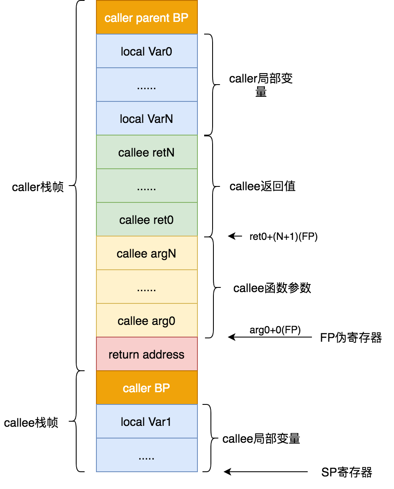
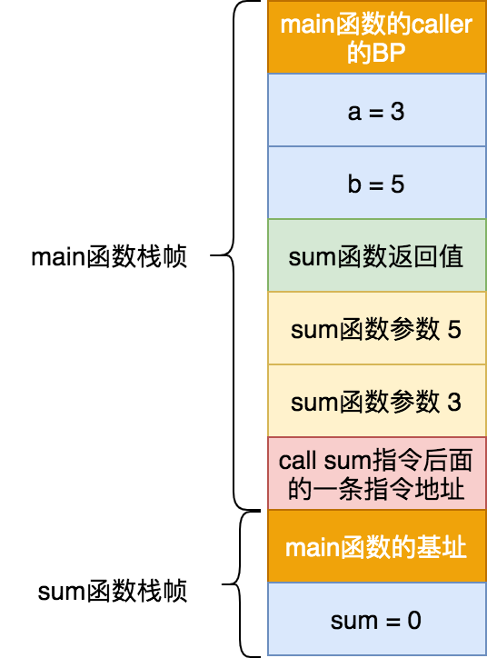
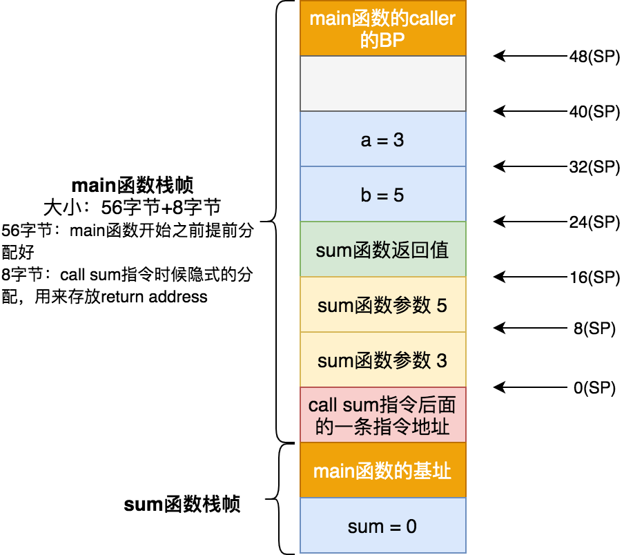

# 調用棧

這一章節延續前面《**[準備篇-Go彙編](../go-assembly.md)** 》那一章節。這一章節將從一個實例出發詳細分析Go 語言中函數調用棧。這一章節會涉及caller，callee，寄存器相關概念，如果還不太瞭解可以去《**[準備篇-Go彙編](../go-assembly.md)** 》查看了解。

在詳細分析函數棧之前，我們先複習以下幾個概念。

## caller 與 callee

如果一個函數調用另外一個函數，那麼該函數被稱爲調用者函數，也叫做caller，而被調用的函數稱爲被調用者函數，也叫做callee。比如函數main中調用sum函數，那麼main就是caller，而sum函數就是callee。

## 棧幀

棧幀（stack frame）指的是未完成函數所持有的，獨立連續的棧區域，用來保存其局部變量，返回地址等信息。

## 函數調用約定

函數調用約定(Calling Conventions)是 **[ABI](https://en.wikipedia.org/wiki/Application_binary_interface)**(Application Binary Interface) 的組成部分，它描述了：

- 如何將執行控制權交給callee，以及返還給caller
- 如何保存和恢復caller的狀態
- 如何將參數傳遞個callee
- 如何從callee獲取返回值

簡而言之，一句話就是**函數調用約定**指的是約定了函數調用時候，函數參數如何傳遞，函數棧由誰完成平衡，以及函數返回值如何返回的。

在Go語言中，**函數的參數和返回值的存儲空間是由其caller的棧幀提供**。這也爲Go語言爲啥支持多返回值以及總是值傳遞的原因。從Go彙編層面看，在callee中訪問其參數和返回值，是通過FP寄存器來操作的（在實現層面是通過SP寄存器訪問的）。**Go語言中函數參數入棧順序是從右到左入棧的**。

函數調用時候，會爲其分配棧空間用來存放臨時變量，返回值等信息，當完成調用後，這些棧空間應該進行回收，以恢復調用以前的狀態。這個過程就是**棧平衡**。棧平衡工作可以由被調用者本身(callee)完成，也可以由其調用者(caller)完成。**在Go語言中是由callee來完成棧平衡的**。

## 函數棧

當前函數作爲caller，其本身擁有的棧幀以及其所有callee的棧幀，可以稱爲該函數的函數棧，也稱函數調用棧。C語言中函數棧大小是固定的，如果超出棧空間，就會棧溢出異常。比如遞歸求斐波拉契，這時候可以使用尾調用來優化。由於Go 語言棧可以自動進行分裂擴容，棧空間不夠時候，可以自動進行擴容。當用火焰圖分析性能時候，火焰越高，說明棧越深。

Go 語言中函數棧全景圖如下：



接下來的函數調用棧分析，都是基於函數棧的全景圖出發。知道該全景圖每一部分含義也就瞭解函數調用棧。

## 實例分析

我們將分析如下代碼。

```go
package main

func sum(a, b int) int {
	sum := 0
	sum = a + b
	return sum
}

func main() {
	a := 3
	b := 5
	print(sum(a, b))
}
```

參照前面的函數棧全景圖，我們畫出main函數調用sum函數時的函數調用棧圖：



從棧底往棧頂，我們依次可以看到：

- main函數的caller的基址（Base Pointer)。這部分是黃色區域。
- main函數局部變量a,b。我們看到a,b變量按照他們出現的順序依次入棧，在實際指令中可能出現指令重排，a,b變量入棧順序可能相反，但這個不影響最終結果。這部分是藍色區域。
- 接下來是綠色區域，這部分是用來存放sum函數返回值的。這部分空間是提前分配好了。由於sum函數返回值只有一個，且是int類型，那麼綠色區域大小是8字節（64位系統下int佔用8字節）。在sum函數內部是通過FP寄存器訪問這個棧空間的。
- 在下來就是淺黃色區域，這個是存放sum函數實參的。從上面介紹中我們知道Go語言中函數參數是從右到左入棧的，sum函數的簽名是`func sum(a, b int) int`，那麼b=5會先入棧，a=3接着入棧。
- 接下來是粉紅色區域，這部分存放的是return address。main函數調用sum函數時候，會將sum函數後面的一條指令入棧。從main函數caller的基址空間到此處都屬於main的函數棧幀。
- 接下來就是sum函數棧幀空間部分。首先同main函數棧幀空間一樣，其存放的sum函數caller的基址，由於sum函數的caller就是main函數，所以這個地方存放就是main棧幀的棧底地址。
....

### 從彙編的角度觀察

接下來我們從Go 彙編角度查看main函數調用sum函數時的函數調用棧。

Go語言中函數的棧幀空間是提前分配好的，分配的空間用來存放函數局部變量，被調用函數參數，被調用函數返回值，返回地址等信息。我們來看下main函數和sum函數的彙編定義：

```as
TEXT	"".main(SB), ABIInternal, $56-0 // main函數定義
TEXT	"".sum(SB), NOSPLIT|ABIInternal, $16-24 // sum函數定義
```

從上面函數定義可以看出來給main函數分配的棧幀空間大小是56字節大小（這裏面的56字節大小，是不包括返回地址空間的，實際上main函數的棧幀大小是56+8(返回地址佔用8字節空間大小) = 64字節大小），由於main函數沒有參數和返回值，所以參數和返回值這部分大小是0。給sum函數分配的棧幀空間大小是16字節大小，sum函數參數有2個，且都是int類型，返回值是int類型，所以參數和返回值大小是24字節。

關於函數聲明時每個字段的含義可以去《**[準備篇-Go彙編-函數聲明](../go-assembly.md#函數聲明)** 》 查看：

需要注意的有兩點：

1. 函數分配的棧空間足以放下所有被調用者信息，如果一個函數會調用很多其他函數，那麼它的棧空間是按照其調用函數中最大空間要求來分配的。
2. 函數棧空間是可以split。當棧空間不足時候，會進行split，重新找一塊2倍當前棧空間的內存空間，將當前棧幀信息拷貝過去，這個叫棧分裂。Go語言在棧分裂基礎上實現了搶佔式調度，這個我們會在後續篇章詳細探討。我們可以使用 `//go:nosplit` 這個編譯指示，強制函數不進行棧分裂。從sum函數定義可以看出來，其沒有進行棧分裂處理。

接下來我們分析main函數的彙編代碼：

```bash
0x0000 00000 (main.go:9)	TEXT	"".main(SB), ABIInternal, $56-0 # main函數定義
0x0000 00000 (main.go:9)	MOVQ	(TLS), CX # 將本地線程存儲信息保存到CX寄存器中
0x0009 00009 (main.go:9)	CMPQ	SP, 16(CX) # 比較當前棧頂地址(SP寄存器存放的)與本地線程存儲的棧頂地址
0x000d 00013 (main.go:9)	PCDATA	$0, $-2 # PCDATA，FUNCDATA用於Go彙編額外信息，不必關注
0x000d 00013 (main.go:9)	JLS	114 # 如果當前棧頂地址(SP寄存器存放的)小於本地線程存儲的棧頂地址，則跳到114處代碼處進行棧分裂擴容操作
0x000f 00015 (main.go:9)	PCDATA	$0, $-1
0x000f 00015 (main.go:9)	SUBQ	$56, SP # 提前分配好56字節空間，作爲main函數的棧幀，注意此時的SP寄存器指向，會往下移動了56個字節
0x0013 00019 (main.go:9)	MOVQ	BP, 48(SP) # BP寄存器存放的是main函數caller的基址，movq這條指令是將main函數caller的基址入棧。對應就是上圖中我們看到的main函數棧幀的黃色區域。
0x0018 00024 (main.go:9)	LEAQ	48(SP), BP # 將main函數的基址存放到到BP寄存器
0x001d 00029 (main.go:9)	PCDATA	$0, $-2
0x001d 00029 (main.go:9)	PCDATA	$1, $-2
0x001d 00029 (main.go:9)	FUNCDATA	$0, gclocals·33cdeccccebe80329f1fdbee7f5874cb(SB)
0x001d 00029 (main.go:9)	FUNCDATA	$1, gclocals·33cdeccccebe80329f1fdbee7f5874cb(SB)
0x001d 00029 (main.go:9)	FUNCDATA	$2, gclocals·33cdeccccebe80329f1fdbee7f5874cb(SB)
0x001d 00029 (main.go:10)	PCDATA	$0, $0
0x001d 00029 (main.go:10)	PCDATA	$1, $0
0x001d 00029 (main.go:10)	MOVQ	$3, "".a+32(SP) # main函數局部變量a入棧
0x0026 00038 (main.go:11)	MOVQ	$5, "".b+24(SP) # main函數局部變量b入棧
0x002f 00047 (main.go:12)	MOVQ	"".a+32(SP), AX # 將局部變量a保存到AX寄存中
0x0034 00052 (main.go:12)	MOVQ	AX, (SP) # sum函數第二個參數
0x0038 00056 (main.go:12)	MOVQ	$5, 8(SP) # sum函數第一個參數
0x0041 00065 (main.go:12)	CALL	"".sum(SB) # 通過call指令調用sum函數。此時會隱式進行兩個操作：1. 將當前指令的下一條指令的地址入棧。當前指令下一條指令就是MOVQ 16(SP), AX，其相對地址是0x0046。2. IP指令寄存器指向了sum函數指令入庫地址。
0x0046 00070 (main.go:12)	MOVQ	16(SP), AX #將sum函數值保存AX寄存中。16(SP) 存放的是sum函數的返回值
0x004b 00075 (main.go:12)	MOVQ	AX, ""..autotmp_2+40(SP)
0x0050 00080 (main.go:12)	CALL	runtime.printlock(SB)
0x0055 00085 (main.go:12)	MOVQ	""..autotmp_2+40(SP), AX
0x005a 00090 (main.go:12)	MOVQ	AX, (SP)
0x005e 00094 (main.go:12)	CALL	runtime.printint(SB)
0x0063 00099 (main.go:12)	CALL	runtime.printunlock(SB)
0x0068 00104 (main.go:13)	MOVQ	48(SP), BP
0x006d 00109 (main.go:13)	ADDQ	$56, SP
0x0071 00113 (main.go:13)	RET
0x0072 00114 (main.go:13)	NOP
0x0072 00114 (main.go:9)	PCDATA	$1, $-1
0x0072 00114 (main.go:9)	PCDATA	$0, $-2
0x0072 00114 (main.go:9)	CALL	runtime.morestack_noctxt(SB) # 調用棧分裂處理函數
0x0077 00119 (main.go:9)	PCDATA	$0, $-1
0x0077 00119 (main.go:9)	JMP	0
```

結合彙編，我們最終畫出 `main` 函數調用棧圖：


