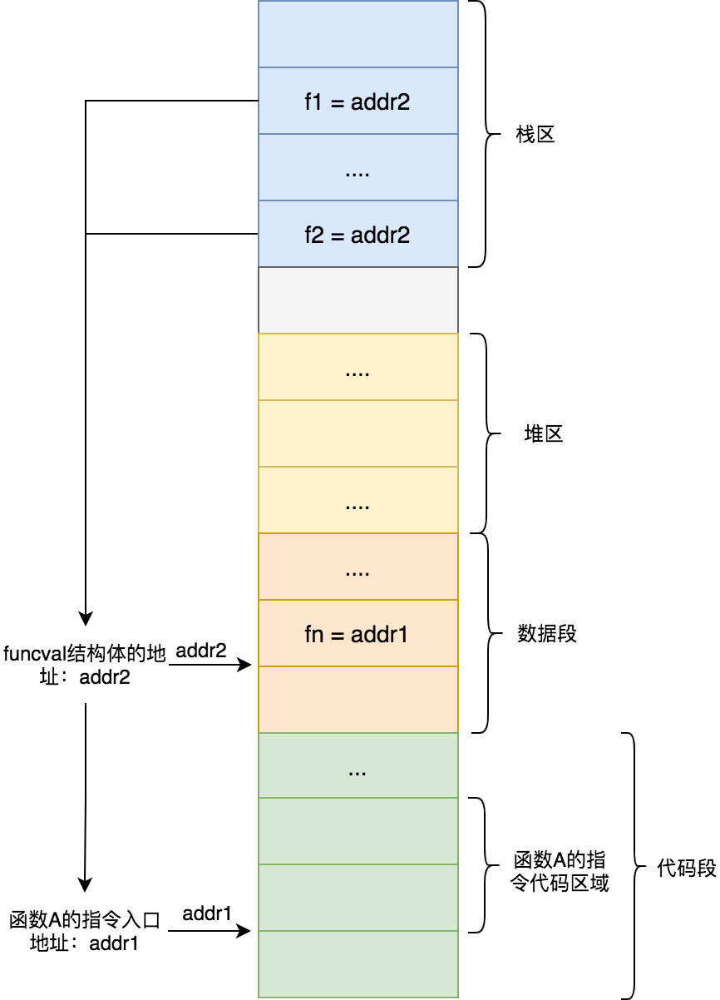
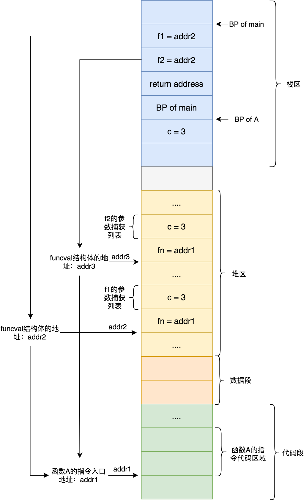

# 閉包

C語言中函數名稱就是函數的首地址。Go語言中函數名稱跟C語言一樣，函數名指向函數的首地址，即函數的入口地址。從前面《**[基礎篇-函數-一等公民](first-class.md)**》那一章節我們知道Go 語言中函數是一等公民，它可以綁定變量，作函數參數，做函數返回值，那麼它底層是怎麼實現的呢？

我們先來瞭解下 `Function Value` 這個概念。

## Function Value

Go 語言中函數是一等公民，函數可以綁定到變量，也可以做參數傳遞以及做函數返回值。Golang把這樣的參數、返回值、變量稱爲**Function value**。

Go 語言中**Function value**本質上是一個指針，但是其並不直接指向函數的入口地址，而是指向的`runtime.funcval`(**[runtime/runtime2.go](https://github.com/cyub/go-1.14.13/blob/master/src/runtime/runtime2.go#L195-L198)**)這個結構體。該結構體中的fn字段存儲的是函數的入口地址：

```go
type funcval struct {
	fn uintptr
	// variable-size, fn-specific data here
}
```

我們以下面這段代碼爲例來看下**Function value**是如何使用的:

```go
func A(i int) {
	i++
	fmt.Println(i)
}

func B() {
	f1 := A
	f1(1)
}

func C() {
	f2 := A
	f2(2)
}
```

上面代碼中，函數A被賦值給變量f1和f2，這種情況下編譯器會做出優化，讓f1和f2共用一個funcval結構體，該結構體是在編譯階段分配到數據段的只讀區域(.rodata)。如下圖所示那樣，f1和f2都指向了該結構體的地址addr2，該結構體的fn字段存儲了函數A的入口地址addr1：



爲什麼f1和f2需要通過了一個二級指針來獲取到真正的函數入口地址，而不是直接將f1，f2指向函數入口地址addr1。關於這個原因就涉及到Golang中閉包設計與實現了。

## 閉包

**閉包(Closure)** 通俗點講就是能夠訪問外部函數內部變量的函數。像這樣能被訪問的變量通常被稱爲捕獲變量。

閉包函數指令在編譯階段生成，但因爲每個閉包對象都要保存自己捕獲的變量，所以要等到執行階段才創建對應的閉包對象。我們來看下下面閉包的例子：

```go
package main

func A() func() int {
    i := 3
    return func() int {
        return i
    }
}

func main() {
    f1 := A()
    f2 := A()
    
    print(f1())
    pirnt(f2())
}
```

上面代碼中當執行main函數時，會在其棧幀區間內爲局部變量f1和f2分配棧空間，當執行第一個A函數時候，會在其棧幀空間分配棧空間來存放局部變量i，然後在堆上分配一個funcval結構體（其地址假定addr2)，該結構體的fn字段存儲的是A函數內那個閉包函數的入口地址（其地址假定爲addr1）。A函數除了分配一個funcval結構體外，還會挨着該結構體分配閉包函數的變量捕獲列表，該捕獲列表裏面只有一個變量i。由於捕獲列表的存在，所以說**閉包函數是一個有狀態函數**。

當A函數執行完畢後，其返回值賦值給f1，此時f1指向的就是地址addr2。同理下來f2指向地址addr3。f1和f2都能通過funcval取到了閉包函數入口地址，但擁有不同的捕獲列表。

當執行f1()時候，Go 語言會將其對應funcval地址存儲到特定寄存器（比如amd64平臺中使用rax寄存器），這樣在閉包函數中就可以通過該寄存器取出funcval地址，然後通過偏移找到每一個捕獲的變量。由此可以看出來**Golang中閉包就是有捕獲列表的Function value**。

根據上面描述，我們畫出內存佈局圖：



若閉包捕獲的變量會發生改變，編譯器會智能的將該變量逃逸到堆上，這樣外部函數和閉包引用的是同一個變量，此時不再是變量值的拷貝。這也是爲什麼下面代碼總是打印循環的最後面一個值。

```go
package main

func main() {
	fns := make([]func(), 0, 5)
	for i := 0; i < 5; i++ {
		fns = append(fns, func() {
			println(i)
		})
	}

	for _, fn := range fns { // 最後輸出5個5，而不是0，1，2，3，4
		fn()
	}
}
```

感興趣的可以仿造上圖，畫出上面代碼的內存佈局圖。重點關注閉包函數捕獲的不是值拷貝，而是引用一個堆變量。
