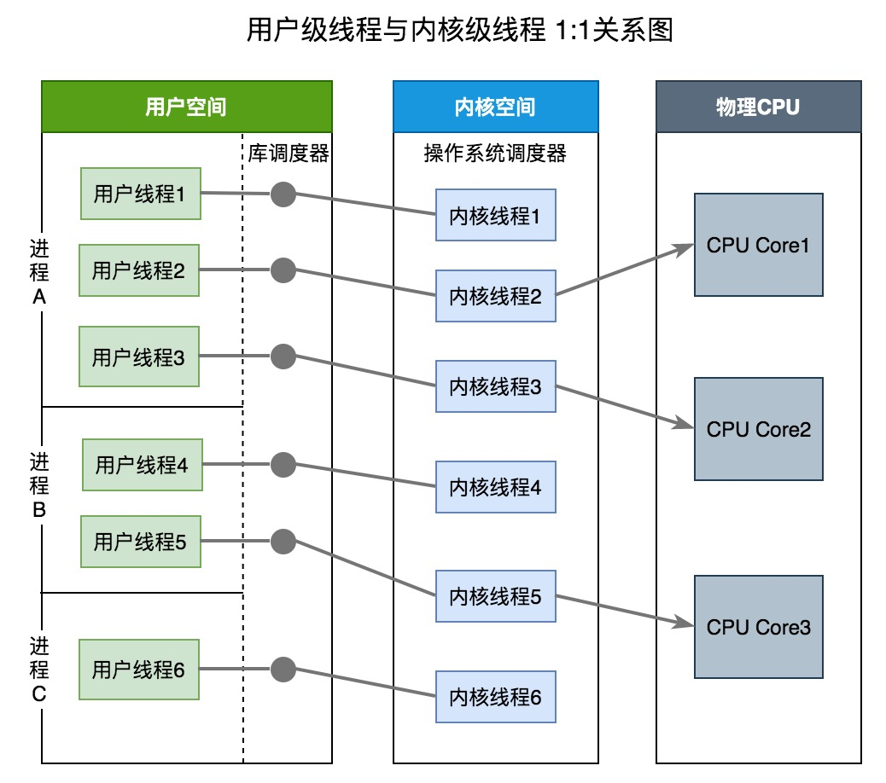
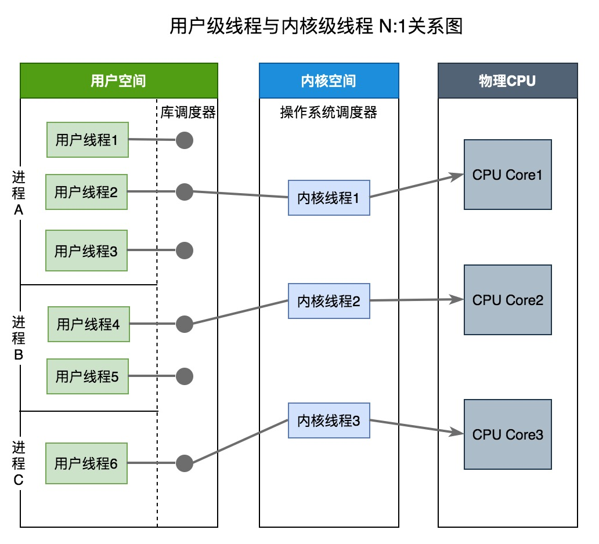
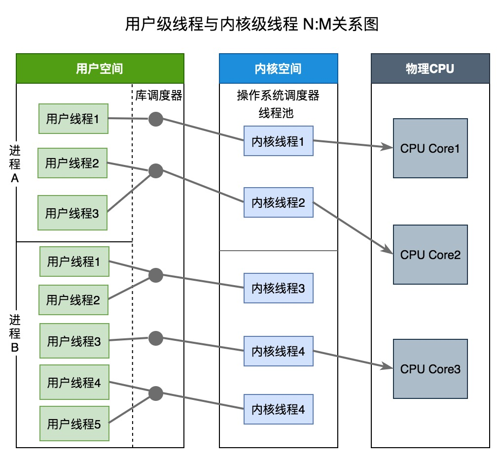
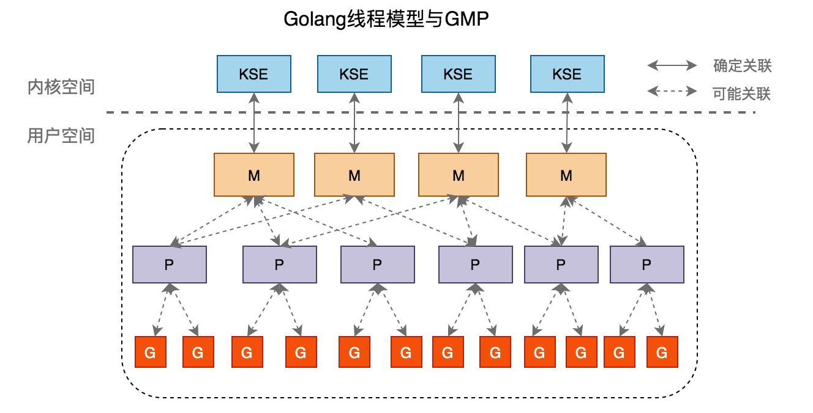
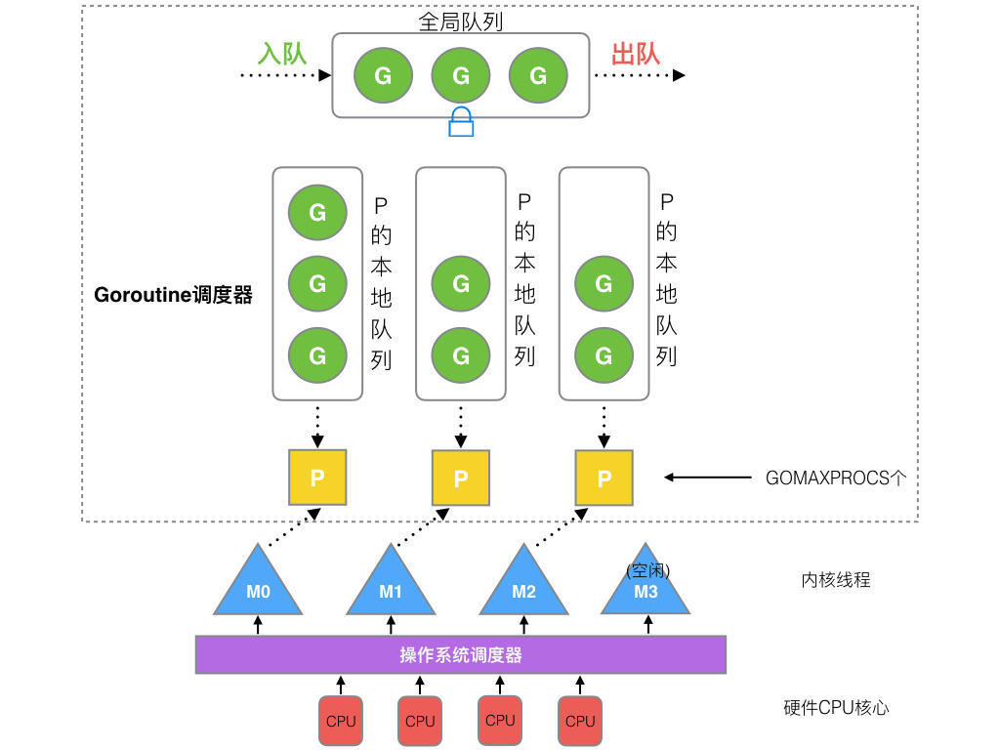
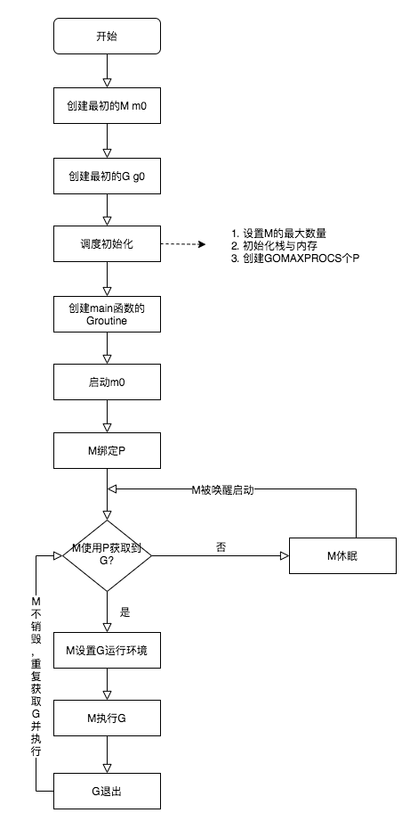
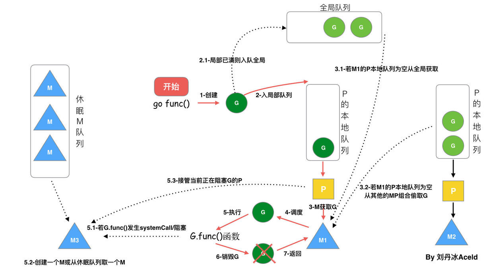

# GMP模型

Golang的一大特色就是Goroutine。Goroutine是Golang支持高併發的重要保障。Golang可以創建成千上萬個Goroutine來處理任務，將這些Goroutine分配、負載、調度到處理器上採用的是G-M-P模型。

## 什麼是Goroutine

Goroutine = Golang + Coroutine。**Goroutine是golang實現的協程，是用戶級線程**。Goroutine具有以下特點：

- 相比線程，其啓動的代價很小，以很小棧空間啓動（2Kb左右）
- 能夠動態地伸縮棧的大小，最大可以支持到Gb級別
- 工作在用戶態，切換成很小
- 與線程關係是n:m，即可以在n個系統線程上多工調度m個Goroutine

<!--more-->

## 進程、線程、Goroutine

在僅支持進程的操作系統中，進程是擁有資源和獨立調度的基本單位。在引入線程的操作系統中，**線程是獨立調度的基本單位，進程是資源擁有的基本單位**。在同一進程中，線程的切換不會引起進程切換。在不同進程中進行線程切換,如從一個進程內的線程切換到另一個進程中的線程時，會引起進程切換

線程創建、管理、調度等採用的方式稱爲線程模型。線程模型一般分爲以下三種：

- 內核級線程(Kernel Level Thread)模型
- 用戶級線程(User Level Thread)模型
- 兩級線程模型，也稱混合型線程模型

三大線程模型最大差異就在於用戶級線程與內核調度實體KSE（KSE，Kernel Scheduling Entity）之間的對應關係。**KSE是Kernel Scheduling Entity的縮寫，其是可被操作系統內核調度器調度的對象實體，是操作系統內核的最小調度單元，可以簡單理解爲內核級線程**。

**用戶級線程即協程**，由應用程序創建與管理，協程必須與內核級線程綁定之後才能執行。**線程由 CPU 調度是搶佔式的，協程由用戶態調度是協作式的，一個協程讓出 CPU 後，才執行下一個協程**。

用戶級線程(ULT)與內核級線程(KLT)比較：

 特性 |  用戶級線程	| 內核級線程
--- | ---|----
創建者 | **應用程序** | **內核**
操作系統是否感知存在| 否 | 是
開銷成本 | **創建成本低，上下文切換成本低**，上下文切換不需要硬件支持	| **創建成本高，上下文切換成本高**，上下文切換需要硬件支持
如果線程阻塞 |整個進程將被阻塞。即不能利用多處理來發揮併發優勢	| 其他線程可以繼續執行,進程不會阻塞
案例  | Java thread, POSIX threads | Window Solaris

### 內核級線程模型



**內核級線程模型中用戶線程與內核線程是一對一關係（1 : 1）**。**線程的創建、銷燬、切換工作都是有內核完成的**。應用程序不參與線程的管理工作，只能調用內核級線程編程接口(應用程序創建一個新線程或撤銷一個已有線程時，都會進行一個系統調用）。每個用戶線程都會被綁定到一個內核線程。用戶線程在其生命期內都會綁定到該內核線程。一旦用戶線程終止，兩個線程都將離開系統。

操作系統調度器管理、調度並分派這些線程。運行時庫爲每個用戶級線程請求一個內核級線程。操作系統的內存管理和調度子系統必須要考慮到數量巨大的用戶級線程。操作系統爲每個線程創建上下文。進程的每個線程在資源可用時都可以被指派到處理器內核。

內核級線程模型有如下優點：

- 在多處理器系統中，內核能夠並行執行同一進程內的多個線程
- 如果進程中的一個線程被阻塞，不會阻塞其他線程，是能夠切換同一進程內的其他線程繼續執行
- 當一個線程阻塞時，內核根據選擇可以運行另一個進程的線程，而用戶空間實現的線程中，運行時系統始終運行自己進程中的線程

缺點：
- 線程的創建與刪除都需要CPU參與，成本大

### 用戶級線程模型



**用戶線程模型中的用戶線程與內核線程KSE是多對一關係（N : 1）**。**線程的創建、銷燬以及線程之間的協調、同步等工作都是在用戶態完成**，具體來說就是由應用程序的線程庫來完成。**內核對這些是無感知的，內核此時的調度都是基於進程的**。線程的併發處理從宏觀來看，任意時刻每個進程只能夠有一個線程在運行，且只有一個處理器內核會被分配給該進程。

從上圖中可以看出來：庫調度器從進程的多個線程中選擇一個線程，然後該線程和該進程允許的一個內核線程關聯起來。內核線程將被操作系統調度器指派到處理器內核。用戶級線程是一種”多對一”的線程映射

用戶級線程有如下優點：

- 創建和銷燬線程、線程切換代價等線程管理的代價比內核線程少得多, 因爲保存線程狀態的過程和調用程序都只是本地過程
- 線程能夠利用的表空間和堆棧空間比內核級線程多

缺點：
- 線程發生I/O或頁面故障引起的阻塞時，如果調用阻塞系統調用則內核由於不知道有多線程的存在，而會阻塞整個進程從而阻塞所有線程, 因此同一進程中只能同時有一個線程在運行
- 資源調度按照進程進行，多個處理機下，同一個進程中的線程只能在同一個處理機下分時複用

### 兩級線程模型



**兩級線程模型中用戶線程與內核線程是一對一關係（N : M）**。兩級線程模型充分吸收上面兩種模型的優點，儘量規避缺點。其線程創建在用戶空間中完成，線程的調度和同步也在應用程序中進行。一個應用程序中的多個用戶級線程被綁定到一些（小於或等於用戶級線程的數目）內核級線程上。

### Golang的線程模型

**Golang在底層實現了混合型線程模型**。M即系統線程，由系統調用產生，一個M關聯一個KSE，即兩級線程模型中的系統線程。G爲Groutine，即兩級線程模型的的應用及線程。M與G的關係是N:M。



## G-M-P模型概覽



G-M-P分別代表：

- G - Goroutine，Go協程，是參與調度與執行的最小單位
- M - Machine，指的是系統級線程
- P - Processor，指的是邏輯處理器，P關聯了的本地可運行G的隊列(也稱爲LRQ)，最多可存放256個G。

GMP調度流程大致如下：

- 線程M想運行任務就需得獲取 P，即與P關聯。
- 然從 P 的本地隊列(LRQ)獲取 G
- 若LRQ中沒有可運行的G，M 會嘗試從全局隊列(GRQ)拿一批G放到P的本地隊列，
- 若全局隊列也未找到可運行的G時候，M會隨機從其他 P 的本地隊列偷一半放到自己 P 的本地隊列。
- 拿到可運行的G之後，M 運行 G，G 執行之後，M 會從 P 獲取下一個 G，不斷重複下去。

### 調度的生命週期



- M0 是啓動程序後的編號爲 0 的主線程，這個 M 對應的實例會在全局變量 runtime.m0 中，不需要在 heap 上分配，M0 負責執行初始化操作和啓動第一個 G， 在之後 M0 就和其他的 M 一樣了
- G0 是每次啓動一個 M 都會第一個創建的 gourtine，G0 僅用於負責調度的 G，G0 不指向任何可執行的函數，每個 M 都會有一個自己的 G0。在調度或系統調用時會使用 G0 的棧空間，全局變量的 G0 是 M0 的 G0

上面生命週期流程說明：

- runtime 創建最初的線程 m0 和 goroutine g0，並把兩者進行關聯（g0.m = m0)
- 調度器初始化：設置M最大數量，P個數，棧和內存出事，以及創建 GOMAXPROCS個P
- 示例代碼中的 main 函數是 main.main，runtime 中也有 1 個 main 函數 ——runtime.main，代碼經過編譯後，runtime.main 會調用 main.main，程序啓動時會爲 runtime.main 創建 goroutine，稱它爲 main goroutine 吧，然後把 main goroutine 加入到 P 的本地隊列。
- 啓動 m0，m0 已經綁定了 P，會從 P 的本地隊列獲取 G，獲取到 main goroutine。
- G 擁有棧，M 根據 G 中的棧信息和調度信息設置運行環境
- M 運行 G
- G 退出，再次回到 M 獲取可運行的 G，這樣重複下去，直到 main.main 退出，runtime.main 執行 Defer 和 Panic 處理，或調用 runtime.exit 退出程序。

### G-M-P的數量

G 的數量：

理論上沒有數量上限限制的。查看當前G的數量可以使用`runtime. NumGoroutine()`

P 的數量：

由啓動時環境變量 `$GOMAXPROCS` 或者是由`runtime.GOMAXPROCS()` 決定。這意味着在程序執行的任意時刻都只有 $GOMAXPROCS 個 goroutine 在同時運行。

M 的數量:

go 語言本身的限制：go 程序啓動時，會設置 M 的最大數量，默認 10000. 但是內核很難支持這麼多的線程數，所以這個限制可以忽略。
runtime/debug 中的 SetMaxThreads 函數，設置 M 的最大數量
一個 M 阻塞了，會創建新的 M。M 與 P 的數量沒有絕對關係，一個 M 阻塞，P 就會去創建或者切換另一個 M，所以，即使 P 的默認數量是 1，也有可能會創建很多個 M 出來。

### 調度的流程狀態



從上圖我們可以看出來：

- 每個P有個局部隊列，局部隊列保存待執行的goroutine(流程2)，當M綁定的P的的局部隊列已經滿了之後就會把goroutine放到全局隊列(流程2-1)
- 每個P和一個M綁定，M是真正的執行P中goroutine的實體(流程3)，M從綁定的P中的局部隊列獲取G來執行
- 當M綁定的P的局部隊列爲空時，M會從全局隊列獲取到本地隊列來執行G(流程3.1)，當從全局隊列中沒有獲取到可執行的G時候，M會從其他P的局部隊列中偷取G來執行(流程3.2)，這種從其他P偷的方式稱爲**work stealing**
- 當G因系統調用(syscall)阻塞時會阻塞M，此時P會和M解綁即**hand off**，並尋找新的idle的M，若沒有idle的M就會新建一個M(流程5.1)。
- 當G因channel或者network I/O阻塞時，不會阻塞M，M會尋找其他runnable的G；當阻塞的G恢復後會重新進入runnable進入P隊列等待執行(流程5.3)

### 調度過程中阻塞

GMP模型的阻塞可能發生在下面幾種情況：

- I/O，select
- block on syscall
- channel
- 等待鎖
- runtime.Gosched()

#### 用戶態阻塞

當goroutine因爲channel操作或者network I/O而阻塞時（實際上golang已經用netpoller實現了goroutine網絡I/O阻塞不會導致M被阻塞，僅阻塞G），對應的G會被放置到某個wait隊列(如channel的waitq)，該G的狀態由_Gruning變爲_Gwaitting，而M會跳過該G嘗試獲取並執行下一個G，如果此時沒有runnable的G供M運行，那麼M將解綁P，並進入sleep狀態；當阻塞的G被另一端的G2喚醒時（比如channel的可讀/寫通知），G被標記爲runnable，嘗試加入G2所在P的runnext，然後再是P的Local隊列和Global隊列。

#### 系統調用阻塞

當G被阻塞在某個系統調用上時，此時G會阻塞在_Gsyscall狀態，M也處於 block on syscall 狀態，此時的M可被搶佔調度：執行該G的M會與P解綁，而P則嘗試與其它idle的M綁定，繼續執行其它G。如果沒有其它idle的M，但P的Local隊列中仍然有G需要執行，則創建一個新的M；當系統調用完成後，G會重新嘗試獲取一個idle的P進入它的Local隊列恢復執行，如果沒有idle的P，G會被標記爲runnable加入到Global隊列。

## G-M-P內部結構

### G的內部結構

G的內部結構中重要字段如下，完全結構參見[源碼](https://github.com/golang/go/blob/5622128a77b4af5e5dc02edf53ecac545e3af730/src/runtime/runtime2.go#L387)

```go
type g struct {
    stack       stack   // g自己的棧
    m            *m      // 隸屬於哪個M
    sched        gobuf   // 保存了g的現場，goroutine切換時通過它來恢復
    atomicstatus uint32  // G的運行狀態
    goid         int64
    schedlink    guintptr // 下一個g, g鏈表
    preempt      bool //搶佔標記
    lockedm      muintptr // 鎖定的M,g中斷恢復指定M執行
    gopc          uintptr  // 創建該goroutine的指令地址
    startpc       uintptr  // goroutine 函數的指令地址
}
```

G的狀態有以下9種，可以參見[代碼](https://github.com/golang/go/blob/5622128a77b4af5e5dc02edf53ecac545e3af730/src/runtime/runtime2.go#L15)：

狀態 | 值 | 含義
---|---|---
_Gidle | 0 | 剛剛被分配，還沒有進行初始化。
_Grunnable | 1 | 已經在運行隊列中，還沒有執行用戶代碼。
_Grunning | 2 | 不在運行隊列裏中，已經可以執行用戶代碼，此時已經分配了 M 和 P。
_Gsyscall | 3 | 正在執行系統調用，此時分配了 M。
_Gwaiting | 4 | 在運行時被阻止，沒有執行用戶代碼，也不在運行隊列中，此時它正在某處阻塞等待中。Groutine wait的原因有哪些參加[代碼](https://github.com/golang/go/blob/5622128a77b4af5e5dc02edf53ecac545e3af730/src/runtime/runtime2.go#L846)
_Gmoribund_unused | 5 |尚未使用，但是在 gdb 中進行了硬編碼。
_Gdead | 6 |尚未使用，這個狀態可能是剛退出或是剛被初始化，此時它並沒有執行用戶代碼，有可能有也有可能沒有分配堆棧。
_Genqueue_unused |7 | 尚未使用。
_Gcopystack |8 |正在複製堆棧，並沒有執行用戶代碼，也不在運行隊列中。

### M的結構

M的內部結構，完整結構參見[源碼](https://github.com/golang/go/blob/5622128a77b4af5e5dc02edf53ecac545e3af730/src/runtime/runtime2.go#L452)

```go
type m struct {
    g0      *g     // g0, 每個M都有自己獨有的g0

    curg          *g       // 當前正在運行的g
    p             puintptr // 隸屬於哪個P
    nextp         puintptr // 當m被喚醒時，首先擁有這個p
    id            int64
    spinning      bool // 是否處於自旋

    park          note
    alllink       *m // on allm
    schedlink     muintptr // 下一個m, m鏈表
    mcache        *mcache  // 內存分配
    lockedg       guintptr // 和 G 的lockedm對應
    freelink      *m // on sched.freem
}
```

### P的內部結構

P的內部結構，完全結構參見[源碼](https://github.com/golang/go/blob/5622128a77b4af5e5dc02edf53ecac545e3af730/src/runtime/runtime2.go#L523)

```go
type p struct {
    id          int32
    status      uint32 // P的狀態
    link        puintptr // 下一個P, P鏈表
    m           muintptr // 擁有這個P的M
    mcache      *mcache  

    // P本地runnable狀態的G隊列，無鎖訪問
    runqhead uint32
    runqtail uint32
    runq     [256]guintptr
    
    runnext guintptr // 一個比runq優先級更高的runnable G

    // 狀態爲dead的G鏈表，在獲取G時會從這裏面獲取
    gFree struct {
        gList
        n int32
    }

    gcBgMarkWorker       guintptr // (atomic)
    gcw gcWork

}
```

P有以下幾種狀態，參加[源碼](https://github.com/golang/go/blob/5622128a77b4af5e5dc02edf53ecac545e3af730/src/runtime/runtime2.go#L100)

狀態 | 值 | 含義
---|---|---
_Pidle | 0 | 剛剛被分配，還沒有進行進行初始化。
_Prunning | 1 | 當 M 與 P 綁定調用 acquirep 時，P 的狀態會改變爲 _Prunning。
_Psyscall | 2 | 正在執行系統調用。
_Pgcstop | 3 | 暫停運行，此時系統正在進行 GC，直至 GC 結束後纔會轉變到下一個狀態階段。
_Pdead | 4 | 廢棄，不再使用。

### 調度器的內部結構

調度器內部結構，完全結構參見[源碼](https://github.com/golang/go/blob/5622128a77b4af5e5dc02edf53ecac545e3af730/src/runtime/runtime2.go#L604)

```go
type schedt struct {

    lock mutex

    midle        muintptr // 空閒M鏈表
    nmidle       int32    // 空閒M數量
    nmidlelocked int32    // 被鎖住的M的數量
    mnext        int64    // 已創建M的數量，以及下一個M ID
    maxmcount    int32    // 允許創建最大的M數量
    nmsys        int32    // 不計入死鎖的M數量
    nmfreed      int64    // 累計釋放M的數量

    pidle      puintptr // 空閒的P鏈表
    npidle     uint32   // 空閒的P數量

    runq     gQueue // 全局runnable的G隊列
    runqsize int32  // 全局runnable的G數量

    // Global cache of dead G's.
    gFree struct {
        lock    mutex
        stack   gList // Gs with stacks
        noStack gList // Gs without stacks
        n       int32
    }

    // freem is the list of m's waiting to be freed when their
    // m.exited is set. Linked through m.freelink.
    freem *m
}
```

## 觀察調度流程

### GODEBUG trace方式

GODEBUG 變量可以控制運行時內的調試變量，參數以逗號分隔，格式爲：name=val。觀察GMP可以使用下面兩個參數：

- schedtrace：設置 schedtrace=X 參數可以使運行時在每 X 毫秒輸出一行調度器的摘要信息到標準 err 輸出中。

- scheddetail：設置 schedtrace=X 和 scheddetail=1 可以使運行時在每 X 毫秒輸出一次詳細的多行信息，信息內容主要包括調度程序、處理器、OS 線程 和 Goroutine 的狀態。

```go
package main

import (
    "sync"
    "time"
)

func main() {
	var wg sync.WaitGroup

	for i := 0; i < 2000; i++ {
		wg.Add(1)
		go func() {
			a := 0

			for i := 0; i < 1e6; i++ {
				a += 1
			}

			wg.Done()
        }()
        time.Sleep(100 * time.Millisecond)
	}

	wg.Wait()
}
```
執行一下命令：

> GODEBUG=schedtrace=1000 go run ./test.go

輸出內容如下：

```
SCHED 0ms: gomaxprocs=1 idleprocs=1 threads=4 spinningthreads=0 idlethreads=1 runqueue=0 [0]
SCHED 1001ms: gomaxprocs=1 idleprocs=1 threads=4 spinningthreads=0 idlethreads=2 runqueue=0 [0]
SCHED 2002ms: gomaxprocs=1 idleprocs=1 threads=4 spinningthreads=0 idlethreads=2 runqueue=0 [0]
SCHED 3002ms: gomaxprocs=1 idleprocs=1 threads=4 spinningthreads=0 idlethreads=2 runqueue=0 [0]
SCHED 4003ms: gomaxprocs=1 idleprocs=1 threads=4 spinningthreads=0 idlethreads=2 runqueue=0 [0]
```

輸出內容解釋說明：

- SCHED XXms: SCHED是調度日誌輸出標誌符。XXms是自程序啓動之後到輸出當前行時間
- gomaxprocs： P的數量，等於當前的 CPU 核心數，或者GOMAXPROCS環境變量的值
- idleprocs： 空閒P的數量，與gomaxprocs的差值即運行中P的數量
- threads： 線程數量，即M的數量
- spinningthreads：自旋狀態線程的數量。當M沒有找到可供其調度執行的 Goroutine 時，該線程並不會銷燬，而是出於自旋狀態
- idlethreads：空閒線程的數量
- runqueue：全局隊列中G的數量
- [0]：表示P本地隊列下G的數量，有幾個P中括號裏面就會有幾個數字

### Go tool trace方式

```go
func main() {
	// 創建trace文件
	f, err := os.Create("trace.out")
	if err != nil {
		panic(err)
	}
	defer f.Close()

	// 啓動trace goroutine
	err = trace.Start(f)
	if err != nil {
		panic(err)
	}
	defer trace.Stop()

	// main
	fmt.Println("Hello trace")
}

```

執行下面命令產生trace文件trace.out：

> go run test.go

執行下面命令，打開瀏覽器，打開控制檯查看。

> go tool trace trace.out

### 總結

1. Golang的線程模型採用的是混合型線程模型，線程與協程關係是N:M。
2. Golang混合型線程模型實現採用GMP模型進行調度，G是goroutine，是golang實現的協程，M是OS線程，P是邏輯處理器。
3. 每一個M都需要與一個P綁定，P擁有本地可運行G隊列，M是執行G的單元，M獲取可運行G流程是先從P的本地隊列獲取，若未獲取到，則從其他P偷取過來（即work steal)，若其他的P也沒有則從全局G隊列獲取，若都未獲取到，則M將處於自旋狀態，並不會銷燬。
4. 當執行G時候，發生通道阻塞等用戶級別阻塞時候，此時M不會阻塞，M會繼續尋找其他可運行的G，當阻塞的G恢復之後，重新進入P的隊列等待執行，若G進行系統調用時候，會阻塞M，此時P會和M解綁(即hand off)，並尋找新的空閒的M。若沒有空閒的就會創建一個新的M。
5. Work Steal和Hand Off保證了線程的高效利用。

**G-M-P高效的保證策略有：**

- M是可以複用的，不需要反覆創建與銷燬，當沒有可執行的Goroutine時候就處於自旋狀態，等待喚醒
- Work Stealing和Hand Off策略保證了M的高效利用
- 內存分配狀態(mcache)位於P，G可以跨M調度，不再存在跨M調度局部性差的問題
- M從關聯的P中獲取G，不需要使用鎖，是lock free的

## 參考資料

- [Golang 調度器 GMP 原理與調度全分析](https://learnku.com/articles/41728)
- [Go: Work-Stealing in Go Scheduler](https://medium.com/a-journey-with-go/go-work-stealing-in-go-scheduler-d439231be64d)
- [線程的3種實現方式--內核級線程, 用戶級線程和混合型線程](https://blog.csdn.net/gatieme/article/details/51892437)
