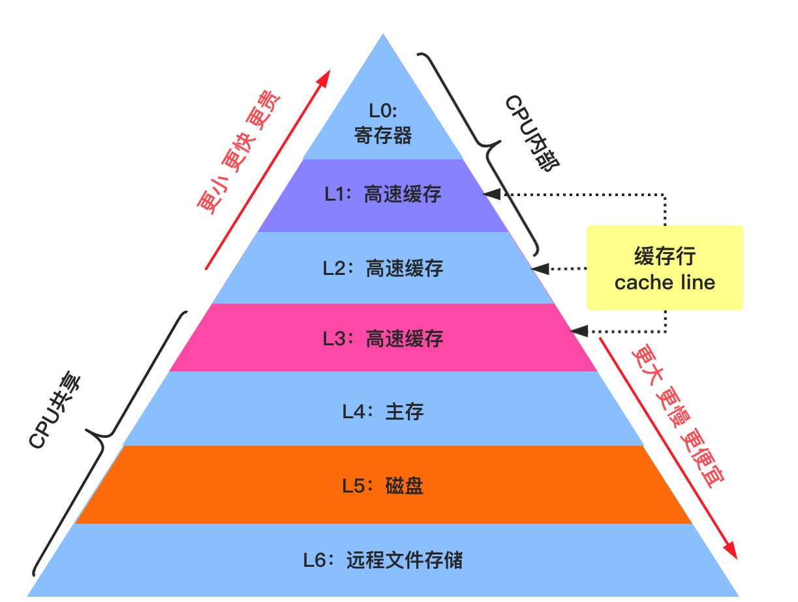
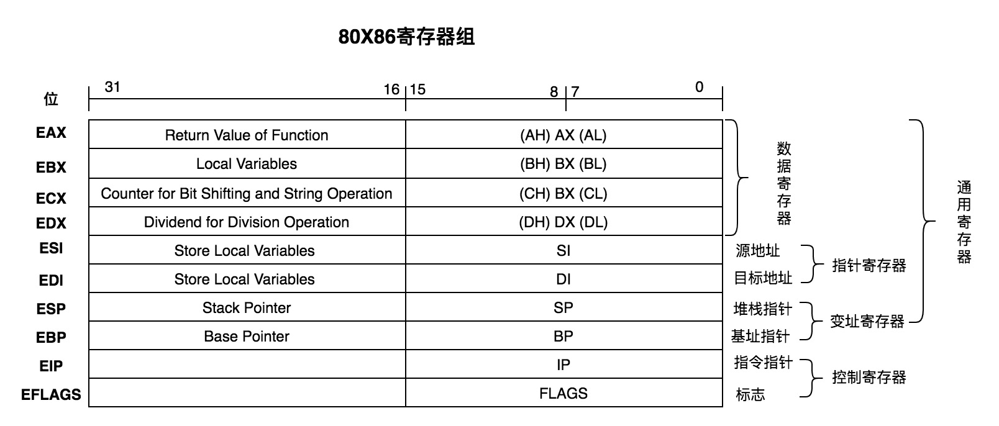
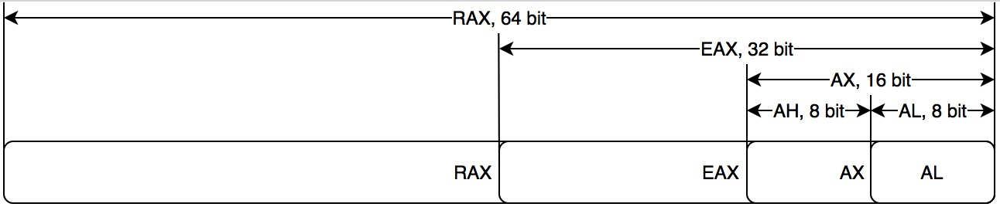
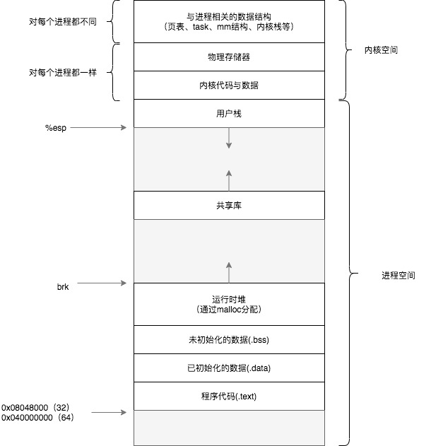

# Go彙編

本節將介紹Go語言所使用到的彙編知識。在介紹Go彙編之前，我們先了解一些彙編語言，寄存器， AT&T 彙編語法，內存佈局等前置知識點。這些知識點與Go彙編或多或少有關係，瞭解這些才能更好的幫助我們去看懂Go彙編代碼。

## 前置知識

### 機器語言

機器語言是機器指令的集合。計算機的機器指令是一系列二進制數字。計算機將之轉換爲一系列高低電平脈衝信號來驅動硬件工作的。

### 彙編語言

機器指令是由0和1組成的二進制指令，難以編寫與記憶。彙編語言是二進制指令的文本形式，與機器指令一一對應，相當於機器指令的助記碼。比如，加法的機器指令是`00000011`寫成彙編語言就是`ADD`。**彙編的指令格式由操作碼和操作數組成**。

將助記碼標準化後稱爲`assembly language`，縮寫爲`asm`，中文譯爲彙編語言。

彙編語言大致可以分爲兩類：

1. 基於x86架構處理器的彙編語言

    - Intel 彙編
        - DOS(8086處理器), Windows
        - Windows 派系 -> VC 編譯器
    - AT&T 彙編
        - Linux, Unix, Mac OS, iOS(模擬器)
        - Unix派系 -> GCC編譯器
2. 基於ARM 架構處理器的彙編語言

    - ARM 彙編

#### 數據單元大小

彙編中數據單元大小可分爲：

- 位 bit
- 半字節 Nibble
- 字節 Byte
- 字 Word 相當於兩個字節
- 雙字 Double Word 相當於2個字，4個字節
- 四字 Quadword 相當於4個字，8個字節

### 寄存器

寄存器是CPU中存儲數據的器件，起到數據緩存作用。內存按照內存層級(memory hierarchy)依次分爲寄存器，L1 Cache, L2 Cache, L3 Cache，其讀寫延遲依次增加，實現成本依次降低。



#### 寄存器分類

一個CPU中有多個寄存器。每一個寄存器都有自己的名稱。寄存器按照種類分爲通用寄存器和控制寄存器。其中通用寄存器有可細分爲數據寄存器，指針寄存器，以及變址寄存器。



1979年因特爾推出8086架構的CPU，開始支持16位。爲了兼容之前8008架構的8位CPU，8086架構中AX寄存器高8位稱爲AH，低8位稱爲AL，用來對應8008架構的8位的A寄存器。後來隨着x86，以及x86-64
架構的CPU推出，開始支持32位以及64位，爲了兼容並保留了舊名稱，16位處理器的AX寄存器拓展成EAX(E代表拓展Extended的意思)。對於64位處理器的寄存器相應的RAX(R代表寄存器Register的意思)。其他指令也類似。



各個寄存器功能介紹：

寄存器 | 功能
---|---
**AX**| A代表累加器Accumulator，X是八位寄存器AH和AL的中H和L的佔位符，表示AX由AH和AL組成。AX一般用於算術與邏輯運算，以及作爲函數返回值
**BX** | B代表Base，BX一般用於保存中間地址(hold indirect addresses)
**CX** | C代表Count，CX一般用於計數，比如使用它來計算循環中的迭代次數或指定字符串中的字符數
**DX** | D代表Data，DX一般用於保存某些算術運算的溢出，並且在訪問80x86 I/O總線上的數據時保存I/O地址
**DI** | DI代表Destination Index，DI一般用於指針
**SI** | SI代表Source Index，SI用途同DI一樣
**SP** | SP代表Stack Pointer，是棧指針寄存器，存放着執行函數對應棧幀的棧頂地址，且始終指向棧頂
**BP** | BP代表Base Pointer，是棧幀基址指針寄存器，存放這執行函數對應棧幀的棧底地址，一般用於訪問棧中的局部變量和參數
**IP** | IP代表Instruction Pointer，是指令寄存器，指向處理器下條等待執行的指令地址(代碼段內的偏移量)，每次執行完相應彙編指令IP值就會增加；IP是個特殊寄存器，不能像訪問通用寄存器那樣訪問它。IP可被jmp、call和ret等指令隱含地改變

### 進程在虛擬內存中佈局

32位系統下，虛擬內存空間大小爲4G，每一個進程獨立的運行在該虛擬內存空間上。從0x00000000開始的3G空間屬於用戶空間，剩下1G空間屬於內核空間。

用戶空間還可以進一步細分，每一部分叫做段(section)，大致可以分爲以下幾段：
- Stack 棧空間：用於函數調用中存儲局部變量、返回地址、返回值等，向下增長，變量存儲和使用過程叫做入棧和出棧過程
- Heap 堆空間：用於動態申請的內存，比如c語言通過malloc函數調用分配內存，其向上增長。指針型變量指向的一般就是這裏面的空間。存儲此空間的數據需要GC的。棧上變量scope是函數級的，而堆上變量屬於進程級的
- Bss段：未初始化數據區，存儲未初始化的全局變量或靜態變量
- Data段：初始化數據區，存儲已經初始化的全局變量或靜態變量
- Text段：代碼區，存儲的是源碼編譯後二進制指令



在32位系統中進程空間(即用戶空間）範圍爲`0x00000000 ~ 0xbfffffff`，內核空間範圍爲`0xc0000000 ~ 0xffffffff`, 實際上分配的進程空間並不是從0x00000000開始的，而是從0x08048000開始，到0xbfffffff結束。另外進程實際的esp指向的地址並不是從0xbfffffff開始的，因爲linux系統會在程序初始化前，將一些命令行參數及環境變量以及ELF輔助向量（`ELF Auxiliary Vectors`)等信息放到棧上。進程啓動時，其空間佈局如下所示（注意圖示中地址是從低地址到高地址的）：

```
stack pointer ->    [ argc = number of args ]     4
                    [ argv[0] (pointer) ]         4   (program name)
                    [ argv[1] (pointer) ]         4
                    [ argv[..] (pointer) ]        4 * x
                    [ argv[n - 1] (pointer) ]     4
                    [ argv[n] (pointer) ]         4   (= NULL)

                    [ envp[0] (pointer) ]         4
                    [ envp[1] (pointer) ]         4
                    [ envp[..] (pointer) ]        4
                    [ envp[term] (pointer) ]      4   (= NULL)

                    [ auxv[0] (Elf32_auxv_t) ]    8
                    [ auxv[1] (Elf32_auxv_t) ]    8
                    [ auxv[..] (Elf32_auxv_t) ]   8
                    [ auxv[term] (Elf32_auxv_t) ] 8   (= AT_NULL vector)

                    [ padding ]                   0 - 16

                    [ argument ASCIIZ strings ]   >= 0
                    [ environment ASCIIZ strings ]   >= 0
                    [ program name ASCIIZ strings ]   >= 0

  (0xbffffffc)      [ end marker ]                4   (= NULL)

  (0xc0000000)      < bottom of stack >           0   (virtual)
```

進程空間起始位置處存放命令行參數個數與參數信息，我們將在後面章節有討論到。

### caller 與 callee

如果一個函數調用另外一個函數，那麼該函數被稱爲調用者函數，也叫做caller，而被調用的函數稱爲被調用者函數，也叫做callee。比如函數main中調用sum函數，那麼main就是caller，而sum函數就是callee。

### 棧幀

棧幀即stack frame，即未完成函數所持有的，獨立連續的棧區域，用來保存其局部變量，返回地址等信息。

### 函數棧

當前函數作爲caller，其本身擁有的棧幀以及其所有callee的棧幀，可以稱爲該函數的函數棧。一般情況下函數棧大小是固定的，如果超出棧空間，就會棧溢出異常。比如遞歸求斐波拉契，這時候可以使用尾調用來優化。用火焰圖分析性能時候，火焰越高，說明棧越深。

### AT&T 彙編語法

AT＆T彙編語法是類Unix的系統上的標準彙編語法，比如gcc、gdb中默認都是使用AT&T彙編語法。AT&T彙編的指令格式如下：

```bash
instruction src dst
```
其中`instruction`是指令助記符，也叫操作碼，比如`mov`就是一個指令助記符，`src`是源操作數，`dst`是目的操作。

當引用寄存器時候，應在寄存器名稱加前綴`%`，對於常數，則應加前綴 **$**。

#### 指令分類

##### 數據傳輸指令

彙編指令 | 邏輯表達式 | 含義
--- | ---|---
mov $0x05, %ax | R[ax] = 0x05 | 將數值5存儲到寄存器ax中
mov %ax, -4(%bp)  | mem[R[bp] -4] = R[ax] | 將ax寄存器中存儲的數據存儲到<br/>**bp寄存器存的地址減去4之後的內存地址**中，
mov -4(%bp), %ax | R[ax] = mem[R[bp] -4] | bp寄存器存儲的地址減去4值，<br/>然後改地址對應的內存存儲的信息存儲到ax寄存器中
mov $0x10, (%sp) | mem[R[sp]] = 0x10 | 將16存儲到sp寄存器存儲的地址對應的內存
push $0x03 | mem[R[sp]] = 0x03<br/> R[sp] = R[sp] - 4 | 將數值03入棧，然後sp寄存器存儲的地址減去4
pop | R[sp] = R[sp] + 4 | 將當前sp寄存器指向的地址的變量出棧，<br/>並將sp寄存器存儲的地址加4
call func1 | --- | 調用函數func1
ret | --- | 函數返回，將返回值存儲到寄存器中或caller棧中，<br/>並將return address彈出到ip寄存器中

當使用`mov`指令傳遞數據時，數據的大小由mov指令的後綴決定。

```as
movb $123, %eax // 1 byte
movw $123, %eax // 2 byte
movl $123, %eax // 4 byte
movq $123, %eax // 8 byte
```

##### 算術運算指令

指令 | 含義
--- | ---
subl $0x05, %eax | R[eax] = R[eax] - 0x05
subl %eax, -4(%ebp) | mem[R[ebp] -4] = mem[R[ebp] -4] - R[eax]
subl -4(%ebp), %eax | R[eax] = R[eax] - mem[R[ebp] -4]

##### 跳轉指令

指令 | 含義
--- | --- 
cmpl %eax %ebx | 計算 R[eax] - R[ebx], 然後設置flags寄存器
jmp location| 無條件跳轉到location
je location | 如果flags寄存器設置了相等標誌，則跳轉到location
jg, jge, jl, gle, jnz, ... location | 如果flags寄存器設置了>, >=, <, <=, != 0等標誌，則跳轉到location

##### 棧與地址管理指令

指令 | 含義 | 等同操作
--- | --- | ---
pushl %eax | 將R[eax]入棧 | subl $4, %esp; <br/>movl %eax, (%esp)
popl %eax | 將棧頂數據彈出，然後存儲到R[eax] | movl (%esp), %eax <br/> addl $4, %esp
leave | Restore the callers stack pointer | movl %ebp, %esp <br/>pop %ebp
lea	8(%esp), %esi | 將R[esp]存放的地址加8，然後存儲到R[esi] | R[esi] = R[esp] + 8

**lea** 是`load effective address`的縮寫，用於將一個內存地址直接賦給目的操作數。

##### 函數調用指令

指令 | 含義
--- | ---
call label | 調用函數，並將返回地址入棧
ret | 從棧中彈出返回地址，並跳轉至該返回地址
leave | 恢復調用者者棧指針

> **警告**
> **注意：**
>
> 以上指令分類並不規範和完整，比如 `call` , `ret` 都可以算作無條件跳轉指令，這裏面是按照功能放在函數調用這一分類了。

## Go 彙編

Go語言彙編器採用Plan9 彙編語法，該彙編語言是由貝爾實驗推出來的。下面說的Go彙編也就是Plan9 彙編。
不同於C語言彙編中彙編指令的寄存器都是代表硬件寄存器，Go彙編中的寄存器使用的是僞寄存器，可以把Go彙編考慮成是底層硬件彙編之上的抽象。

### 僞寄存器

Go彙編一共有4個僞寄存器：

- **FP**: Frame pointer: arguments and locals.

  - 使用形如 symbol+offset(FP) 的方式，引用函數的輸入參數。例如 arg0+0(FP)，arg1+8(FP)
  - offset是正值

- **PC**: Program counter: jumps and branches.

  - PC寄存器，在 x86 平臺下對應 ip 寄存器，amd64 上則是 rip

- **SB**: Static base pointer: global symbols.

  - 全局靜態基指針，一般用來聲明函數或全局變量

- **SP**: Stack pointer: top of stack.

  - SP寄存器指向當前棧幀的局部變量的開始位置，使用形如 symbol+offset(SP) 的方式，引用函數的局部變量。
  - offset是負值，offset 的合法取值是 [-framesize, 0)。
  - 手寫彙編代碼時，如果是 symbol+offset(SP) 形式，則表示僞寄存器 SP。如果是 offset(SP) 則表示硬件寄存器 SP。**對於編譯輸出(go tool compile -S / go tool objdump)的代碼來講，所有的 SP 都是硬件寄存器 SP，無論是否帶 symbol**。

### 函數聲明

```bash
                              參數大小+返回值大小
                                  | 
 TEXT pkgname·add(SB),NOSPLIT,$32-16
       |        |               |
      包名     函數名         棧幀大小
```

- `TEXT`指令聲明瞭`pagname.add`是在`.text`段
- `pkgname·add`中的`·`，是一個 `unicode` 的中點。在程序被鏈接之後，所有的中點`·`都會被替換爲點號`.`，所以通過 **[GDB](analysis-tools/gdb.md)** 調試打斷點時候，應該是 `b pagname.add`
- `(SB)`: `SB` 是一個虛擬寄存器，保存了靜態基地址(static-base) 指針，即我們程序地址空間的開始地址。 `"".add(SB)` 表明我們的符號add位於某個固定的相對地址空間起始處的偏移位置
    ```shell
    objdump -j .text -t test | grep 'main.add' # 可獲得main.add的絕對地址
   ```

- `NOSPLIT`: 表明該函數內部不進行棧分裂邏輯處理，可以避免CPU資源浪費。關於棧分裂會在調度器章節介紹
- `$32-16`: `$32`代表即將分配的棧幀大小；而`$16`指定了傳入的參數與返回值的大小

#### 函數調用棧

Go彙編中函數調用的參數以及返回值都是由棧傳遞和保存的，這部分空間由`caller`在其棧幀(stack frame)上提供。Go彙編中沒有使用PUSH/POP指令進行棧的伸縮處理，所有棧的增長和收縮是通過在棧指針寄存器`SP`上分別執行加減指令來實現的。

```bash
                                                                                             
                                       caller                                                
                                 +------------------+                                        
                                 |                  |                                        
       +---------------------->  |------------------|                                        
       |                         | caller parent BP |                                        
       |                         |------------------|  <--------- BP(pseudo SP)              
       |                         |   local Var0     |                                        
       |                         |------------------|                                        
       |                         |   .........      |                                        
       |                         |------------------|                                        
       |                         |   local VarN     |                                        
       |                         |------------------|                                        
       |                         |   temporarily    |                                        
                                 |   unused space   |                                        
caller stack frame               |------------------|                                        
                                 |   callee retN    |                                        
       |                         |------------------|                                        
       |                         |   .........      |                                        
       |                         |------------------|                                        
       |                         |   callee ret0    |                                        
       |                         |------------------|                                        
       |                         |   callee argN    |                                        
       |                         |------------------|                                        
       |                         |   .........      |                                        
       |                         |------------------|                                        
       |                         |   callee arg0    |                                        
       |                         |------------------|  <--------- FP(virtual register)       
       |                         |   return addr    |                                        
       +---------------------->  |------------------|  <----------------------+              
                                 |   caller BP      |                         |              
          BP(pseudo SP) ------>  |------------------|                         |              
                                 |   local Var0     |                         |              
                                 |------------------|                         |              
                                 |   local Var1     |                                        
                                 |------------------|                   callee stack frame   
                                 |   .........      |                                        
                                 |------------------|                         |              
                                 |   local VarN     |                         |              
      SP(Real Register) ------>  |------------------|                         |              
                                 |                  |                         |              
                                 |                  |                         |              
                                 +------------------+  <----------------------+              
                                                                                             
                                      callee                                                 
```

關於Go彙編進一步知識，我們將在 《**[基礎篇-函數-函數調用棧](function/call-stack.md)** 》 章節詳細探討說明，此處我們只需要大致瞭解下函數聲明、調用棧概念即可。

### 獲取Go彙編代碼

go代碼示例：

```go
package main

import "fmt"

//go:noinline
func add(a, b int)  int {
    return a + b
}

func main() {
    c := add(3, 5)
    fmt.Println(c)
}
```

#### go tool compile

```bash
go tool compile -N -l -S main.go
GOOS=linux GOARCH=amd64 go tool compile -N -l -S main.go # 指定系統和架構
```

- -N選項指示禁止優化
- -l選項指示禁止內聯
- -S選項指示打印出彙編代碼

若要禁止指定函數內聯優化，也可以在函數定義處加上`noinline`編譯指示：

```go
//go:noinline
func add(a, b int)  int {
    return a + b
}
```

#### go tool objdump

方法1： 根據目標文件反編譯出彙編代碼

```bash
go tool compile -N -l main.go # 生成main.o
go tool objdump main.o
go tool objdump -s "main.(main|add)" ./test # objdump支持搜索特定字符串
```

方法2： 根據可執行文件反編譯出彙編代碼

```bash
go build -gcflags="-N -l" main.go -o test
go tool objdump main.o
```

#### go build -gcflags -S

```bash
go build -gcflags="-N -l -S"  main.go
```

#### 其他方法

- [objdump命令](https://en.wikipedia.org/wiki/Objdump)
- [go編譯器：gccgo](https://github.com/golang/gofrontend)
- [在線轉換匯編代碼：godbolt](https://go.godbolt.org/)

## 進一步閱讀

- [Go官方：A Quick Guide to Go's Assembler](https://golang.org/doc/asm)
- [plan9 assembly 完全解析](https://github.com/cch123/golang-notes/blob/master/assembly.md)
- [x86 Assembly book](https://en.wikibooks.org/wiki/X86_Assembly#Table_of_Contents)
- [What is an ABI?](https://www.section.io/engineering-education/what-is-an-abi/)
