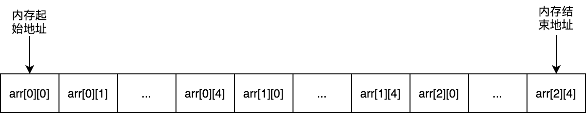
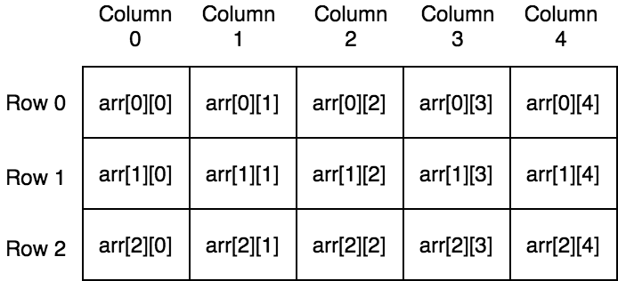

# 數組

數組是Go語言中常見的數據結構，相比切片，數組我們使用的比較少。

## 初始化

Go語言數組有兩個聲明初始化方式，一種需要顯示指明數組大小，另一種使用 `...` 保留字， 數組的長度將由編譯器在編譯階段推斷出來：

```go
arr1 := [3]int{1, 2, 3} // 使用[n]T方式
arr2 := [...]int{1, 2, 3} // 使用[...]T方式
arr3 := [3]int{2: 3} // 使用[n]T方式
arr4 := [...]int{2: 3} // 使用[...]T方式
```

> **警告**
> **注意：**
>
> 上面代碼中 `arr3` 和 `arr4` 的初始化方式是指定數組索引對應的值。實際使用中這種方式並不常見。

## 可比較性

數組大小是數組類型的一部分，只有數組大小和數組元素類型一樣的數組纔能夠進行比較。

```go

func main() {
	var a1  [3]int
	var a2  [3]int
	var a3  [5]int
	fmt.Println(a1 == a2) // 輸出true
	fmt.Println(a1 == a3) // 不能夠比較，會報編譯錯誤： invalid operation: a1 == a3 (mismatched types [3]int and [5]int)
}
```

## 值類型

Go語言中數組是一個值類型變量，將一個數組作爲函數參數傳遞是拷貝原數組形成一個新數組傳遞，在函數裏面對數組做任何更改都不會影響原數組：

```go
func passArr(arr [3]int) {
	arr[0] = arr[0] * 100
}

func main() {
	myArr := [3]int{1, 3, 5}
	passArr(myArr)
	fmt.Println(myArr[0]) // 輸出1
}
```

## 空間局部性與時間局部性

CPU訪問數據時候，趨於訪問同一片內存區域的數據，這個稱爲 **局部性原理（principle of locality）**。局部性原理可以爲細分爲 **空間局部性（Spatial Locality）** 和 **時間局部性（Temporal Locality）**。

- 空間局部性

    指的是如果一個位置的數據被訪問，那麼它周圍的數據也有可能被訪問到。

- 時間局部性

    指的是如果一個位置的數據被訪問到，那麼它下一次還是很有可能被訪問到。所以我們可以把最近訪問的數據緩存起來，內存淘汰算法LRU就是基於這個原理。

我們知道數組內存空間是連續分配的，比如對於[3][5]int類型數組其內存空間分配使用如下圖所示：



觀察上面的二維數組的內存佈局，我們可以得出對於 `[m][n]T` 類型的數組中任一個元素內存地址的計算公式是：

```
數組元素的內存地址 = 第一個數組元素的內存地址 + 該元素跨過了多少行 * 元素類型大小 + 該元素在當前行的位置 * 元素類型大小
```

轉換成僞碼的實現如下：

```go
address(arr[x][y]) = address(arr[0][0]) + x * n * sizeof(T) + y * sizeof(T)
				   = address(arr[0][0]) + (x * n + y) * sizeof(T)
```

下面我們根據上面公式來訪問數組中元素，下面代碼中使用到了 `uintptr` 和 `unsafe.Pointer`，如果不太瞭解的話可以看本書的 《**[基礎篇-指針](pointer.md)**》 那一章節：

```go
package main

import (
	"fmt"
	"unsafe"
)

func main() {
	arr := [2][3]int{{1, 2, 3}, {4, 5, 6}}
	for i := 0; i < 2; i++ {
		for j := 0; j < 3; j++ {
			addr := uintptr(unsafe.Pointer(&arr[0][0])) + uintptr(i*3*8) + uintptr(j*8) // 地址
			fmt.Printf("arr[%d][%d]: 地址 = 0x%x，值 = %d\n", i, j, addr, *(*int)(unsafe.Pointer(uintptr(unsafe.Pointer(&arr[0][0])) + uintptr(i*3*8) + uintptr(j*8))))
		}
	}
}
```

上面代碼運行結果如下：

```shell
arr[0][0]: 地址 = 0xc000068ef0，值 = 1
arr[0][1]: 地址 = 0xc000068ef8，值 = 2
arr[0][2]: 地址 = 0xc000068f00，值 = 3
arr[1][0]: 地址 = 0xc000068f08，值 = 4
arr[1][1]: 地址 = 0xc000068f10，值 = 5
arr[1][2]: 地址 = 0xc000068f18，值 = 6
```

### 空間局部性示例

對於數組的訪問，我們可以一行行訪問，也可以一列列訪問，根據上面分析我們可以得出**一行行訪問可以有很好的空間局部性，有更好的執行效率**的結論。因爲一行行訪問時，下一次訪問的就是當前元素挨着的元素，而一列列訪問則是需要跨過數組列數個元素：



最後我們來進行下基準測試驗證一下：

```go
func BenchmarkAccessArrayByRow(b *testing.B) {
	var myArr [3][5]int
	b.ReportAllocs()
	b.ResetTimer()
	for k := 0; k < b.N; k++ {
		for i := 0; i < 3; i++ {
			for j := 0; j < 5; j++ {
				myArr[i][j] = i*i + j*j
			}
		}
	}
}

func BenchmarkAccessArrayByCol(b *testing.B) {
	var myArr [3][5]int
	b.ReportAllocs()
	b.ResetTimer()
	for k := 0; k < b.N; k++ {
		for i := 0; i < 5; i++ {
			for j := 0; j < 3; j++ {
				myArr[j][i] = i*i + j*j
			}
		}
	}
}
```

本人電腦中基準測試結果如下：

```shell
goos: linux
goarch: amd64
BenchmarkAccessArrayByRow 	121336255	        10.3 ns/op	       0 B/op	       0 allocs/op
BenchmarkAccessArrayByCol 	82772149	        13.2 ns/op	       0 B/op	       0 allocs/op
PASS
```

從上面結果可以看出來，我們可以發現按行訪問（10.3 ns/op）快於按列訪問（13.2 ns/op），符合我們預測的結論。

## 如何實現隨機訪問數組的全部元素？

這裏將介紹兩種實現方法。這兩種實現方法都是Go語言底層使用到的算法。

第一種方法用在Go調度器部分。G-M-P調度模型中，當M關聯的P的本地隊列中沒有可以執行的G時候，M會從其他P的本地可運行G隊列中偷取G，所有P存儲一個全局切片中，爲了隨機性選擇P來偷取，這就需要隨機的訪問數組。該算法具體叫什麼，未找到相關文檔。由於該算法實現上使用到素數和取模運算，姑且稱之素數取模隨機法。

第二種方法使用算法`Fisher–Yates shuffle`，Go語言用它來隨機性處理通道選擇器select中case語句。

### 素數取模隨機法

該算法實現邏輯是：對於一個數組[n]T，隨機的從小於n的素數集合中，選擇一個素數，假定是p，接着從數組0到n-1位置中隨機選擇一個位置開始，假定是m，那麼此時`(m + p)%n = i`位置處的數組元素就是我們要訪問的第一個元素。第二次要訪問的元素是`(上一次位置+p)%n`處元素，這裏面就是`(i+p)%n`，以此類推，訪問n次就可以訪問完全部數組元素。

舉個具體例子來說明，比如對於[8]int數組a，其素數集合是{1, 3, 5, 7}。假定選擇的素數是5，從位置1開始。

- 第一次訪問元素是 (1 + 5)%8 = 6處元素，即a[6]
- 第二次訪問元素是 (6 + 5)%8 = 3處元素，即a[3]
- 第三次訪問元素是 (3 + 5)%8 = 0處元素，即a[0]
- 第四次訪問元素是 (0 + 5)%8 = 5處元素，即a[5]
- 第五次訪問元素是 (5 + 5)%8 = 2處元素，即a[2]
- 第六次訪問元素是 (2 + 5)%8 = 7處元素，即a[7]
- 第七次訪問元素是 (7 + 5)%8 = 4處元素，即a[4]
- 第八次訪問元素是 (4 + 5)%8 = 1處元素，即a[1]

從上面例子可以看出來訪問8次即可遍歷完所有數組元素，由於素數和開始位置是隨機的，那麼訪問也能做到隨機性。

該算法實現如下，代碼來自Go源碼 **[runtime/proc.go](https://github.com/golang/go/blob/go1.14.13/src/runtime/proc.go#L5403-L5451)**：

```go
package main

import (
	"fmt"
	"math/rand"
)

type randomOrder struct {
	count    uint32
	coprimes []uint32
}

type randomEnum struct {
	i     uint32
	count uint32
	pos   uint32
	inc   uint32
}

func (ord *randomOrder) reset(count uint32) {
	ord.count = count
	ord.coprimes = ord.coprimes[:0]
	for i := uint32(1); i <= count; i++ { // 初始化素數集合
		if gcd(i, count) == 1 {
			ord.coprimes = append(ord.coprimes, i)
		}
	}
}

func (ord *randomOrder) start(i uint32) randomEnum {
	return randomEnum{
		count: ord.count,
		pos:   i % ord.count,
		inc:   ord.coprimes[i%uint32(len(ord.coprimes))],
	}
}

func (enum *randomEnum) done() bool {
	return enum.i == enum.count
}

func (enum *randomEnum) next() {
	enum.i++
	enum.pos = (enum.pos + enum.inc) % enum.count
}

func (enum *randomEnum) position() uint32 {
	return enum.pos
}

func gcd(a, b uint32) uint32 { // 輾轉相除法取最大公約數
	for b != 0 {
		a, b = b, a%b
	}
	return a
}

func main() {
	arr := [8]int{1, 2, 3, 4, 5, 6, 7, 8}
	var order randomOrder
	order.reset(uint32(len(arr)))

	fmt.Println("====第一次隨機遍歷====")
	for enum := order.start(rand.Uint32()); !enum.done(); enum.next() {
		fmt.Println(arr[enum.position()])
	}

	fmt.Println("====第二次隨機遍歷====")
	for enum := order.start(rand.Uint32()); !enum.done(); enum.next() {
		fmt.Println(arr[enum.position()])
	}
}
```

### Fisher–Yates shuffle

## 進一步閱讀

- [Locality of reference](https://en.wikipedia.org/wiki/Locality_of_reference)
- [Fisher–Yates_shuffle](https://en.wikipedia.org/wiki/Fisher%E2%80%93Yates_shuffle#The_modern_algorithm)
