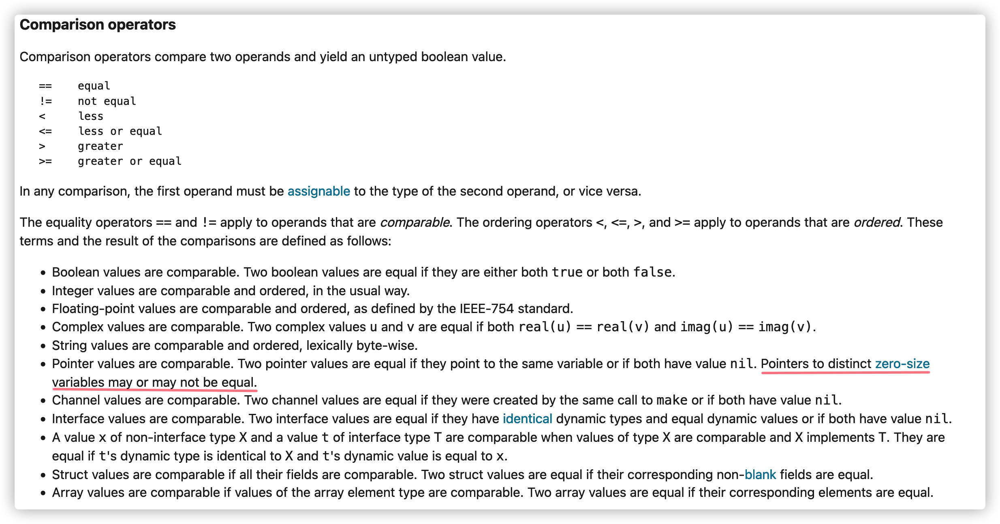

# 空結構體

空結構體指的是沒有任何字段的結構體。

## 大小與內存地址

空結構體佔用的內存空間大小爲零字節，並且它們的地址可能相等也可能不等。當發生內存逃逸時候，它們的地址是相等的，都指向了 `runtime.zerobase`。

```go
// empty_struct.go
type Empty struct{}

//go:linkname zerobase runtime.zerobase
var zerobase uintptr // 使用go:linkname編譯指令，將zerobase變量指向runtime.zerobase

func main() {
	a := Empty{}
	b := struct{}{}

	fmt.Println(unsafe.Sizeof(a) == 0) // true
	fmt.Println(unsafe.Sizeof(b) == 0) // true
	fmt.Printf("%p\n", &a)             // 0x590d00
	fmt.Printf("%p\n", &b)             // 0x590d00
	fmt.Printf("%p\n", &zerobase)      // 0x590d00

	c := new(Empty)
	d := new(Empty)
	fmt.Sprint(c, d) // 目的是讓變量c和d發生逃逸
	println(c) // 0x590d00
	println(d) // 0x590d00
	fmt.Println(c == d) // true

	e := new(Empty)
	f := new(Empty)
	println(e)          // 0xc00008ef47
	println(f)          // 0xc00008ef47
	fmt.Println(e == f) // flase
}
```

從上面代碼輸出可以看到 `a`, `b`, `zerobase` 這三個變量的地址都是一樣的，最終指向的都是全局變量`runtime.zerobase`(**[runtime/malloc.go](https://github.com/golang/go/blob/go1.14.13/src/runtime/malloc.go#L827)**)。

```go
// base address for all 0-byte allocations
var zerobase uintptr
```

我們可以通過下面方法再次來驗證一下 `runtime.zerobase` 變量的地址是不是也是`0x590d00`：

```shell
go build -o empty_struct empty_struct.go
go tool nm ./empty_struct | grep 590d00
# 或者
objdump -t empty_struct | grep 590d00
```

執行上面命令輸出以下的內容：

```shell
590d00 D runtime.zerobase
# 或者
0000000000590d00 g     O .noptrbss	0000000000000008 runtime.zerobase
```

從上面輸出的內容可以看到 `runtime.zerobase` 的地址也是 `0x590d00`。

接下來我們看看變量逃逸的情況：

```shell
 go run -gcflags="-m -l" empty_struct.go
# command-line-arguments
./empty_struct.go:15:2: moved to heap: a
./empty_struct.go:16:2: moved to heap: b
./empty_struct.go:18:13: ... argument does not escape
./empty_struct.go:18:31: unsafe.Sizeof(a) == 0 escapes to heap
./empty_struct.go:19:13: ... argument does not escape
./empty_struct.go:19:31: unsafe.Sizeof(b) == 0 escapes to heap
./empty_struct.go:20:12: ... argument does not escape
./empty_struct.go:21:12: ... argument does not escape
./empty_struct.go:22:12: ... argument does not escape
./empty_struct.go:24:10: new(Empty) escapes to heap
./empty_struct.go:25:10: new(Empty) escapes to heap
./empty_struct.go:26:12: ... argument does not escape
./empty_struct.go:29:13: ... argument does not escape
./empty_struct.go:29:16: c == d escapes to heap
./empty_struct.go:31:10: new(Empty) does not escape
./empty_struct.go:32:10: new(Empty) does not escape
./empty_struct.go:35:13: ... argument does not escape
./empty_struct.go:35:16: e == f escapes to heap
```

可以看到變量 `c` 和 `d` 逃逸到堆上，它們打印出來的都是 `0x591d00`，且兩者進行相等比較時候返回 `true`。而變量 `e` 和 `f` 打印出來的都是`0xc00008ef47`，但兩者進行相等比較時候卻返回`false`。這因爲Go有意爲之的，當空結構體變量未發生逃逸時候，指向該變量的指針是不等的，當空結構體變量發生逃逸之後，指向該變量是相等的。這也就是 **[Go官方語法指南](https://go.dev/ref/spec)** 所說的：

> Pointers to distinct zero-size variables may or may not be equal



> **危險**
> **注意：**  
> 不論逃逸還是未逃逸，我們都不應該對空結構體類型變量指向的內存地址是否一樣，做任何預期。

## 當一個結構體嵌入空結構體時，佔用空間怎麼計算？

空結構體本身不佔用空間，但是作爲某結構體內嵌字段時候，有可能是佔用空間的。具體計算規則如下：

- 當空結構體是該結構體唯一的字段時，該結構體是不佔用空間的，空結構體自然也不佔用空間
- 當空結構體作爲第一個字段或者中間字段時候，是不佔用空間的
- 當空結構體作爲最後一個字段時候，是佔用空間的，大小跟其前一個字段保持一致

```go
type s1 struct {
	a struct{}
}

type s2 struct {
	_ struct{}
}

type s3 struct {
	a struct{}
	b byte
}

type s4 struct {
	a struct{}
	b int64
}

type s5 struct {
	a byte
	b struct{}
	c int64
}

type s6 struct {
	a byte
	b struct{}
}

type s7 struct {
	a int64
	b struct{}
}

type s8 struct {
	a struct{}
	b struct{}
}

func main() {
	fmt.Println(unsafe.Sizeof(s1{})) // 0
	fmt.Println(unsafe.Sizeof(s2{})) // 0
	fmt.Println(unsafe.Sizeof(s3{})) // 1
	fmt.Println(unsafe.Sizeof(s4{})) // 8
	fmt.Println(unsafe.Sizeof(s5{})) // 16
	fmt.Println(unsafe.Sizeof(s6{})) // 2
	fmt.Println(unsafe.Sizeof(s7{})) // 16
	fmt.Println(unsafe.Sizeof(s8{})) // 0
}
```

當空結構體作爲數組、切片的元素時候：

```go
var a [10]int
fmt.Println(unsafe.Sizeof(a)) // 80

var b [10]struct{}
fmt.Println(unsafe.Sizeof(b)) // 0

var c = make([]struct{}, 10)
fmt.Println(unsafe.Sizeof(c)) // 24，即slice header的大小
```

## 用途

由於空結構體佔用的空間大小爲零，我們可以利用這個特性，完成一些功能，卻不需要佔用額外空間。

### 阻止`unkeyed`方式初始化結構體

```go
type MustKeydStruct struct {
	Name string
	Age  int
	_    struct{}
}

func main() {
	persion := MustKeydStruct{Name: "hello", Age: 10}
	fmt.Println(persion)
	persion2 := MustKeydStruct{"hello", 10} //編譯失敗，提示： too few values in MustKeydStruct{...}
	fmt.Println(persion2)
}
```

### 實現集合數據結構

集合數據結構我們可以使用map來實現：只關心key，不必關心value，我們就可以值設置爲空結構體類型變量（或者底層類型是空結構體的變量）。

```go
package main

import (
	"fmt"
)

type Set struct {
	items map[interface{}]emptyItem
}

type emptyItem struct{}

var itemExists = emptyItem{}

func NewSet() *Set {
	set := &Set{items: make(map[interface{}]emptyItem)}
	return set
}

// 添加元素到集合
func (set *Set) Add(item interface{}) {
	set.items[item] = itemExists
}

// 從集合中刪除元素
func (set *Set) Remove(item interface{}) {
	delete(set.items, item)

}

// 判斷元素是否存在集合中
func (set *Set) Contains(item interface{}) bool {
	_, contains := set.items[item]
	return contains
}

// 返回集合大小
func (set *Set) Size() int {
	return len(set.items)
}

func main() {
	set := NewSet()
	set.Add("hello")
	set.Add("world")
	fmt.Println(set.Contains("hello"))
	fmt.Println(set.Contains("Hello"))
	fmt.Println(set.Size())
}
```

### 作爲通道的信號傳輸

使用通道時候，有時候我們只關心是否有數據從通道內傳輸出來，而不關心數據內容，這時候通道數據相當於一個信號，比如我們實現退出時候。下面例子是基於通道實現的信號量。

```go
// empty struct
var empty = struct{}{}

// Semaphore is empty type chan
type Semaphore chan struct{}

// P used to acquire n resources
func (s Semaphore) P(n int) {
	for i := 0; i < n; i++ {
		s <- empty
	}
}

// V used to release n resouces
func (s Semaphore) V(n int) {
	for i := 0; i < n; i++ {
		<-s
	}
}

// Lock used to lock resource
func (s Semaphore) Lock() {
	s.P(1)
}

// Unlock used to unlock resource
func (s Semaphore) Unlock() {
	s.V(1)
}

// NewSemaphore return semaphore
func NewSemaphore(N int) Semaphore {
	return make(Semaphore, N)
}
```

## 進一步閱讀

- [The empty struct](https://dave.cheney.net/2014/03/25/the-empty-struct)
