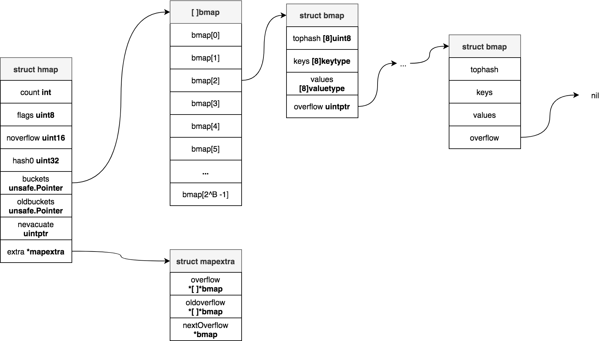
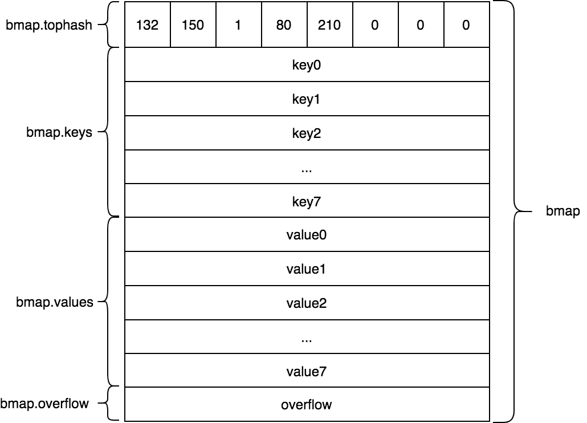
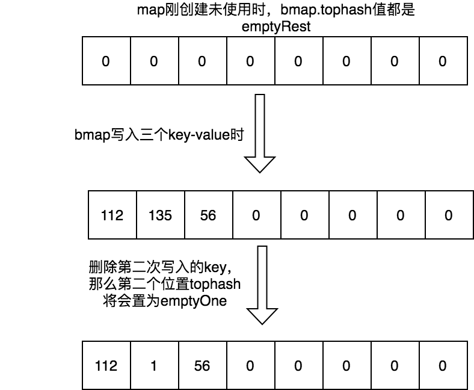
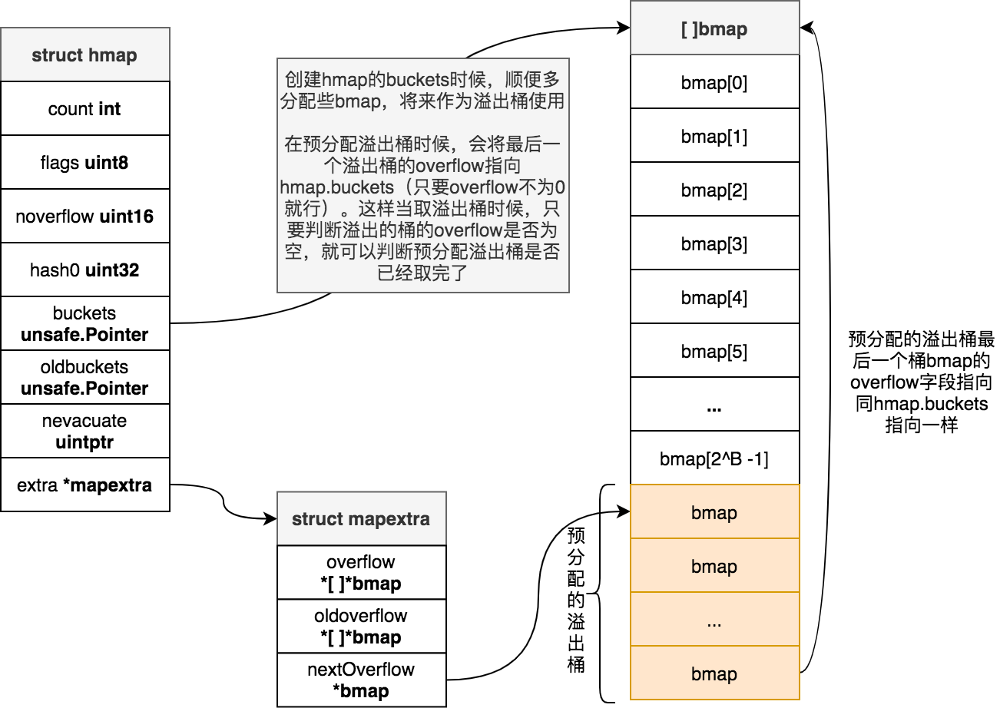
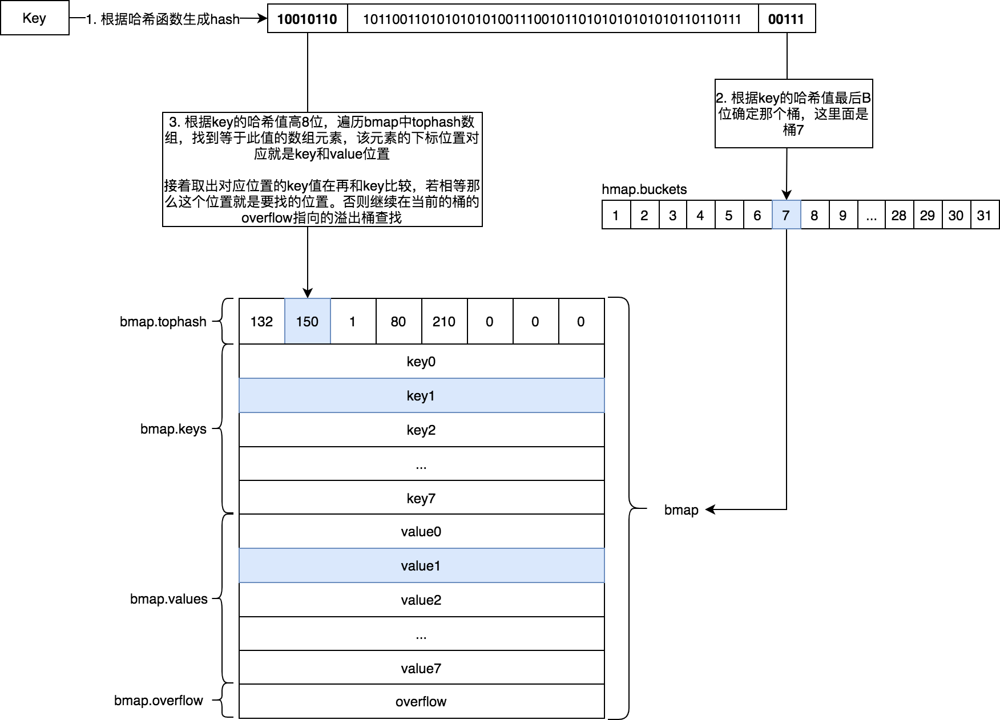

# 映射

映射也被稱爲哈希表(hash table)、字典。它是一種由key-value組成的抽象數據結構。大多數情況下，它都能在O(1)的時間複雜度下實現增刪改查功能。若在極端情況下出現所有key都發生哈希碰撞時則退回成鏈表形式，此時複雜度爲O(N)。

映射底層一般都是由數組組成，該數組每個元素稱爲桶，它使用hash函數將key分配到不同桶中，若出現碰撞衝突時候，則採用鏈地址法（也稱爲拉鍊法）或者開放尋址法解決衝突。下圖就是一個由姓名-號碼構成的哈希表的結構圖：


Go語言中映射中key若出現衝突碰撞時候，則採用鏈地址法解決，Go語言中映射具有以下特點：

- 引用類型變量
- 讀寫併發不安全
- 遍歷結果是隨機的

## 數據結構



Go語言中映射的數據結構是 `runtime.hmap`(**[runtime/map.go](https://github.com/golang/go/blob/go1.14.13/src/runtime/map.go#L115-L129)**):

```go
// A header for a Go map.
type hmap struct {
	count     int //  元素個數，用於len函數返回map元素數量
	flags     uint8 // 標誌位，標誌當前map正在寫等狀態
	B         uint8  // buckets個數的對數，即桶數量 = 2 ^ B
	noverflow uint16 // overflow桶數量的近似值，overflow桶即溢出桶，即鏈表法中存在鏈表上的桶的個數
	hash0     uint32 // 隨機數種子，用於計算key的哈希值

	buckets    unsafe.Pointer // 指向buckets數組，如果元素個數爲0時，該值爲nil
	oldbuckets unsafe.Pointer // 擴容時指向舊的buckets
	nevacuate  uintptr        // 用於指示遷移進度，小於此值的桶已經遷移完成
	
	extra *mapextra // 額外記錄overflow桶信息
}
```

映射中每一個桶的結構是 `runtime.bmap`(**[runtime/map.go](https://github.com/golang/go/blob/go1.14.13/src/runtime/map.go#L149-L159)**)：

```go
// A bucket for a Go map.
type bmap struct {
	tophash [bucketCnt]uint8
}
```

上面bmap結構是靜態結構，在編譯過程中 `runtime.bmap` 會拓展成以下結構體：

```go
type bmap struct{
	tophash [8]uint8
	keys [8]keytype // keytype 由編譯器編譯時候確定
	values [8]elemtype // elemtype 由編譯器編譯時候確定
	overflow uintptr // overflow指向下一個bmap，overflow是uintptr而不是*bmap類型，是爲了減少gc
}
```

bmap結構示意圖：



每個桶bmap中可以裝載8個key-value鍵值對。當一個key確定存儲在哪個桶之後，還需要確定具體存儲在桶的哪個位置（這個位置也稱爲桶單元，一個bmap裝載8個key-value鍵值對，那麼一個bmap共8個桶單元），bmap中tophash就是用於實現快速定位key的位置。在實現過程中會使用key的hash值的高八位作爲tophash值，存放在bmap的tophash字段中。tophash計算公式如下：

```go
func tophash(hash uintptr) uint8 {
	top := uint8(hash >> (sys.PtrSize*8 - 8))
	if top < minTopHash {
		top += minTopHash
	}
	return top
}
```

上面函數中hash是64位的，sys.PtrSize值是8，所以`top := uint8(hash >> (sys.PtrSize*8 - 8))`等效`top = uint8(hash >> 56)`，最後top取出來的值就是hash的最高8位值。bmap的tophash字段不光存儲key哈希值的高八位，還會存儲一些狀態值，用來表明當前桶單元狀態，這些狀態值都是小於minTopHash的。

爲了避免key哈希值的高八位值出現這些狀態值相等產生混淆情況，所以當key哈希值高八位若小於minTopHash時候，自動將其值加上minTopHash作爲該key的tophash。桶單元的狀態值如下：

```go
emptyRest      = 0 // 表明此桶單元爲空，且更高索引的單元也是空
emptyOne       = 1 // 表明此桶單元爲空
evacuatedX     = 2 // 用於表示擴容遷移到新桶前半段區間
evacuatedY     = 3 // 用於表示擴容遷移到新桶後半段區間
evacuatedEmpty = 4 // 用於表示此單元已遷移
minTopHash     = 5 // key的tophash值與桶狀態值分割線值，小於此值的一定代表着桶單元的狀態，大於此值的一定是key對應的tophash值
```

emptyRest和emptyOne狀態都表示此桶單元爲空，都可以用來插入數據。但是emptyRest還代表着更高單元也爲空，那麼遍歷尋找key的時候，當遇到當前單元值爲emptyRest時候，那麼更高單元無需繼續遍歷。

下圖中桶單元1的tophash值是emptyOne，桶單元3的tophash值是emptyRest，那麼我們一定可以推斷出桶單元3以上都是emptyRest狀態。



bmap中可以裝載8個key-value，這8個key-value並不是按照key1/value1/key2/value2/key3/value3...這樣形式存儲，而採用key1/key2../key8/value1/../value8形式存儲，因爲第二種形式可以減少padding，源碼中以map[int64]int8舉例說明。

hmap中extra字段是 `runtime.mapextra` 類型，用來記錄額外信息：

```go
// mapextra holds fields that are not present on all maps.
type mapextra struct {
	overflow    *[]*bmap // 指向overflow桶指針組成的切片，防止這些溢出桶被gc了
	oldoverflow *[]*bmap // 擴容時候，指向舊的溢出桶組成的切片，防止這些溢出桶被gc了

	//指向下一個可用的overflow 桶
	nextOverflow *bmap
}
```

當映射的key和value都不是指針類型時候，bmap將完全不包含指針，那麼gc時候就不用掃描bmap。bmap指向溢出桶的字段overflow是uintptr類型，爲了防止這些overflow桶被gc掉，所以需要mapextra.overflow將它保存起來。如果bmap的overflow是*bmap類型，那麼gc掃描的是一個個拉鍊表，效率明顯不如直接掃描一段內存(hmap.mapextra.overflow)

## 映射的創建

當使用make函數創建映射時候，若不指定map元素數量時候，底層將使用是`make_small`函數創建hmap結構，此時只產生哈希種子，不初始化桶：

```go
func makemap_small() *hmap {
	h := new(hmap)
	h.hash0 = fastrand()
	return h
}
```

若指定map元素數量時候，底層會使用 `makemap` 函數創建hmap結構：

```go
func makemap(t *maptype, hint int, h *hmap) *hmap {
	mem, overflow := math.MulUintptr(uintptr(hint), t.bucket.size)
	if overflow || mem > maxAlloc { // 檢查所有桶佔用的內存是否大於內存限制
		hint = 0
	}

	// h不nil，說明map結構已經創建在棧上了，這個操作由編譯器處理的
	if h == nil { // h爲nil，則需要創建一個hmap類型
		h = new(hmap)
	}
	h.hash0 = fastrand() // 設置map的隨機數種子

	B := uint8(0)
	for overLoadFactor(hint, B) { // 設置合適B的值
		B++
	}
	h.B = B

	// 如果B == 0，那麼map的buckets，將會惰性分配（allocated lazily），使用時候再分配
	// 如果B != 0時，初始化桶
	if h.B != 0 {
		var nextOverflow *bmap
		h.buckets, nextOverflow = makeBucketArray(t, h.B, nil)
		if nextOverflow != nil {
			h.extra = new(mapextra)
			h.extra.nextOverflow = nextOverflow // extra.nextOverflow指向下一個可用溢出桶位置
		}
	}

	return h
}
```

makemap函數的第一個參數是maptype類指針，它描述了創建的map中key和value元素的類型信息以及其他map信息，第二個參數hint，對應是`make([Type]Type, len)`中len參數，第三個參數h，如果不爲nil，說明當前map的結構已經有編譯器在棧上創建了，makemap只需要完成設置隨機數種子等操作。

`overLoadFactor`函數用來判斷當前映射的加載因子是否超過加載因子閾值。`makemap`使用`overLoadFactor`函數來調整B值。

**加載因子**，也稱爲擴容因子，或者負載因子，用來描述哈希表中元素填滿程度，加載因子越大，表明哈希表中元素越多，空間利用率高，但是這也意味着衝突的機會就會加大。**加載因子是通過寫入元素個數除以桶個數得到，當哈希表中所有桶已寫滿情況下，此時加載因子是1**，此時再寫入新key一定會產生衝突碰撞。爲了提高哈希表寫入效率就必須在加載因子超過一定值時（這個值稱爲**加載因子閾值**），進行rehash操作，將桶容量進行擴容，來儘量避免出現衝突情況。

Java中hashmap的默認加載因子閾值是0.75，Go語言中映射的加載因子閾值是6.5。爲什麼Go映射的加載因子閾值不是0.75，而且超過了1？這是因爲Java中哈希表的桶存放的是一個key-value，其滿載因子是1，Go映射中每個桶可以存8個key-value，滿載因子是8，當加載因子閾值爲6.5時候空間利用率和寫入性能達到最佳平衡。

```go
func overLoadFactor(count int, B uint8) bool {
	// count > bucketCnt，bucketCnt值是8，每一個桶可以存放8個key-value，如果map中元素個數count小於8那麼一定不會超過加載因子

	// loadFactorNum和loadFactorDen的值分別是13和2，bucketShift(B)等效於1<<B
	// 所以 uintptr(count) > loadFactorNum*(bucketShift(B)/loadFactorDen) 等於  uintptr(count) > 6.5 * 2^ B
	return count > bucketCnt && uintptr(count) > loadFactorNum*(bucketShift(B)/loadFactorDen)
}

// bucketShift returns 1<<b, optimized for code generation.
func bucketShift(b uint8) uintptr {
	return uintptr(1) << (b & (sys.PtrSize*8 - 1))
}
```

`makeBucketArray`函數是用來創建bmap array，來用作爲map的buckets。對於創建時指定元素大小超過(2^4) * 8時候，除了創建map的buckets，也會提前分配好一些桶作爲溢出桶。buckets和溢出桶，在內存上是連續的。爲啥提前分配好溢出桶，而不是在溢出時候，再分配，這是因爲現在分配是直接申請一大片內存，效率更高。

hamp.extra.nextOverflow指向該溢出桶，溢出桶的除了最後一個桶的overflow指向map的buckets，其他桶的overflow指向nil，這是用來判斷溢出桶最後邊界，後面代碼有涉及此處邏輯。

```go
func makeBucketArray(t *maptype, b uint8, dirtyalloc unsafe.Pointer) (buckets unsafe.Pointer, nextOverflow *bmap) {
	base := bucketShift(b) // 等效於 base := 1 << b
	nbuckets := base

	if b >= 4 { // 對於小b，不太可能出現溢出桶，所以B超過4時候，才考慮提前分配寫溢出桶
		nbuckets += bucketShift(b - 4)
		sz := t.bucket.size * nbuckets
		up := roundupsize(sz)
		if up != sz {
			nbuckets = up / t.bucket.size
		}
	}

	if dirtyalloc == nil {
		buckets = newarray(t.bucket, int(nbuckets))
	} else {
		// 若dirtyalloc不爲nil時，
		// dirtyalloc指向的之前已經使用完的map的buckets，之前已使用完的map和當前map具有相同類型的t和b，這樣它buckets可以拿來複用
		// 此時只需對dirtyalloc進行清除操作就可以作爲當前map的buckets
		buckets = dirtyalloc
		size := t.bucket.size * nbuckets
		// 下面是清空dirtyalloc操作
		if t.bucket.ptrdata != 0 { // map中key或value是指針類型
			memclrHasPointers(buckets, size)
		} else {
			memclrNoHeapPointers(buckets, size)
		}
	}

	if base != nbuckets { // 多創建一些溢出桶
		nextOverflow = (*bmap)(add(buckets, base*uintptr(t.bucketsize)))
		// 溢出桶的最後一個的overflow字段指向buckets
		last := (*bmap)(add(buckets, (nbuckets-1)*uintptr(t.bucketsize)))
		last.setoverflow(t, (*bmap)(buckets))
	}
	return buckets, nextOverflow
}
```

我們畫出桶初始化時候的分配示意圖：



通過上面分析整個映射創建過程，可以看到使用make創建map時候，返回都是hmap類型指針，這也就說明**Go語言中映射是引用類型**。

## 訪問映射操作

訪問映射涉及到key定位的問題，首先需要確定從哪個桶找，確定桶之後，還需要確定key-value具體存放在哪個單元裏面（每個桶裏面有8個坑位）。key定位詳細流程如下：

1. 首先需根據hash函數計算出key的hash值
2. 該key的hash值的低`hmap.B`位的值是該key所在的桶
3. 該key的hash值的高8位，用來快速定位其在桶具體位置。一個桶中存放8個key，遍歷所有key，找到等於該key的位置，此位置對應的就是值所在位置
4. 根據步驟3取到的值，計算該值的hash，再次比較，若相等則定位成功。否則重複步驟3去`bmap.overflow`中繼續查找。
5. 若`bmap.overflow`鏈表都找個遍都沒有找到，則返回nil。



當m爲2的x冪時候，n對m取餘數存在以下等式：

```
n % m = n & (m -1)
```

舉個例子比如：n爲15，m爲8，n%m等7, n&(m-1)也等於7，取餘應儘量使用第二種方式，因爲效率更高。

那麼對於映射中key定位計算就是：

```
key對應value所在桶位置 = hash(key)%(hmap.B << 1) = hash(key) & (hmap.B <<1 - 1)
```
那麼爲什麼上面key定位流程步驟2中說的卻是根據該key的hash值的低`hmap.B`位的值是該key所在的桶。兩者是沒有區別的，只是一種意思不同說法。

### 直接訪問與逗號ok模式訪問

訪問映射操作方式有兩種：

第一種直接訪問，若key不存在，則返回value類型的零值，其底層實現`mapaccess1`函數：

```go
v := a["x"]
```
第二種是逗號ok模式，如果key不存在，除了返回value類型的零值，ok變量也會設置爲false，其底層實現`mapaccess2`：

```go
v, ok := a["x"]
```

爲了優化性能，Go編譯器會根據key類型採用不同底層函數，比如對於key類型是int的，底層實現是mapaccess1_fast64。具體文件可以查看runtime/map_fastxxx.go。優化版本函數有：

key 類型 | 方法
---- | ----
uint64 | func mapaccess1_fast64(t *maptype, h *hmap, key uint64) unsafe.Pointer
uint64 | func mapaccess2_fast64(t *maptype, h *hmap, key uint64) (unsafe.Pointer, bool)
uint32 | func mapaccess1_fast32(t *maptype, h *hmap, key uint32) unsafe.Pointer
uint32 | func mapaccess2_fast32(t *maptype, h *hmap, key uint32) (unsafe.Pointer, bool)
string | func mapaccess1_faststr(t *maptype, h *hmap, ky string) unsafe.Pointer
string | func mapaccess2_faststr(t *maptype, h *hmap, ky string) (unsafe.Pointer, bool)

這裏面我們這分析通用的mapaccess1函數。

```go
func mapaccess1(t *maptype, h *hmap, key unsafe.Pointer) unsafe.Pointer {
	if h == nil || h.count == 0 { // map爲nil或者map中元素個數爲0，則直接返回零值
		if t.hashMightPanic() {
			t.hasher(key, 0) // see issue 23734
		}
		return unsafe.Pointer(&zeroVal[0])
	}
	if h.flags&hashWriting != 0 { // 有其他Goroutine正在寫map，則直接panic
		throw("concurrent map read and map write")
	}
	hash := t.hasher(key, uintptr(h.hash0)) // 計算出key的hash值
	m := bucketMask(h.B) // m = 2^h.B - 1
	b := (*bmap)(add(h.buckets, (hash&m)*uintptr(t.bucketsize))) // 根據上面介紹的取餘操作轉換成位與操作來獲取key所在的桶
	if c := h.oldbuckets; c != nil { // 如果oldbuckets不爲0，說明該map正在處於擴容過程中
		if !h.sameSizeGrow() { // 如果不是等容量擴容，此時buckets大小是oldbuckets的兩倍，那麼m需減半，然後用來定位key在舊桶中位置
			m >>= 1
		}
		oldb := (*bmap)(add(c, (hash&m)*uintptr(t.bucketsize))) // 獲取key在舊桶的桶
		if !evacuated(oldb) { // 如果舊桶數據沒有遷移新桶裏面，那就在舊桶裏面找
			b = oldb
		}
	}
	top := tophash(hash) // 計算出key的tophash
bucketloop:
	for ; b != nil; b = b.overflow(t) { // for循環實現功能是先從當前桶找，若未找到則當前桶的溢出桶b.overfolw(t)查找，直到溢出桶爲nil
		for i := uintptr(0); i < bucketCnt; i++ { // 每個桶有8個單元，循環這8個單元，一個個找
			if b.tophash[i] != top { // 如果當前單元的tophash與key的tophash不一致，
				if b.tophash[i] == emptyRest { // 若單元tophash值是emptyRest，則直接跳出整個大循環，emptyRest表明當前單元和更高單元存儲都爲空，所以無需在繼續查找下去了
					break bucketloop
				}
				continue // 繼續查找桶其他的單元
			}

			// 此時已找到tophash等於key的tophash的桶單元，此時i記錄這桶單元編號
			k := add(unsafe.Pointer(b), dataOffset+i*uintptr(t.keysize)) // dataOffset是bmap.keys相對於bmap的偏移，k記錄key存在bmap的位置
			if t.indirectkey() { // 若key是指針類型
				k = *((*unsafe.Pointer)(k))
			}
			if t.key.equal(key, k) {// 如果key和存放bmap裏面的key相等則獲取對應value值返回
				// value在bmap中的位置 = bmap.keys相對於bmap的偏移 + 8個key佔用的空間(8 * keysize) + 該value在bmap.values中偏移(i * t.elemsize)
				e := add(unsafe.Pointer(b), dataOffset+bucketCnt*uintptr(t.keysize)+i*uintptr(t.elemsize))
				if t.indirectelem() {
					e = *((*unsafe.Pointer)(e))
				}
				return e
			}
		}
	}
	return unsafe.Pointer(&zeroVal[0])
}
```

## 賦值映射操作

在map中增加和更新key-value時候，都會調用`runtime.mapassign`方法，同訪問操作一樣，Go編譯器針對不同類型的key，會採用優化版本函數：

key 類型 | 方法
---- | ----
uint64 | func mapassign_fast64(t *maptype, h *hmap, key uint64) unsafe.Pointer
unsafe.Pointer | func mapassign_fast64ptr(t *maptype, h *hmap, key unsafe.Pointer) unsafe.Pointer
uint32 | func mapassign_fast32(t *maptype, h *hmap, key uint32) unsafe.Pointer
unsafe.Pointer | func mapassign_fast32ptr(t *maptype, h *hmap, key unsafe.Pointer) unsafe.Pointer
string | func mapassign_faststr(t *maptype, h *hmap, s string) unsafe.Pointer

這裏面我們只分析通用的方法mapassign：

```go
func mapassign(t *maptype, h *hmap, key unsafe.Pointer) unsafe.Pointer {
	if h == nil { // 對於nil map賦值操作直接panic。需要注意的是訪問nil map返回的是value類型的零值
		panic(plainError("assignment to entry in nil map"))
	}
	if h.flags&hashWriting != 0 { // 有其他Goroutine正在寫操作，則直接panic
		throw("concurrent map writes")
	}
	hash := t.hasher(key, uintptr(h.hash0)) // 計算出key的hash值
	h.flags ^= hashWriting // 將寫標誌位置爲1

	if h.buckets == nil { // 惰性創建buckets，make創建map時候，並未初始buckets，等到mapassign時候在創建初始化
		h.buckets = newobject(t.bucket) // newarray(t.bucket, 1)
	}

again:
	bucket := hash & bucketMask(h.B) // bucket := hash & (2^h.B - 1)
	if h.growing() { // 如果當前map處於擴容過程中，則先進行擴容，將key所對應的舊桶先遷移過來
		growWork(t, h, bucket)
	}
	b := (*bmap)(unsafe.Pointer(uintptr(h.buckets) + bucket*uintptr(t.bucketsize))) // 獲取key所在的桶
	top := tophash(hash) // 計算出key的tophash

	var inserti *uint8 // 指向key的tophash應該存放的位置，即bmap.tophash這個數組中某個位置
	var insertk unsafe.Pointer // 指向key應該存放的位置，即bmap.keys這個數組中某個位置
	var elem unsafe.Pointer // 指向value應該存放的位置，即bmap.values這個數組中某個位置
bucketloop:
	for {
		for i := uintptr(0); i < bucketCnt; i++ {
			if b.tophash[i] != top {
				if isEmpty(b.tophash[i]) && inserti == nil { // 當i單元的tophash值爲空，那麼說明該單元可以用來存放key-value。
					// 再加上inserti == nil條件就是inserti只找到第一個空閒的單元即可
					inserti = &b.tophash[i]
					insertk = add(unsafe.Pointer(b), dataOffset+i*uintptr(t.keysize))
					elem = add(unsafe.Pointer(b), dataOffset+bucketCnt*uintptr(t.keysize)+i*uintptr(t.elemsize))
				}
				if b.tophash[i] == emptyRest { // 如果i單元的tophash值爲emptyRest，那麼剩下單元也不用繼續找了，剩下單元一定都是空的
					break bucketloop
				}
				continue
			}

			// 上面代碼是先找到第一個爲空的桶單元，然後把該桶單元相關的tophash、key、value等位置信息記錄在inserti，insertk，elem臨時變量上。
			// 這樣當key沒有在map中情況下，可以拿inserti，insertk，elem這變量，將該key的信息寫入到桶單元中，這種情況下key是一個新key，這種賦值操作屬於新增操作。

			// 下面代碼部分就是處理中map已存在key的情況，這時候，我們只需要找到key所在桶單元中value的位置，然後把value新值寫入即可。
			// 這種情況下key是一箇舊key，這種賦值操作屬於更新操作。
			k := add(unsafe.Pointer(b), dataOffset+i*uintptr(t.keysize))
			if t.indirectkey() {
				k = *((*unsafe.Pointer)(k))
			}
			if !t.key.equal(key, k) {
				continue
			}
			
			if t.needkeyupdate() {
				typedmemmove(t.key, k, key)
			}
			elem = add(unsafe.Pointer(b), dataOffset+bucketCnt*uintptr(t.keysize)+i*uintptr(t.elemsize))
			goto done
		}
		ovf := b.overflow(t) // 當前桶沒有找到，繼續在其溢出桶裏面找，
		if ovf == nil { // 直到都沒有找到，那麼跳出循環，不在找了。
			break
		}
		b = ovf
	}

	// 當map未擴容中，那麼就判斷當前map是否需要擴容，擴容條件是以下兩個條件符合任意之一即可：
	// 1. 是否達到負載因子的閾值6.5
	// 2. 溢出桶是否過多
	if !h.growing() && (overLoadFactor(h.count+1, h.B) || tooManyOverflowBuckets(h.noverflow, h.B)) {
		hashGrow(t, h)
		goto again // 跳到again標籤處，再來一遍
	}

	// 如果上面兩層for循環都沒有找到空的桶單元，那說明所有桶單元都寫滿了，那麼就得創建一個溢出桶了。
	// 然後將數據存放到該溢出桶的第一個單元上
	if inserti == nil {
		newb := h.newoverflow(t, b) // 創建一個溢出桶
		inserti = &newb.tophash[0]
		insertk = add(unsafe.Pointer(newb), dataOffset)
		elem = add(insertk, bucketCnt*uintptr(t.keysize))
	}

	// store new key/elem at insert position
	if t.indirectkey() {
		kmem := newobject(t.key)
		*(*unsafe.Pointer)(insertk) = kmem
		insertk = kmem
	}
	if t.indirectelem() {
		vmem := newobject(t.elem)
		*(*unsafe.Pointer)(elem) = vmem
	}
	typedmemmove(t.key, insertk, key)
	*inserti = top // 寫入key的tophash值
	h.count++ // 更新map的元素計數

done:
	if h.flags&hashWriting == 0 {
		throw("concurrent map writes")
	}
	h.flags &^= hashWriting // 將map的寫標誌置爲0，那麼其他Gorountine可以進行寫入操作了
	if t.indirectelem() {
		elem = *((*unsafe.Pointer)(elem))
	}
	return elem
}
```

我們梳理總結下mapassign函數執行流程：

1. 首先進行寫標誌檢查和桶初始化檢查。如果當前map寫標誌位已經置爲1，那麼肯定有它Gorountine正在進行寫操作，那麼直接panic。桶初始化檢查是當map的桶未創建情況下，則在桶初始化檢查階段創建一個桶。

2. 接下來判斷桶是否處在擴容過程中，如果處在擴容過程中，那麼先將當前key所在舊桶全部遷移到新桶中，然後再接着遷移一箇舊桶，也就是說每次mapasssign最多隻遷移兩個舊桶。爲什麼一定要先遷移key所在的舊桶數據呢？如果key是新key，那麼舊桶中一定沒有這個key信息，這種情況遷不遷移舊桶無關緊要，但若key之前在舊桶已存在，那麼一定要先遷移，如果不這樣的話，當key的新value寫入新桶中之後再遷移，那麼舊桶中的舊數據就會覆蓋掉新桶中key的value值，爲了應對這種情況，所以一定要先遷移key所在舊桶數據。

3. 接下就是兩層for循環。第一層for循環就是遍歷當前key所在桶，以及桶的溢出桶，直到桶的所有溢出桶都遍歷一遍後，終止該層循環。第二層for循環遍歷的是第一層for循環每次得到的桶中的8個桶單元。兩層for循環是爲了在map中找到key，如果找到key，那隻需更新key對應value值就可。在循環過程中，會記錄下第一個爲空的桶單元，這樣在未找到key的情況時候，就把key-value信息寫入這個桶單元中。如果map中未找到key，且也未找到空的桶單元，那麼沒有辦法了，只能創建一個溢出桶來存放該key-value。

4. 接下里判斷當前map是否需要擴容，如果需要擴容，則調用hashGrow函數，將舊的buckets掛到hmap.oldbuckets字段上，再接着通過goto語法跳轉標籤形式跳到流程2繼續執行下去

5. 最後就是將key的tophash，key值寫入到找到的桶單元中，並返回桶單元的value地址。value的寫入是拿到mapassign返回的地址，再寫入的。

接下來我們看下溢出桶創建操作：

1. 首先會從預分配的溢出桶列表中取，如果未取到，則會現場創建一個溢出桶
2. 若map的key和value都不是指針類型，那麼會將溢出桶記錄到hmap.extra.overflow中

```go
func (h *hmap) newoverflow(t *maptype, b *bmap) *bmap {
	var ovf *bmap
	if h.extra != nil && h.extra.nextOverflow != nil {
		ovf = h.extra.nextOverflow // 從上面分析映射的創建過程代碼中，我們知道創建map的buckets時候，有時候會順便創建一些溢出桶，
		// h.extra.nextOverflow就是指向這些溢出桶
		if ovf.overflow(t) == nil { // ovf不是最後一個溢出桶
			h.extra.nextOverflow = (*bmap)(add(unsafe.Pointer(ovf), uintptr(t.bucketsize))) // extra.nextOverflow指向下一個溢出桶
		} else { // ovf是最後一個溢出桶
			ovf.setoverflow(t, nil) // 將ovf.overflow設置nil
			h.extra.nextOverflow = nil
		}
	} else {
		// 沒有可用的預分配的溢出桶，則創建一個溢出桶
		ovf = (*bmap)(newobject(t.bucket))
	}
	h.incrnoverflow() // 更新溢出桶計數，這個溢出桶計數可用來是否進行rehash的依據
	if t.bucket.ptrdata == 0 { // 如果map中的key和value都不是指針類型，那麼將溢出桶指針添加到extra.overflow這個切片中
		h.createOverflow()
		*h.extra.overflow = append(*h.extra.overflow, ovf)
	}
	b.setoverflow(t, ovf)
	return ovf
}

func (h *hmap) createOverflow() {
	if h.extra == nil {
		h.extra = new(mapextra)
	}
	if h.extra.overflow == nil {
		h.extra.overflow = new([]*bmap)
	}
}

func (b *bmap) overflow(t *maptype) *bmap {
	return *(**bmap)(add(unsafe.Pointer(b), uintptr(t.bucketsize)-sys.PtrSize))
}

func (b *bmap) setoverflow(t *maptype, ovf *bmap) {
	*(**bmap)(add(unsafe.Pointer(b), uintptr(t.bucketsize)-sys.PtrSize)) = ovf
}

func (h *hmap) incrnoverflow() {
	if h.B < 16 {
		h.noverflow++
		return
	}
	
	// 當h.B大於等於16時候，有1/(1<<(h.B-15))的概率會更新h.noverflow
	// 比如h.B == 18時，mask==7，那麼fastrand & 7 == 0的概率就是1/8
	mask := uint32(1)<<(h.B-15) - 1
	if fastrand()&mask == 0 {
		h.noverflow++
	}
}
```

## 映射的刪除操作

在map中刪除key-value時候，都會調用`runtime.mapdelete`方法，同訪問操作一樣，Go編譯器針對不同類型的key，會採用優化版本函數：

key 類型 | 方法
---- | ----
uint64 | func mapdelete_fast64(t *maptype, h *hmap, key uint64)
uint32 | func mapdelete_fast32(t *maptype, h *hmap, key uint32)
string | func mapdelete_faststr(t *maptype, h *hmap, ky string)

這裏面我們只大概分析通用刪除操作mapdelete函數：

**刪除map中元素時候並不會釋放內存**。刪除時候，會清空映射中相應位置的key和value數據，並將對應的tophash置爲emptyOne。此外會檢查當前單元旁邊單元的狀態是否也是空狀態，如果也是空狀態，那麼會將當前單元和旁邊空單元狀態都改成emptyRest。

```go
func mapdelete(t *maptype, h *hmap, key unsafe.Pointer) {
	if h == nil || h.count == 0 { // 對nil map或者數量爲0的map進行刪除
		if t.hashMightPanic() {
			t.hasher(key, 0) // see issue 23734
		}
		return
	}
	if h.flags&hashWriting != 0 { // 有其他Goroutine正在寫操作，則直接panic
		throw("concurrent map writes")
	}

	hash := t.hasher(key, uintptr(h.hash0))
	h.flags ^= hashWriting // 將寫標誌置爲1，刪除操作也是一種寫操作

	bucket := hash & bucketMask(h.B)
	if h.growing() {
		growWork(t, h, bucket)
	}
	b := (*bmap)(add(h.buckets, bucket*uintptr(t.bucketsize)))
	bOrig := b
	top := tophash(hash)
search:
	for ; b != nil; b = b.overflow(t) {
		for i := uintptr(0); i < bucketCnt; i++ {
			if b.tophash[i] != top {
				if b.tophash[i] == emptyRest {
					break search
				}
				continue
			}
			k := add(unsafe.Pointer(b), dataOffset+i*uintptr(t.keysize))
			k2 := k
			if t.indirectkey() {
				k2 = *((*unsafe.Pointer)(k2))
			}
			if !t.key.equal(key, k2) {
				continue
			}
			
			// 清空key
			if t.indirectkey() {
				*(*unsafe.Pointer)(k) = nil
			} else if t.key.ptrdata != 0 {
				memclrHasPointers(k, t.key.size)
			}
			// 清空value
			e := add(unsafe.Pointer(b), dataOffset+bucketCnt*uintptr(t.keysize)+i*uintptr(t.elemsize))
			if t.indirectelem() {
				*(*unsafe.Pointer)(e) = nil
			} else if t.elem.ptrdata != 0 {
				memclrHasPointers(e, t.elem.size)
			} else {
				memclrNoHeapPointers(e, t.elem.size)
			}
			b.tophash[i] = emptyOne // 將tophash置爲emptyOne
			
			// 下面代碼是將當前單元附近的emptyOne狀態的單元都改成emptyRest狀態
			if i == bucketCnt-1 {
				if b.overflow(t) != nil && b.overflow(t).tophash[0] != emptyRest {
					goto notLast
				}
			} else {
				if b.tophash[i+1] != emptyRest {
					goto notLast
				}
			}
			for {
				b.tophash[i] = emptyRest
				if i == 0 {
					if b == bOrig {
						break
					}
					c := b
					for b = bOrig; b.overflow(t) != c; b = b.overflow(t) {
					}
					i = bucketCnt - 1
				} else {
					i--
				}
				if b.tophash[i] != emptyOne {
					break
				}
			}
		notLast:
			h.count--
			break search
		}
	}

	if h.flags&hashWriting == 0 {
		throw("concurrent map writes")
	}
	h.flags &^= hashWriting
}
```

## 擴容方式

Go語言中映射擴容採用漸進式擴容，避免一次性遷移數據過多造成性能問題。當對映射進行新增、更新時候會觸發擴容操作然後進行擴容操作（刪除操作只會進行擴容操作，不會進行觸發擴容操作），每次最多遷移2個bucket。擴容方式有兩種類型：

1. 等容量擴容
2. 雙倍容量擴容

### 等容量擴容

當對一個map不停進行新增和刪除操作時候，會創建了很多溢出桶，而加載因子沒有超過閾值不會發生雙倍容量擴容，這些桶利用率很低，就會導致查詢效率變慢。這時候就需要採用等容量擴容，使用桶中數據更緊湊，減少溢出桶數量，從而提高查詢效率。**等容量擴容的條件是在未達到加載因子閾值情況下，如果B小於15時，溢出桶的數量大於2^B，B大於等於15時候，溢出桶數量大於2^15時候**會進行等容量擴容操作：

```go
func tooManyOverflowBuckets(noverflow uint16, B uint8) bool {
	if B > 15 {
		B = 15
	}
	return noverflow >= uint16(1)<<(B&15)
}
```

### 雙倍容量擴容

雙倍容量擴容指的是桶的數量變成舊桶數量的2倍。當映射的負載因子超過閾值時候，會觸發雙倍容量擴容。

```go
func overLoadFactor(count int, B uint8) bool {
	return count > bucketCnt && uintptr(count) > loadFactorNum*(bucketShift(B)/loadFactorDen)
}
```

不論是等容量擴容，還是雙倍容量擴容，都會新創建一個buckets，然後將hmap.buckets指向這個新的buckets，hmap.oldbuckets指向舊的buckets。

## 進一步閱讀

- [深度解密Go語言之map](https://www.cnblogs.com/qcrao-2018/p/10903807.html)
