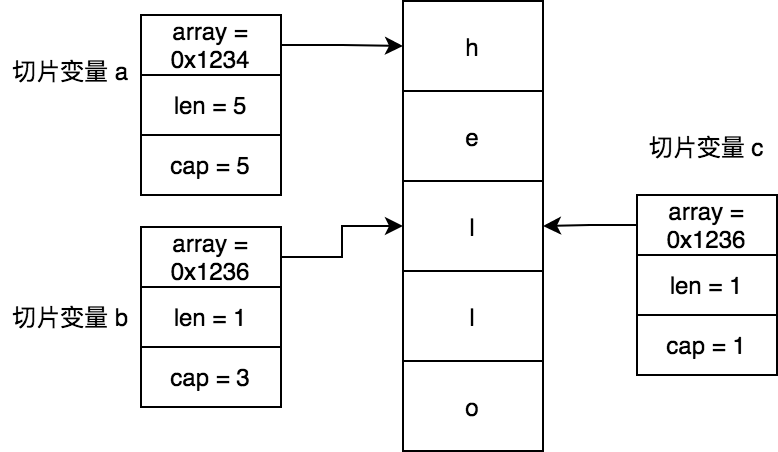
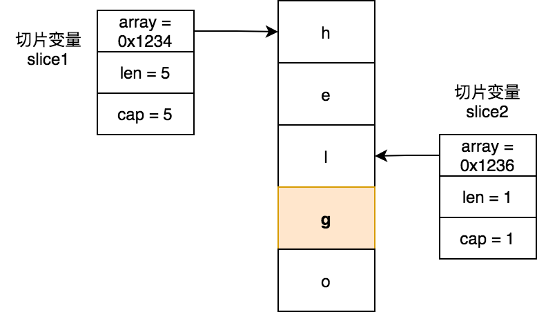
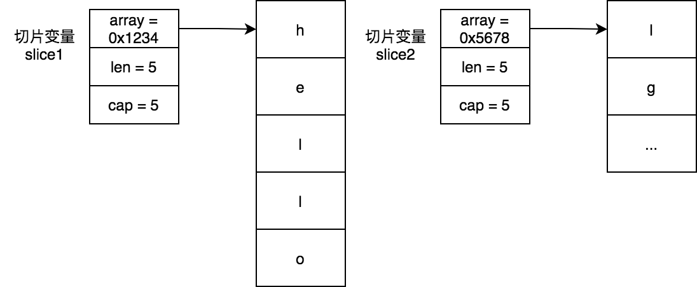
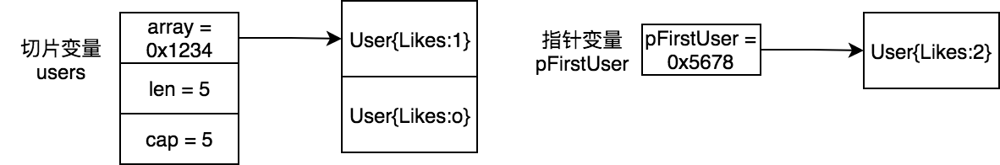

# 切片

切片是Go語言中最常用的數據類型之一，它類似數組，但相比數組它更加靈活，高效，由於它本身的特性，往往也更容易用錯。

不同於數組是值類型，而切片是引用類型。雖然兩者作爲函數參數傳遞時候都是值傳遞（pass by value），但是切片傳遞的包含數據指針（可以細分爲pass by pointer），如果切片使用不當，會產生意想不到的副作用。

## 初始化

切片的初始化方式可以分爲三種：

- 使用make函數創建切片

    make函數語法格式爲：make([]T, length, capacity)，capacity可以省略，默認等於length
- 使用字面量創建切片
- 從數組或者切片派生(reslice)出新切片

	Go支持從數組、指向數組的指針、切片類型變量再reslice一個新切片。
	
	reslice操作語法可以是[]T[low : high]，也可以是[]T[low : high : max]。其中low,high,max都可以省略，low默認值是0，high默認值cap([]T)，max默認值cap([]T)。low,hight,max取值範圍是`0 <= low <= high <= max <= cap([]T)`，其中high-low是新切片的長度，max-low是新切片的容量。

	對於[]T[low : high]，其包含的元素是[]T中下標low開始，到high結束（不含high所在位置的，相當於左閉右開[low, high)）的元素，元素個數是high - low個，容量是cap([]T) - low。

```go
func main() {
	slice1 := make([]int, 0)
	slice2 := make([]int, 1, 3)
	slice3 := []int{}
	slice4 := []int{1: 2, 3}
	arr := []int{1, 2, 3}
	slice5 := arr[1:2]
	slice6 := arr[1:2:2]
	slice7 := arr[1:]
	slice8 := arr[:1]
	slice9 := arr[3:]
	slice10 := slice2[1:2]
	fmt.Printf("%s = %v,\t len = %d, cap = %d\n", "slice1", slice1, len(slice1), cap(slice1))
	fmt.Printf("%s = %v,\t len = %d, cap = %d\n", "slice2", slice2, len(slice2), cap(slice2))
	fmt.Printf("%s = %v,\t len = %d, cap = %d\n", "slice3", slice3, len(slice3), cap(slice3))
	fmt.Printf("%s = %v,\t len = %d, cap = %d\n", "slice4", slice4, len(slice4), cap(slice4))
	fmt.Printf("%s = %v,\t len = %d, cap = %d\n", "slice5", slice5, len(slice5), cap(slice5))
	fmt.Printf("%s = %v,\t len = %d, cap = %d\n", "slice6", slice6, len(slice6), cap(slice6))
	fmt.Printf("%s = %v,\t len = %d, cap = %d\n", "slice7", slice7, len(slice7), cap(slice7))
	fmt.Printf("%s = %v,\t len = %d, cap = %d\n", "slice8", slice8, len(slice8), cap(slice8))
	fmt.Printf("%s = %v,\t len = %d, cap = %d\n", "slice9", slice9, len(slice9), cap(slice9))
	fmt.Printf("%s = %v,\t len = %d, cap = %d\n", "slice10", slice10, len(slice10), cap(slice10))
}
```

上面代碼輸出一下內容：

```bash
slice1 = [],	 len = 0, cap = 0
slice2 = [0],	 len = 1, cap = 3
slice3 = [],	 len = 0, cap = 0
slice4 = [0 2 3],	 len = 3, cap = 3
slice5 = [2],	 len = 1, cap = 2
slice6 = [2],	 len = 1, cap = 1
slice7 = [2 3],	 len = 2, cap = 2
slice8 = [1],	 len = 1, cap = 3
slice9 = [],	 len = 0, cap = 0
slice10 = [0],	 len = 1, cap = 2
```

> **警告**
> **注意：** 
>
> 我們使用arr[3]訪問切片元素時候會報 ``index out of range [3] with length`` 錯誤，而使用arr[3:]來初始化slice9卻是可以的。因爲這是Go語言故意爲之的。具體原因可以參見 [Why slice not painc](https://github.com/golang/go/issues/42069) 這個issue。

接下來我們來看看切片的底層數據結構。

## 數據結構

Go語言中切片的底層數據結構是 `runtime.slice`（**[runtime/slice.go](https://github.com/golang/go/blob/go1.14.13/src/runtime/slice.go#L13-L17)**），其中包含了指向數據數組的指針，切片長度以及切片容量：

```go
type slice struct {
	array unsafe.Pointer // 底層數據數組的指針
	len   int // 切片長度
	cap   int // 切片容量
}
```

> **警告**
> **注意：** 
>
> 切片底層數據結構也可以說成是 `reflect.SliceHeader`，兩者沒有衝突。`reflect.SliceHeader` 是暴露出來的類型，可以被用戶程序代碼直接使用。

我們來看看下面切片如何共用同一個底層數組的：

```go
func main() {
	a := []byte{'h', 'e', 'l', 'l', 'o'}
	b := a[2:3]
	c := a[2:3:3]
	fmt.Println(string(a), string(b), string(c)) // 輸出 hello l l
}
```



在前面 《**[基礎篇-字符串](string.md)** 》 章節，我們使用了 **[GDB](../analysis-tools/gdb.md)** 工具驗證了字符串的數據結構，這一次我們使用另外一種方式驗證切片的數據結構。我們通過打印切片的底層結構信息來驗證：

```go
func main() {
	type sliceHeader struct {
		array unsafe.Pointer // 底層數據數組的指針
		len   int            // 切片長度
		cap   int            // 切片容量
	}
	a := []byte{'h', 'e', 'l', 'l', 'o'}
	b := a[2:3]
	c := a[2:3:3]
	ptrA := (*sliceHeader)(unsafe.Pointer(&a))
	ptrB := (*sliceHeader)(unsafe.Pointer(&b))
	ptrC := (*sliceHeader)(unsafe.Pointer(&c))

	fmt.Printf("切片%s: 底層數組地址=0x%x, 長度=%d, 容量=%d\n", "a", ptrA.array, ptrA.len, ptrA.cap)
	fmt.Printf("切片%s: 底層數組地址=0x%x, 長度=%d, 容量=%d\n", "b", ptrB.array, ptrB.len, ptrB.cap)
	fmt.Printf("切片%s: 底層數組地址=0x%x, 長度=%d, 容量=%d\n", "c", ptrC.array, ptrC.len, ptrC.cap)
}
```

上面代碼輸出以下內容：

```shell
切片a: 底層數組地址=0xc00009400b, 長度=5, 容量=5
切片b: 底層數組地址=0xc00009400d, 長度=1, 容量=3
切片c: 底層數組地址=0xc00009400d, 長度=1, 容量=1
```

從輸出內容可以看到切片變量 `b`和 `c` 都指向同一個底層數組地址 `0xc00009400d`，它們與切片變量 `a` 指向的底層數組地址 `0xc00009400b` 恰好相差2個字節，這兩個字節大小的內存空間存在的是 `h` 和 `e` 字符。

## 副作用

由於切片底層結構的特殊性，當我們使用切片的時候需要特別留心，防止產生副作用(side effect)。

### 示例1：append操作產生副作用

```go
func main() {
	slice1 := []byte{'h', 'e', 'l', 'l', 'o'}
	slice2 := slice1[2:3]
	slice2 = append(slice2, 'g')
	fmt.Println(string(slice2)) // lg
	fmt.Println(string(slice1)) // 輸出helge，slice1的值也變了。
}
```

上面代碼本意是將切片slice2追加`g`字符，卻產生副作用，即也修改了slice1的值：



#### 解決append產生的副作用

解決由於append產生的副作用，有兩種解決辦法：
- reslice時候指定max邊界
- 使用copy函數拷貝出一個副本

##### reslice時候指定max邊界

```go
func main() {
	slice1 := []byte{'h', 'e', 'l', 'l', 'o'}
	slice2 := slice1[2:3:3]
	slice2 = append(slice2, 'g') // 此時slice2容量擴大到8
	fmt.Println(string(slice2)) // 輸出lg
	fmt.Println(string(slice1)) // 輸出hello
}
```

通過`slice2 := slice1[2:3:3]` 方式進行reslice之後，slice2的長度和容量一樣，若對slice2再進行append操作其一定會發送擴容操作，此後slice2和slice1之間就沒有任何關係了。



##### 使用copy函數拷貝出一個副本

```go
func main() {
	slice1 := []byte{'h', 'e', 'l', 'l', 'o'}
	slice2 := make([]byte, 1)
	copy(slice2, slice1[2:3])
	slice2 = append(slice2, 'g')
	fmt.Println(string(slice2)) // 輸出lg
	fmt.Println(string(slice1)) // 輸出hello
}
```

### 示例2：指針類型變量引用切片產生副作用

```go
type User struct {
	Likes int
}

func main() {
	users := make([]User, 1)
	pFirstUser := &users[0]
	pFirstUser.Likes++
	fmt.Println("所有用戶：")
	for i := range users {
		fmt.Printf("User: %d Likes: %d\n\n", i, users[i].Likes)
	}
	users = append(users, User{}) // 添加一個新用戶到集合中
	pFirstUser.Likes++                // 第一個用戶的Likes次數加一
	fmt.Println("所有用戶：")
	for i := range users {
		fmt.Printf("User: %d Likes: %d\n", i, users[i].Likes)
	}
}
```

指向上面代碼輸出以下內容：

```shell
所有用戶：
User: 0 Likes: 1

所有用戶：
User: 0 Likes: 1
User: 1 Likes: 0
```

代碼本意是通過User類型指針變量`pUsers`進行第一個用戶Likes更新操作，沒想到切片進行append之後，產生了副作用：`pUsers`指向切片已經與切片變量`users`不一樣了。



### 避免切片副作用黃金法則

1. **在邊界處拷貝切片**，這裏面的邊界指的是函數接受切片參數或返回切片的時候。
2. **永遠不要使用一個變量來引用切片數據**

## 擴容策略

當對切片進行append操作時候，若切片容量不夠時候，會進行擴容處理。當切片進行擴容時候會先調用`runtime.growslice`函數，該函數返回一個新的slice底層結構體，該結構體array字段指向新的底層數組地址，cap字段是新切片的容量，**len字段是舊切片的長度**，舊切片的內容會拷貝到新切片中，最後再把要追加的數據複製到新切片中，並更新切片len長度。

```go
// et是slice元素類型
// old是舊的slice
// cap是新slice最低要求容量大小。是舊的slice的長度加上append函數中追加的元素的個數
// 比如s := []int{1, 2, 3}；s = append(s, 4, 5); 此時growslice中的cap參數值爲5
func growslice(et *_type, old slice, cap int) slice {
	if cap < old.cap {
		panic(errorString("growslice: cap out of range"))
	}

	if et.size == 0 {
		return slice{unsafe.Pointer(&zerobase), old.len, cap}
	}

	newcap := old.cap
	doublecap := newcap + newcap
	if cap > doublecap { // 最小cap要求大於舊slice的cap兩倍大小
		newcap = cap
	} else {
		if old.len < 1024 { // 當舊slice的len小於1024, 擴容一倍
			newcap = doublecap
		} else { // 否則每次擴容25%
			for 0 < newcap && newcap < cap {
				newcap += newcap / 4
			}
			if newcap <= 0 {
				newcap = cap
			}
		}
	}

	var overflow bool
	var lenmem, newlenmem, capmem uintptr
	switch {
	case et.size == 1: // 元素大小
		lenmem = uintptr(old.len)
		newlenmem = uintptr(cap)
		capmem = roundupsize(uintptr(newcap))
		overflow = uintptr(newcap) > maxAlloc
		newcap = int(capmem) // 調整newcap大小
	case et.size == sys.PtrSize:
		lenmem = uintptr(old.len) * sys.PtrSize
		newlenmem = uintptr(cap) * sys.PtrSize
		capmem = roundupsize(uintptr(newcap) * sys.PtrSize)
		overflow = uintptr(newcap) > maxAlloc/sys.PtrSize
		newcap = int(capmem / sys.PtrSize)
	case isPowerOfTwo(et.size):
		var shift uintptr
		if sys.PtrSize == 8 {
			// Mask shift for better code generation.
			shift = uintptr(sys.Ctz64(uint64(et.size))) & 63
		} else {
			shift = uintptr(sys.Ctz32(uint32(et.size))) & 31
		}
		lenmem = uintptr(old.len) << shift
		newlenmem = uintptr(cap) << shift
		capmem = roundupsize(uintptr(newcap) << shift)
		overflow = uintptr(newcap) > (maxAlloc >> shift)
		newcap = int(capmem >> shift)
	default:
		lenmem = uintptr(old.len) * et.size
		newlenmem = uintptr(cap) * et.size
		capmem, overflow = math.MulUintptr(et.size, uintptr(newcap))
		capmem = roundupsize(capmem)
		newcap = int(capmem / et.size)
	}

	if overflow || capmem > maxAlloc {
		panic(errorString("growslice: cap out of range"))
	}

	var p unsafe.Pointer
	if et.ptrdata == 0 { // 切片元素中沒有指針類型數據，不用考慮寫屏障問題
		p = mallocgc(capmem, nil, false)
		memclrNoHeapPointers(add(p, newlenmem), capmem-newlenmem)
	} else {
		p = mallocgc(capmem, et, true)
		if lenmem > 0 && writeBarrier.enabled {
			bulkBarrierPreWriteSrcOnly(uintptr(p), uintptr(old.array), lenmem)
		}
	}
	// 涉及到slice擴容都會有內存移動操作
	memmove(p, old.array, lenmem)

	return slice{p, old.len, newcap}
}
```

從上面代碼中可以總結出切片擴容的策略是：

1. 若切片容量小於1024，會擴容一倍
2. 若切片容量大於等於1024，會擴容1/4大小，由於考慮內存對齊，最終實際擴容大小可能會大於1/4

從上面代碼中可以看到，切片進行擴容時一定會進行內存拷貝，這是成本較大操作。所以**切片一大優化點就是在使用之前儘量指定好切片所需容量，避免出現擴容情況**。

## string類型與[]byte類型如何實現zero-copy互相轉換？

### 什麼是零拷貝(zero-copy)

**零拷貝(zero-copy)** 指的是CPU不需要先將數據從某處內存複製到另一個特定區域。當應用程序讀取文件，需要從磁盤中加載內核區域，然後將內核區域內容複製到應用內存區域，這就涉及到內存拷貝。若採用mmap技術可以文件映射到特定內存中，只需加載一次，應用程序和內核都可以共享內存中文件數據，這就實現了zero-copy。或者當應用程序需要發送文件給遠程時候，可以採用sendfile技術實現零拷貝，若未實現零拷貝，則需要進行四次拷貝過程:

> 磁盤---（DMA copy）--> 系統內核 --> 應用程序區域 --> 系統內核(socket) ---（DMA copy）---> 網卡

### 使用[]byte(string) 和 string([]byte)方式進行字符串和字節切片互轉時候會不會發生內存拷貝？

```go
package main

func byteArrayToString(b []byte) string {
	return string(b)
}

func stringToByteArray(s string) []byte {
	return []byte(s)
}

func main() {
}
```

我們來看下上面代碼中的底層實現

```shell
go tool compile -N -l -S main.go
```

執行上面命名，輸出以下內容：

```shell
"".byteArrayToString STEXT size=117 args=0x28 locals=0x38
	0x0000 00000 (main.go:3)	TEXT	"".byteArrayToString(SB), ABIInternal, $56-40
	0x0000 00000 (main.go:3)	MOVQ	(TLS), CX
	0x0009 00009 (main.go:3)	CMPQ	SP, 16(CX)
	0x000d 00013 (main.go:3)	PCDATA	$0, $-2
	0x000d 00013 (main.go:3)	JLS	110
	0x000f 00015 (main.go:3)	PCDATA	$0, $-1
	0x000f 00015 (main.go:3)	SUBQ	$56, SP
	0x0013 00019 (main.go:3)	MOVQ	BP, 48(SP)
	0x0018 00024 (main.go:3)	LEAQ	48(SP), BP
	...
	0x003c 00060 (main.go:4)	MOVQ	AX, 8(SP)
	0x0041 00065 (main.go:4)	MOVQ	CX, 16(SP)
	0x0046 00070 (main.go:4)	MOVQ	DX, 24(SP)
	0x004b 00075 (main.go:4)	CALL	runtime.slicebytetostring(SB)
	0x0050 00080 (main.go:4)	MOVQ	40(SP), AX
	....
"".stringToByteArray STEXT size=144 args=0x28 locals=0x50
	0x0000 00000 (main.go:7)	TEXT	"".stringToByteArray(SB), ABIInternal, $80-40
	0x0000 00000 (main.go:7)	MOVQ	(TLS), CX
	0x0009 00009 (main.go:7)	CMPQ	SP, 16(CX)
	...
	0x0040 00064 (main.go:8)	MOVQ	AX, 8(SP)
	0x0045 00069 (main.go:8)	MOVQ	CX, 16(SP)
	0x004a 00074 (main.go:8)	CALL	runtime.stringtoslicebyte(SB)
	0x004f 00079 (main.go:8)	MOVQ	32(SP), AX
	0x0054 00084 (main.go:8)	MOVQ	40(SP), CX
	....
```

從上面彙編代碼可以看到 `string([]byte)` 底層調用的是 `runtime.slicebytetostring`，`[]byte(string)` 底層調用的是 `runtime.stringtoslicebyte`。查看這兩個底層函數實現可以看到兩者都是先創建一段內存空間，然後使用 `memmove` 函數拷貝內存，將數據拷貝到新內存空間。這也就是說 `[]byte(string)` 和 `string([]byte)` 進行轉換時候需要內存拷貝。

### string類型與[]byte類型 zero-copy轉換實現

那麼能不能實現不需要內存拷貝的字符串和字節切片的轉換呢？答案是可以的。

根據前面 《**[基礎篇-字符串](string.md)** 》 章節和本章節，我們可以看到字符串和字節切片底層結構很相似，它們相同部分都有指向底層數據指針和記錄底層數據長度len字段，而字節切片額外多了一個字段cap，記錄底層數據的容量。我們只要轉換時候讓它們共享底層數據就能實現zero-copy。讓我們再看看字符串和切片的數組結構：

```go
type StringHeader struct {
	Data uintptr
	Len  int
}

type SliceHeader struct {
	Data uintptr
	Len  int
	Cap  int
}
```

我們來看下網上比較常見zero-copy的實現方式，它是有bug的：

```go
func string2bytes(s string) []byte {
    return *(*[]byte)(unsafe.Pointer(&s))
}

func bytes2string(b []byte) string{
    return *(*string)(unsafe.Pointer(&b))
}
```

我們來測試一下：

```go
func main() {
	a := "hello"
	b := string2bytes(a)
	fmt.Println(string(b), len(b), cap(b))
}
```
上面代碼輸出以下內容：

```shell
hello 5 824634122328
```

從上面輸入內容，我們可以看到字符串轉換成字節切片後的容量明顯是有問題的。讓我們來分析下具體原因。

上面兩個函數藉助 **[非安全指針類型](pointer.md#unsafepointer)** 強制轉換類型實現的。對於字節切片轉換字符串使用這種方式是可以的，字節切片多餘的cap字段會自動溢出掉；而反過來由於字符串沒有記錄容量字段，那麼將其強制轉換成字節切片時候，字節切片的cap字段是未知的，這有可能導致非常嚴重問題。所以將字符串轉換成字節切片時候需要保證字節切片的cap設置正確。

正確的字符串轉字節切片實現如下：

```go
func StringToBytes(s string) (b []byte) {
	sh := *(*reflect.StringHeader)(unsafe.Pointer(&s))
	bh := (*reflect.SliceHeader)(unsafe.Pointer(&b))
	bh.Data, bh.Len, bh.Cap = sh.Data, sh.Len, sh.Len
	return b
}
```
或者

```go
func StringToBytes(s string) []byte {
	return *(*[]byte)(unsafe.Pointer(
		&struct {
			string
			Cap int
		}{s, len(s)},
	))
}
```

## 進一步閱讀

- [The Go Programming Language Specification: Slice expressions](https://golang.org/ref/spec#Slice_expressions)
- [Uber Go Style Guide: Copy Slices and Maps at Boundaries](https://github.com/uber-go/guide/blob/master/style.md#copy-slices-and-maps-at-boundaries)
