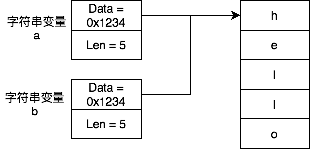
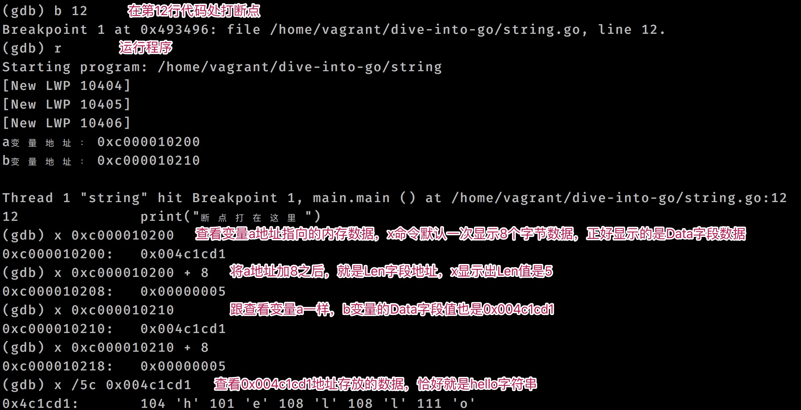
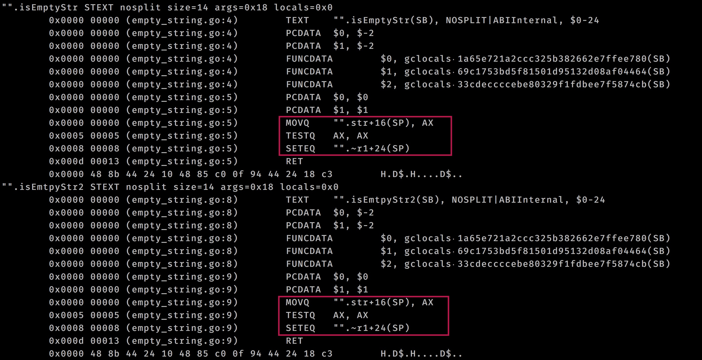

# 字符串

我們知道C語言中的字符串是使用字符數組 `char[]` 表示，字符數組的最後一位元素是 `\0`，用來標記字符串的結束。C語言中字符串的結構簡單，但獲取字符串長度時候，需要遍歷字符數組才能完成。

Go語言中字符串的底層結構中也包含了字符數組，該字符數組是完整的字符串內容，它不同於C語言，字符數組中沒有標記字符串結束的標記。爲了記錄底層字符數組的大小，Go語言使用了額外的一個長度字段來記錄該字符數組的大小，字符數組的大小也就是字符串的長度。

## 數據結構

Go語言字符串的底層數據結構是 `reflect.StringHeader`(**[reflect/value.go](https://github.com/golang/go/blob/go1.14.13/src/reflect/value.go#L1954-L1957)**)，它包含了指向字節數組的指針，以及該指針指向的字符數組的大小：

```go
type StringHeader struct {
	Data uintptr
	Len  int
}
```

## 字符串複製

當將一個字符串變量賦值給另外一個變量時候，他們 `StringHeader.Data` 都指向同一個內存地址，不會發生字符串拷貝：

```go
a := "hello"
b := a
```



從上圖中我們可以看到a變量和b變量的Data字段存儲的都是0x1234，而0x1234是字符數組的起始地址。

接來下我們藉助 **[GDB](../analysis-tools/gdb.md)** 工具來驗證Go語言中字符串數據結構是不是按照上面說的那樣。

```go
package main

import (
	"fmt"
)

func main() {
	a := "hello"
	b := a
	fmt.Printf("a變量地址：%p\n", &a)
	fmt.Printf("b變量地址：%p\n", &b)
	print("斷點打在這裏")
}
```

將上面代碼構建二進制應用， 然後使用 **[GDB](../analysis-tools/gdb.md)** 調試一下：

```shell
go build -o string string.go # 構建二進制應用
gdb ./string # GDB調試
```

調試流程如下：



## len(str) == 0 和 str == \"\"有區別嗎？

判斷一個字符串是否是空字符串，我們既可以使用len判斷其長度是0，也可以判斷其是否等於空字符串 `""`。那麼它們有什麼區別嗎？這個問題的答案是二者沒有區別。因爲他們底層實現是一樣的。

讓我們來探究一下。源代碼如下：

```go
package main

func isEmptyStr(str string) bool {
	return len(str) == 0
}

func isEmtpyStr2(str string) bool {
	return str == ""
}

func main() {
}
```

接下來我們來查看下上面代碼的底層彙編：

```shell
go tool compile -S empty_string.go # 查看底層彙編代碼 
```

從下圖中，我們可以發現兩種方式的實現是一樣的：



> **警告**
> **注意：**  
> 當我們編譯時候開啓了禁止內聯，禁止優化時候，可以發現 `len(str) == 0` 和 `str == ""` 的實現是不同的，前者的執行效率是不如後者的。在默認情況下，Go編譯器是開啓了優化選項的，`len(str) == 0` 會優化成跟 `str == ""` 的實現一樣。

## [3]string類型的變量佔用多大空間？

對於這個問題，直覺上覺得[3]string類型變量，由3個字符串組成，而字符串長度是不確定的，所以對於類似[n]string類型變量佔用多大的空間是不確定。

首先明確的是Go語言中提供了 `unsafe.Sizeof` 函數來確定一個類型變量佔用空間大小，這個大小是不含它引用的內存大小。比如某結構體中一個字段是個指針類型，這個字段指向的內存是不計算進去的，只會計算該字段本身的大小。

字符串底層結構是 `reflect.StringHeader` ，一共佔用16個字節空間，所以我們對於[n]string的大小，計算僞代碼如下：

```go
unsafe.Sizeof([n]string) == n * 16
```
那麼問題[3]string類型的變量佔用多大空間？的答案是48。

## 如何高效的進行字符串拼接？

字符串進行拼接有多種方法：

- 使用拼接字符 `+` 拼接字符串

    效率低，每次拼接會產生臨時字符串，適合少量字符串拼接。使用起來最簡單。
- 使用 `fmt.Printf()` 來拼接字符

    由於需要將字符串轉換成空接口類型，效率差，這裏面不再討論
- 使用 `strings.Join()` 來拼接字符串

    其底層其實使用的是 `strings.Builder` ，效率高，適合字符串數組。
- 使用 `bytes.Buffer` 來拼接字符串

    效率高，可以複用
- 使用 `strings.Builder` 來拼接字符串

    效率高，每次Reset()之後，其底層緩衝會被清除，不適合複用。

### 使用拼接符 + 進行拼接

```go
package main

import (
	"fmt"
	"reflect"
	"unsafe"
)

func main() {
	strSlices := []string{"h", "e", "l", "l", "o"}

	var all string
	for _, str := range strSlices {
		all += str
		sh := (*reflect.StringHeader)(unsafe.Pointer(&all))
		fmt.Printf("str地址：%p，all地址：%p，all底層字節數組地址=0x%x\n", &str, &all, sh.Data)
	}
}
```

上面代碼輸出一下內容：

```shell
str地址：0xc000010250，all地址：0xc000010240，all底層字節數組地址=0x4bc8f7
str地址：0xc000010250，all地址：0xc000010240，all底層字節數組地址=0xc000018048
str地址：0xc000010250，all地址：0xc000010240，all底層字節數組地址=0xc000018068
str地址：0xc000010250，all地址：0xc000010240，all底層字節數組地址=0xc000018078
str地址：0xc000010250，all地址：0xc000010240，all底層字節數組地址=0xc000018088
```

從上面輸出中可以發現str和all地址一直沒有變，但是all的底層字節數組地址一直在變化，這說明拼接符 `+` 在拼接字符串時候，會創建許多臨時字符串，臨時字符串意味着內存分配，指向效率不會太高。

### 使用 bytes.Buffer 拼接字符串

```go
package main

import "bytes"

func main() {
	strSlices := []string{"h", "e", "l", "l", "o"}

	var bf bytes.Buffer
	for _, str := range strSlices {
		bf.WriteString(str)
	}
	print(bf.String())
}
```

`bytes.Buffer` 底層結構包含內存緩衝，最少緩衝大小是64個字節，當進行字符串拼接時候，由於利用到了緩衝，拼接效率相比拼接符 `+` 大大提升：

```go
type Buffer struct {
	buf      []byte // 內存緩衝是字節切片類型
	off      int // buf已讀索引，下次讀取從buf[off]開始
	lastRead readOp
}

func (b *Buffer) String() string {
	if b == nil {
		// Special case, useful in debugging.
		return "<nil>"
	}
	return string(b.buf[b.off:])
}
```

> **警告**
> **注意：**
>
> bytes.Buffer是可以複用的。當進行reset時候，並不會銷燬內存緩衝。

### 使用 strings.Builder 拼接字符串

```go
package main

import "strings"

func main() {
	strSlices := []string{"h", "e", "l", "l", "o"}

	var strb strings.Builder
	for _, str := range strSlices {
		strb.WriteString(str)
	}
	print(strb.String())
}
```

`strings.Builder` 同 `bytes.Buffer` 一樣都是用內存緩衝，最大限度地減少了內存複製：

```go
type Builder struct {
	addr *Builder // 用來運行時檢測是否違背nocopy機制
	buf  []byte // 內存緩衝，類型是字節數組
}

func (b *Builder) String() string {
	return *(*string)(unsafe.Pointer(&b.buf))
}
```

從上面可以看到 `string.Builder` 的 `String` 方法使用 `unsafe.Pointer` 將字節數組轉換成字符串。而`bytes.Buffer`的 `String` 方法使用的 `string([]byte)`將字節數組轉換成字符串，後者由於涉及內存分配和拷貝，相比之下它的執行效率低。

爲什麼`bytes.Buffer`的 `String` 方法的效率比較低，可以查看《**[基礎篇-切片-string類型與[]byte類型如何實現zero-copy互相轉換？](slice.md#string類型與byte類型如何實現zero-copy互相轉換)**》。

### 字符串拼接基準測試

下面我們進行基準測試下：

```go
// 使用拼接符拼接字符串
func BenchmarkJoinStringUsePlus(b *testing.B) {
	strSlices := []string{"h", "e", "l", "l", "o"}
	for i := 0; i < b.N; i++ {
		for j := 0; j < 10000; j++ {
			var all string
			for _, str := range strSlices {
				all += str
			}
			_ = all
		}
	}
}

// 複用bytes.Buffer結構
func BenchmarkJoinStringUseBytesBufWithReuse(b *testing.B) {
	strSlices := []string{"h", "e", "l", "l", "o"}
	var bf bytes.Buffer
	for i := 0; i < b.N; i++ {
		for j := 0; j < 10000; j++ {
			var all string
			for _, str := range strSlices {
				bf.WriteString(str)
			}
			all = bf.String()
			_ = all
			bf.Reset()
		}
	}
}

// 使用bytes.Buffer，未進行復用
func BenchmarkJoinStringUseBytesBufWithoutReuse(b *testing.B) {
	strSlices := []string{"h", "e", "l", "l", "o"}

	for i := 0; i < b.N; i++ {
		for j := 0; j < 10000; j++ {
			var all string
			var bf bytes.Buffer
			for _, str := range strSlices {
				bf.WriteString(str)
			}
			all = bf.String()
			_ = all
			bf.Reset()
		}
	}
}

// 使用strings.Builder
func BenchmarkJoinStringUseStringBuilder(b *testing.B) {
	strSlices := []string{"h", "e", "l", "l", "o"}
	for i := 0; i < b.N; i++ {
		for j := 0; j < 10000; j++ {
			all := ""
			var strb strings.Builder
			for _, str := range strSlices {
				strb.WriteString(str)
			}
			all = strb.String()
			_ = all
			strb.Reset()
		}
	}
}
```

基準測試結果如下：

```shell
BenchmarkJoinStringUsePlus                 	     703	   1633439 ns/op	  160000 B/op	   40000 allocs/op
BenchmarkJoinStringUseBytesBufWithReuse    	    2130	    471368 ns/op	       0 B/op	       0 allocs/op
BenchmarkJoinStringUseBytesBufWithoutReuse 	    1209	    883053 ns/op	  640000 B/op	   10000 allocs/op
BenchmarkJoinStringUseStringBuilder        	    1830	    548350 ns/op	   80000 B/op	   10000 allocs/op
```

### 字符串拼接效率總結

從上面結果可以分析得到字符串拼接效率，其中`strings.Builder`的效率最高，拼接字符`+`效率最低：

```shell
strings.Builder > bytes.Buffer > 拼接字符+
```

但是由於`bytes.Buffer`可以複用，若在需要多此執行字符串拼接的場景下，推薦使用它。

